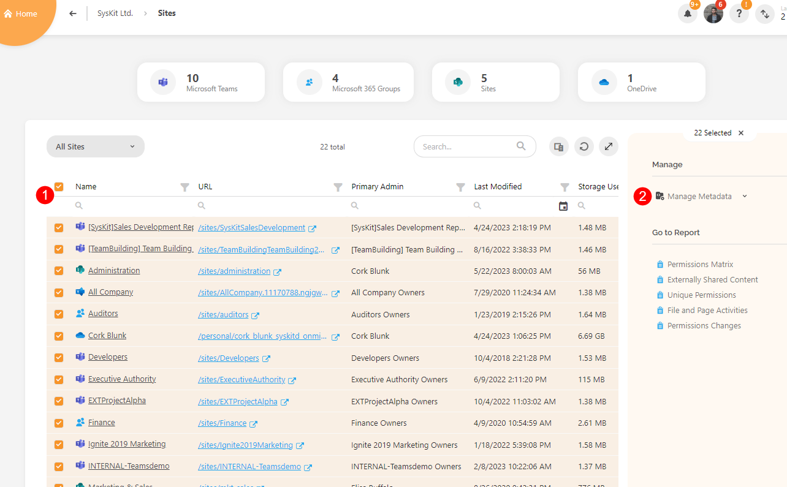
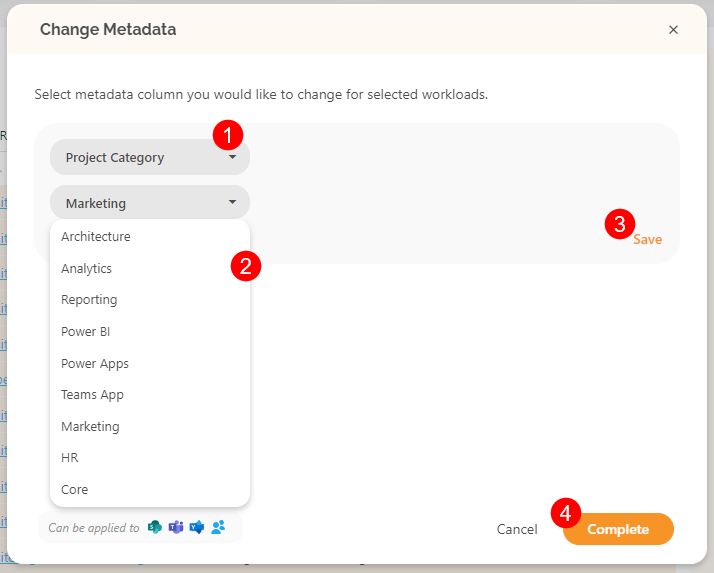
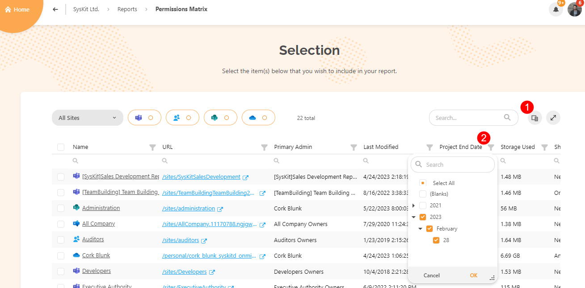
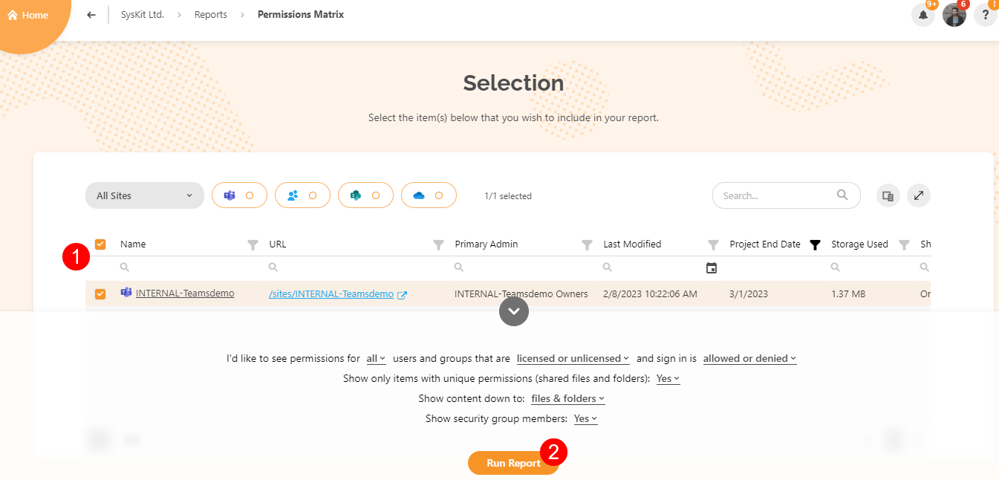

# Custom Metadata



This feature has to be **enabled by your Syskit Point administrator** for you to utilize it.


Custom metadata provides additional information on **Microsoft Teams, Microsoft 365 Groups, Sites, and OneDrive**. It allows you to create and define specific properties or attributes that are relevant to your needs.

Custom metadata in Syskit Point allows you to **organize, find, and automate processes** that involve your workspaces based on your unique requirements in order to enhance your productivity and efficiency.

**Essential metadata** is natively available in  Microsoft 365 and collected by Syskit Point during the sync process. 

Here are some examples of such metadata:

 * **The Microsoft Teams Owner**
 * **The date of creation for a site**
 * **The storage used by a site**
 * **And other useful information**

With the Syskit Point custom metadata feature, you can:

* **Leverage custom metadata** to organize and expand on the existing information and better describe Microsoft Teams, Microsoft 365 Groups, Sites, and OneDrive in relation to your business processes and policies; for example, you can assign custom metadata properties such as "Project," "Department," or "Client Name."

* **Improve reporting and analytics** to enable better tracking and reporting by using the custom metadata to generate reports and gain insights into various aspects of your workspaces, such as project progress, document usage, or team performance which can be valuable for decision-making and assessing productivity

* **Improve search and discovery** as associating custom metadata with files makes it easier to find specific documents and filter them based on their attributes, making it more efficient to locate relevant information.



Only Syskit Point **administrators can create new custom metadata**.


## Change Custom Metadata



**Ask your Syskit Point administrator** for the best practice on custom metadata adjustment.



After custom metadata has been created by your Syskit Point admin, you are able to manage and change how it applies to the **workspaces where you are the owner**.

To change the custom metadata that has been set up to your workspaces, **select Sites or Microsoft Teams & Groups from the Home page**.

* On the **Sites (1)** overview screen, select one or multiple workspaces to edit their metadata
* Select **Manage Metadata (2)**; the option is available on the right side of the screen
  * This will open the Change Metadata pop-up

On the Change Metadata pop-up, you can:
* **Select the metadata column (1)** you would like to change  
* In the drop-down menu **select the type of change (2)** from those available on the list
* Click **Save (3)** to store the change
* Click **Complete (4)** to finalize your selection
  * This will start the process of changing the custom metadata, and once completed, the information input will be displayed under the selected workspaces

## Filter Workspaces by Metadata

When generating a report, it can include and be filtered by the specific custom metadata that was set up.

As you’re starting your cleanup and planning on implementing automated governance, **use the metadata field to segment your Teams and Sites into priority tiers**. 

On your sites report filter out e.g. Externally shared (+) inactive (+) Teams, and apply the metadata field “Priority 1”. This way, **the mentioned subset of teams/sites will always be available through most reports**, automated governance application and other.

To generate a report with custom metadata, take the following steps:

* Go to Reports and select the type of report to generate
* Use the **Column Chooser (1)** to select the metadata
* Once the custom metadata column was added, use the **filter drop-down menu (2)** to select the details for the report

This will filter the report to show the items that the chosen metadata applies to.
* **Select (1)** one or more files to include in the report
  * Set the values for the report on the pop-up that appears
* Click **Run Report (2)** to generate the report

This can be applied to any reports from the Report section that include **Sites, Microsoft Teams & Groups, and OneDrive**.