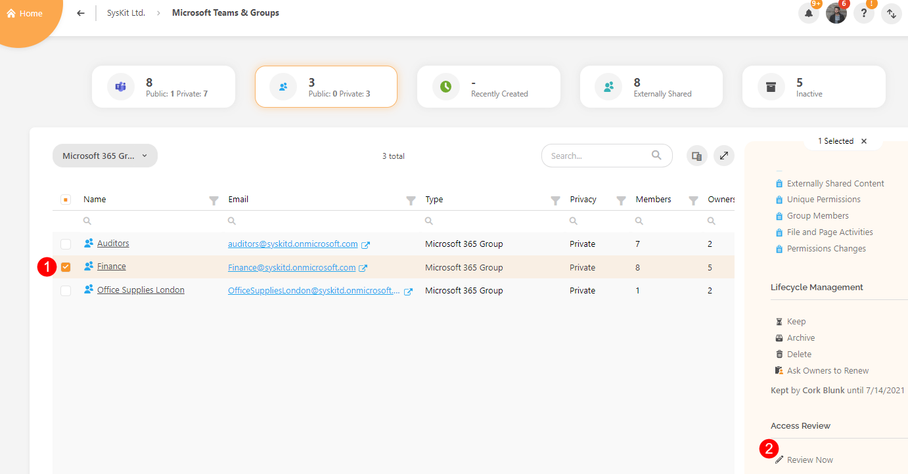
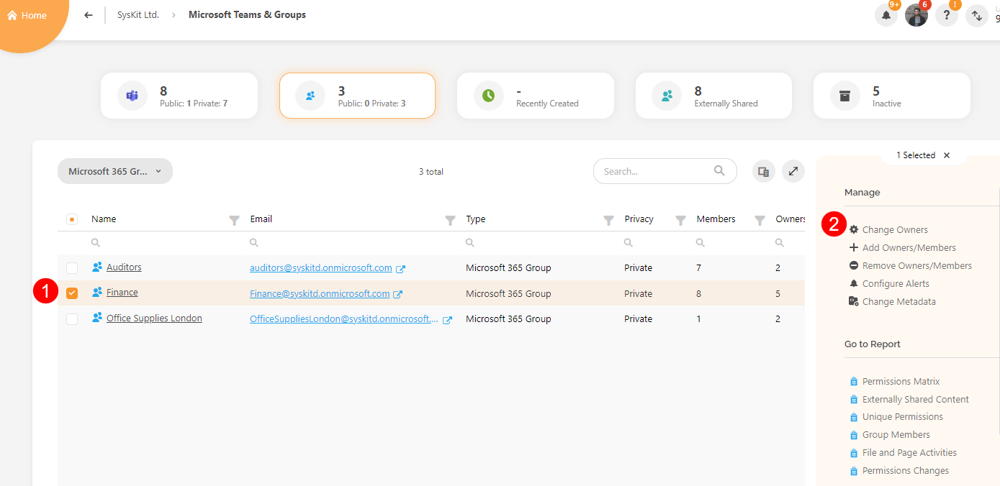
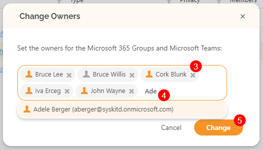
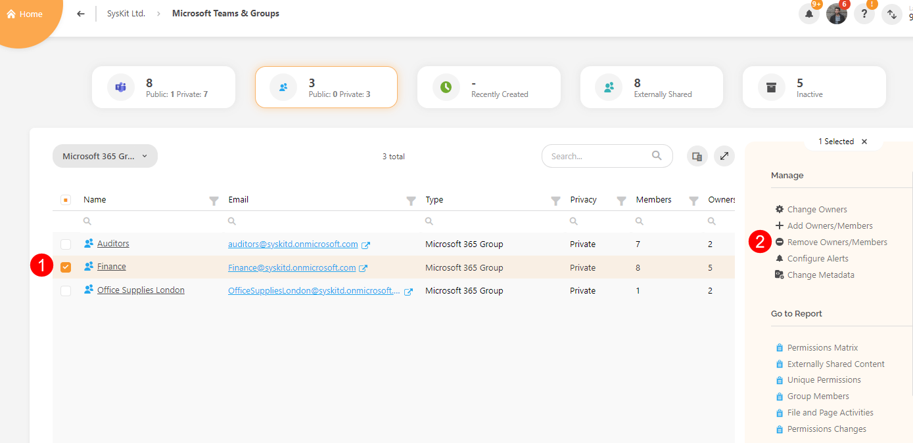
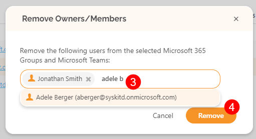

# Manage Workspaces

Managing your workspaces in Syskit Point can **simplify the day-to-day management of teams, sites and groups** where you are the owner of the workspace or the resource where the workspace is present. 

Managing your workspaces helps you **ensure users have access to all the resources they need** to do their work effectively as well as **identify and remove users** that should no longer have access. 

When it comes to workspace management, Syskit Point lets you easily:
 * [Manage Workspace Access](#manage-workspace-access)
 * [Add and Remove Owners](#add-and-remove-owners)
 * [Remove Access](#remove-access)

These changes can be made in instances **when certain members or owners leave a project** and need to have their access revoked or if a member needs to have **permissions added as their responsibilities within the project increased**. 

The steps listed below can be done for your:
 * Sites
 * Microsoft Teams
 * Microsoft Groups

This article will use Microsoft Groups to explain the steps, but the same steps apply to any workspace you want to manage.  

To manage your workspace's access, complete the following: 

* On your Syskit Point home screen, click the **Microsoft Teams & Groups** button
  * This opens the Microsoft Teams & Groups
  * To manage sites, **click on the Sites button**
* Navigate to your groups by either clicking the **Microsoft Groups button (1)** at the top or selecting **Microsoft Groups from the filter (2)**

There, you will be able to complete any of the following actions described below. 



You are only able to **manage access for groups where you are the owner**.



## Manage Workspace Access

Once users have been added to your workspace, you can manage their permissions by assigning roles to the workspace. Roles control what members can do within the workspace and are as follows: 
  * **Full Control** - user has complete control of the group
  * **Design** - user can view, add, update, delete, approve, and customize
  * **Edit** - user can add, edit, and delete lists as well as view, add, update, and delete list items and documents
  * **Contribute** - user can view, add, update, and delete list items and documents
  * **Read** - user can view pages and list items, and download documents

To change permissions, repeat [the initial step listed above ](#manage-workspaces) so that only your **Microsoft Groups** are visible on the Microsoft Teams & Groups screen. 

When you see a list of your groups, take the following steps:

 * **Select a group (1)** you want to change permissions for
   * Once selected, the right side of the screen provides more available actions with this group
 * Scroll down to the **Access Review section** on the right side of the screen and **click the Review Now button (2)**
 * You will be redirected to the **Access Review task** for this group where you will be able to **change the group permissions**

[For more information on how to complete the Access Review task, take a look at this article.](../resolve-governance-tasks/access-review.md)

## Add and Remove Owners

Adding and removing owners from the workspace can be done directly on the workspace's section of Syskit Point. 

To start, repeat [the initial step listed above ](#manage-workspaces) so that only your **Microsoft Groups** are visible on the Microsoft Teams & Groups screen. 

  * When your groups are visible, **select the group (1)** you want to change owners for
* **Click the Change Owners button (2)** located on the right side of the screen
    * The Change Owners pop-up opens, showing all the current owners
  * To remove any of the current owners by **clicking the x (3)** next to their name
  * To **add more owners** to the Team or Group, type the **name or email address (3)** of the person you want to assign as an owner in the space provided
  * Once finished, click **Change (4)** to store your preference

## Remove Group Access

Removing Group Access from members or owners of the workspace can be done directly on its specific section of Syskit Point. 

To start, repeat [the initial step listed above ](#manage-workspace) so that only your **Microsoft Groups** are visible on the Microsoft Teams & Groups screen. 

  * When your groups are visible, **select the group (1)** you want to remove access from
* **Click the Remove Owners/Members button (2)** located on the right side of the screen, and the Remove Owners/Members pop-up will open
  * To remove any of the current members or owners, type the **name or email address (3)** of the person you want to remove from being able to access the group
    * You can remove multiple owners or members at once
  * Once finished, click **Remove (4)** to store your preference

