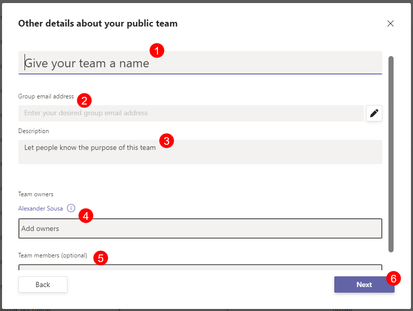
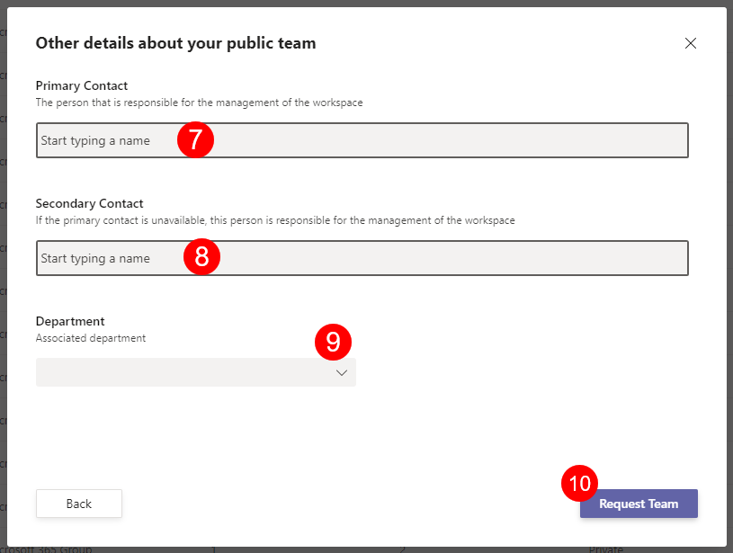
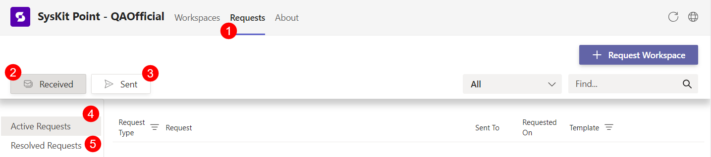

# New Workspace

If your team or department is starting a **new project that will require collaborating and file-sharing**, you may need to **create a new workspace**.

With the **Request New Workspace** feature, you can choose which type of workspace to create based on the available templates. Once your request is sent, the only thing left is for it to be reviewed and approved by your Syskit Point Administrator.

## Request New Workspace

A new workspace needs to be requested from your Microsoft Teams. 

Complete the following steps to submit your request:

* Open your **Microsoft Teams.** 
* Start the **Syskit Point** app in the left side panel.  
  * If you don’t see the app by default, click the three dots and search for Syskit Point. 
  * Select the Syskit Point app, and it will appear on your Teams side panel. 
  * To have it permanently visible, right-click the app icon and select **Pin**.
* Click the **Request Workspace** button, located on the top right.
* Select the **type of workspace** you want to request: **Microsoft Team, Microsoft 365 Group, SharePoint Site**.
* Choose the workspace template that best fits your need from the ones that are available.
* Based on the template, multiple pieces of information may be required - in the case of requesting a Microsoft Teams workspace, the template might require the following information:
  * **Team name (1)**
  * **Group email address (2)**
  * **Description of the workspace (3)**
  * **Team owners (4)**
  * **Team members (5)**
* When finished, click **Next (6)** to get to the next step, where you will be asked to:
  * Enter the name of the **Primary Contact (7)** - the person responsible for managing the workspace
  * Enter the name of the **Secondary Contact (8)** - if the primary person is unavailable, this person is responsible for managing the workspace.
  * **Department (9)** - that the workspace belongs to
* Once completed click **Request Team (10)** to finalize your request.

All updates and notifications about your requests and approval progress will be visible in the **Microsoft Teams Activity tab** and in the **Syskit Point app**.

* To check on the current status of your request through the Syskit Point app, click on the **Requests (1)** button at the top of the screen.  
  * On the Requests screen, you will be able to check between: 
    * **Received (2)** requests
    * **Sent (3)** requests
    * **Active Requests (4)**
    * **Resolved Requests (5)**



Your Syskit Point admin can **add additional metadata fields that provide you with more information** and can help you govern and secure your environment.


 [To learn more about custom metadata, take a look at this article.](../manage-workspaces/manage-custom-metadata.md)