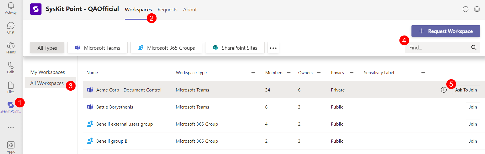
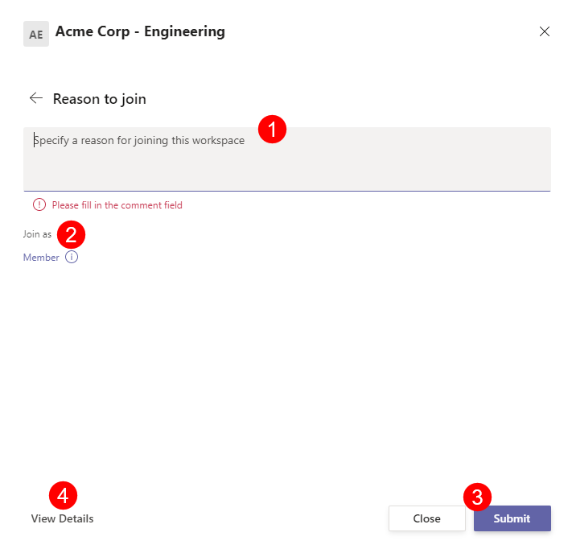

#  Request Access to Workspaces

If you're ever in a situation where you **need access to a certain site, team, or group** but don't have permission, the **Request Access to Workspaces feature is a quick and easy solution to this problem**. 

Let's say you're **onboarding into a new organization, and want to join all conversations** relevant to your professional and individual interests. Whether it’s a project M365 group, or the after-work football Team – **ask for access and join the relevant workspaces** that will make your experience more enjoyable.

Being part of the same workspace makes sharing necessary files painless and easy.

When the Access Requests policy is enabled, **users can request to join workspaces either as a Member, Owner, or both** - depending on the Access Requests policy assigned to a particular workspace - **directly through their Microsoft Teams**. 

To request to join a workspace, just follow these steps:

 * Open your **Microsoft Teams app** and navigate to the **Syskit Point feature (1)**
 * Under the **Workspaces section (2)**, you can see **My Workspaces and All Workspaces (3)** 
    * My Workspaces show all the workspaces you are already a part of
    * All Workspaces show all workspaces you can request access to

You can request to join a workspace by either:
  * Searching through the list of available workspaces in your **All Workspaces (3)** section
  * Typing in the name of the workspace you are looking for in the **search bar (4)**, located near the top right corner

Once you locate the workspace you want to request access to, **click the Ask to Join button (5)**.
  * This can be found on the right side of the screen in the same line as the desired workspace 

Clicking Ask to Join will open a pop-up screen where you can **enter the reason why you are interested in joining (1)** the specific workspace. 
  * If the Access Requests policy that was assigned allows for multiple access levels, you will be able to choose between Member, Owner, or both
  * If  the policy is set to allow just one of the mentioned **access levels (2)**, it will be automatically selected

**Click Submit (3)** once you are ready to submit your request.

On this request form, you can also find more information on the workspace by navigating to the bottom and clicking the **View Details button (4)**.

View Details open an information section for the group which will list the following details:
  * URL of the workspace
  * E-mail for the workspace
  * Privacy level
  * Description of the workspace
  * Owners
  * Members
    * You can search for a specific user in the workspace by using the search bar located in the top right of the screen


After you've submitted the request, **it will need to be approved by a third party**. This will depend on who the Access Requests policy lists as responsible for approving requests for that workspace.
