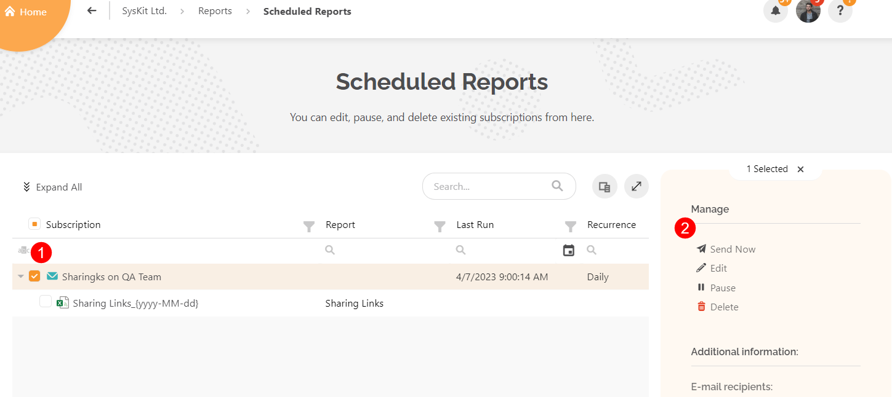
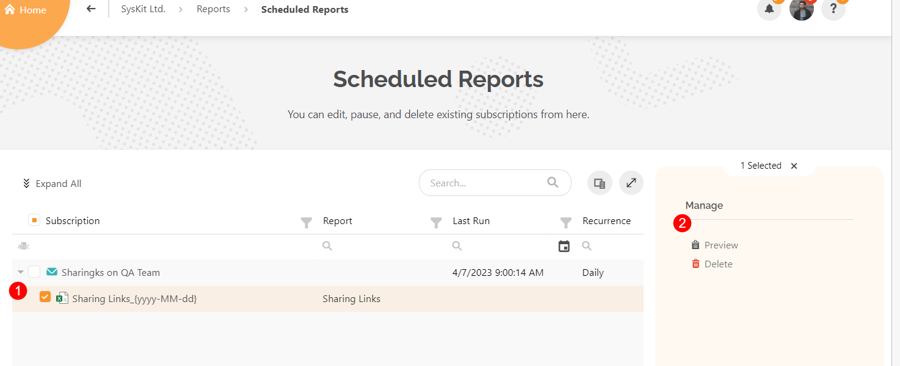
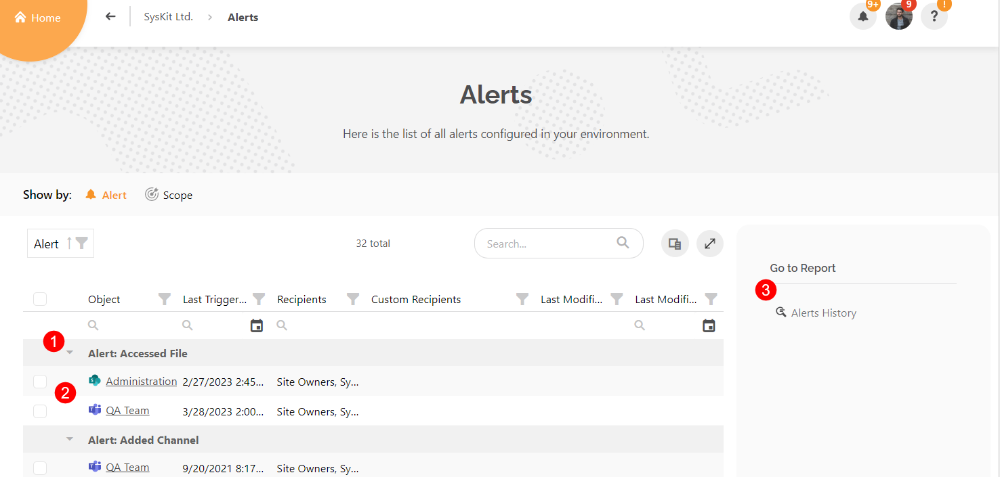
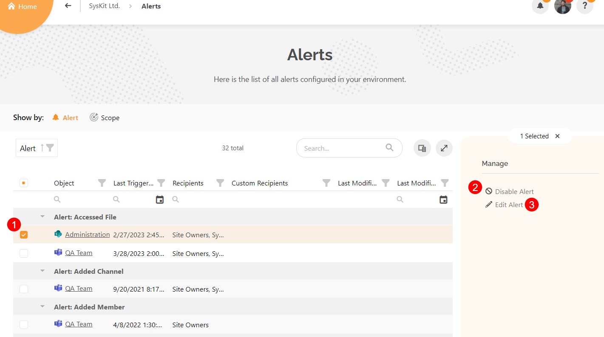

# Schedule Reports

When you manage permissions and resources in your Microsoft 365 tenant, it is important to stay regularly updated on some aspects of your M365 workspaces. 

Rather than generating specific reports manually every time you need them, **SysKit Point allows you to automate report generation** and sends the reports to you at your selected frequency.

Here are a few examples of the way the Scheduled Reports feature can be utilized:
 * **If you want to control what is being shared externally from your workspaces, you can schedule an Externally Shared Content report** and set it up so that you will receive the report daily, weekly or monthly, based on your needs. That way, you can be confident that access to the data inside of your workspaces is well controlled. 
 * **If you want to stay on top of who has access to your workspaces, you can schedule the Permissions Matrix report** and also have it delivered at regular intervals. This helps you identify which users have access to what content and which users might need to be given access or removed from having access. 

With the help of the Scheduled Reports feature, you can:

* **Create Scheduled Reports from views and reports generated in SysKit Point** - all of the filters you define when generating a report or view are then applied when sending the scheduled report
* **Setup automatic sending of PDF or XLSX reports to one or more e-mail recipients** in your tenant
* **Define how often and when to send Scheduled Reports**
* **Create a Subscription - group of Scheduled Reports** that share the same schedule frequency and delivery options


**Please note!**  
You can only set up **Scheduled Reports for workspaces where you are the owner**.


[To learn how to schedule a report, take a look at this article.](../../governance-and-automation/scheduled-reports.md#schedule-a-report)

## Manage Scheduled Reports

**Clicking Scheduled Reports on the home page** of SysKit Point will open the dedicated Scheduled Reports screen with a list of all reports you have scheduled. 

Here you will be able to edit, pause or delete existing subscriptions. 

To make changes to your scheduled report, complete the following:

* **Select the Subscription (1)** for the report
* This will provide **a selection of actions (2) you can complete on the scheduled report** as well as the e-mail where the report is being sent, located on the right side of the screen
* Select one of the following options: 
  * **Send Now** - triggers the delivery of the report immediately
  * **Edit** - lets you edit the subscription made for the report
  * **Pause** - puts a pause on delivering the report included in this description
  * **Delete** - erases the subscription entirely

* **Selecting the report Excel file for the subscription (1)** provides **two different actions (2)** that can be completed on the right side of the screen:
  * **Choose to Preview** the file
  * **Delete** the file

By default, Scheduled Reports are sent once a day. As mentioned, **reports can be delivered via e-mail** or **uploaded to a document library**. The results for both cases are displayed in the pictures below.

To **change the time when the Scheduled Reports are delivered**, the SysKit point admin will need to make changes in the E-mail Settings.

# Setting Alerts

The **Alerts** feature in SysKit Point **allows you to monitor events** that are collected within **Microsoft 365 audit logs**, which means that you can work proactively and **be notified about an action immediately** after it happens.

Be the first one to **learn when a team's privacy or sharing settings have been changed**. Keep an extra close eye on your organization's sensitive collaboration spaces and **monitor the ins and outs through personalized alerts**. 

For example, you can set up an alert to **be notified when content has been externally shared**, or you can monitor relevant events in a particular Site or Team, e.g., Changed File or Folder. If somebody **renamed a very important file** you're working on, you could **get notified immediately** instead of wondering what happened to that file. 

You can **enable alerts on the following screens**:

* **Sites overview screen**
* **Microsoft Teams & Groups overview screen**
* **Users overview screen**
* **Specific SharePoint site**; to monitor events that occurred on the selected site; additionally, when exploring site content, you can set alerts on the following:
  * **Subsite**
  * **Document library**
  * **Folder**
  * **Document**
* **Specific user**; to monitor events caused by a specific user


**Please note!**

You can only set up **Alerts for workspaces where you are the owner** and for users to whom you are the manager.



[To learn how to set up an alert, take a look at this article.](../../governance-and-automation/configure-alerts.md#enabling-and-customizing-alerts)

## Manage Alerts

You can manage the alerts you have set up by **clicking Alerts on the home page** of your SysKit Point. 

This will open the **Alerts screen**, which shows:

* A list of alerts which explains the **type of alert set (1)** and **the workspaces (2)** it is applied to 
* On the right side, there is the option to view **Alerts History (3)**
  * **Selecting Alerts History** opens a screen that shows all the alerts that have previously occurred in your environment 
  * There, you can select an alert, and on the right side of the screen, you have the option to **Mark as Resolved** of **View Details** on the alert

* Navigating back to the Alerts screen, you can also **select a workspace (1)** which provides the following options:
  * **Disable Alert (2)** - disables the alert for the selected workspace
  * **Edit Alert (3)** - lets you edit the alert for the selected workspace
    * If more than one workspace is selected at the same time, you can only disable the alerts for those workspaces

