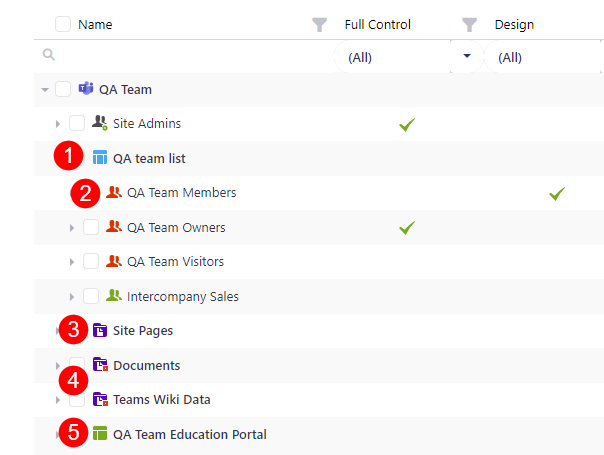
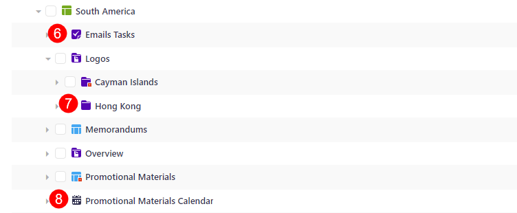
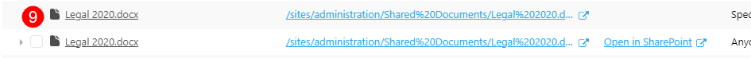
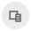

# Syskit Icons Glossary

**Syskit Point contains icons** that are placed next to different types of tracked **workspaces**, **users** and various **group types**. 

This article will **explain all of the available icons** and what they mean, which will help you navigate your Syskit Point as a collaborator. 

## Sites

Selecting **Sites** on the home page of Syskit Point will open a list with all types of workspaces you can access. 

For more explanations of the terms, click on the names to be redirected to the Microsoft 365 articles.

| Icon | Workspace | Description |
|---:|---|---|
||[Microsoft Teams](https://learn.microsoft.com/en-us/microsoftteams/teams-overview)|Teams is the place to have informal chats, iterate quickly on a project, work with team files, and collaborate on shared deliverables.|
||[Microsoft 365 Group](https://learn.microsoft.com/en-us/microsoft-365/admin/create-groups/office-365-groups?view=o365-worldwide)|Microsoft 365 Groups is the foundational membership service that drives all teamwork across Microsoft 365. With Microsoft 365 Groups, you can give a group of people access to a collection of shared resources. |
||[Site](https://learn.microsoft.com/en-us/microsoft-365/community/glossary#site)|SharePoint site keeps content at the center of teamwork, making all types of content easily shareable and accessible across teams.|
||[OneDrive](https://learn.microsoft.com/en-us/sharepoint/onedrive-overview)|OneDrive is a robust but simple-to-use cloud storage platform for small businesses, enterprises, and everything in between.|
||[Yammer](https://learn.microsoft.com/en-us/microsoft-365/community/glossary#yammer)/Viva Engage|Viva Engage brings people together across the organization to connect with leaders, coworkers, and communities. It provides an experience where people can crowdsource answers and ideas, share their work and experience, and find belonging at work.|
||[Private Channel](https://learn.microsoft.com/en-us/microsoftteams/private-channels)| Private channels in Microsoft Teams create focused spaces for collaboration within your teams. Only the users on the team who are owners or members of the private channel can access the channel.|
||[Shared Channel](https://learn.microsoft.com/en-us/microsoftteams/shared-channels)|Shared channels in Microsoft Teams create collaboration spaces where you can invite people who aren't in the team.|

## Microsoft Teams & Groups

Selecting **Microsoft Teams and Groups** on the home page of Syskit Point opens a list of all teams or groups you are the owner or member of. 

For more explanations of the terms, click on the names to be redirected to the Microsoft 365 documentation. 

| Icon | Teams/Group | Description |
|---:|---|---|
||[Microsoft Teams](https://learn.microsoft.com/en-us/microsoftteams/teams-overview)|Teams is the place to have informal chats, iterate quickly on a project, work with team files, and collaborate on shared deliverables.|
||[Microsoft 365 Group](https://learn.microsoft.com/en-us/microsoft-365/admin/create-groups/office-365-groups?view=o365-worldwide)|Microsoft 365 Groups is the foundational membership service that drives all teamwork across Microsoft 365. With Microsoft 365 Groups, you can give a group of people access to a collection of shared resources. |
||[Yammer](https://learn.microsoft.com/en-us/microsoft-365/community/glossary#yammer)/Viva Engage|Viva Engage brings people together across the organization to connect with leaders, coworkers, and communities. It provides an experience where people can crowdsource answers and ideas, share their work and experience, and find belonging at work.|
||[Security Group](https://learn.microsoft.com/en-us/windows-server/identity/ad-ds/manage/understand-security-groups)|Use groups to collect user accounts, computer accounts, and other groups into manageable units. Working with groups instead of with individual users helps you simplify network maintenance and administration.|
||[Mail-Enabled Security Groups](https://learn.microsoft.com/en-us/exchange/recipients-in-exchange-online/manage-mail-enabled-security-groups)|A mail-enabled security group can be used to distribute messages and to grant access permissions to resources in Active Directory.|
||Security Group (On-Premises)|Security group synced to Azure Active Directory from on-premises Active Directory.|
||[Distribution List](https://learn.microsoft.com/en-us/microsoft-365/admin/setup/create-distribution-lists?view=o365-worldwide) | Use distribution lists (sometimes called distribution groups) when you want to send email to group of people without having to type each individual recipient's name.|
||Distribution List (On-Premises)|Distribution list synced to Azure Active Directory from on-premises Active Directory.|

## Users 

Selecting **Users** on the home page of Syskit Point will open a list with all users you are the manager of.  

For more explanations of the terms, click on the names to be redirected to the Microsoft 365 resources. 

| Icon | User | Description |
|---:|---|---|
||[Microsoft 365 User](https://learn.microsoft.com/en-us/microsoft-365/enterprise/manage-microsoft-365-accounts?view=o365-worldwide)|Active Microsoft 365 user in your tenant.|
||[Guest User](https://learn.microsoft.com/en-us/microsoft-365/admin/add-users/about-guest-users?view=o365-worldwide)|Represents various type of Guest users - Guest user that can be found in Azure Active Directory, Ad Hoc Guest user added via sharing link that is not a part of the Azure Active Directory, or a Shared Channel user outside of your company.|
||[Blocked](https://learn.microsoft.com/en-us/microsoft-365/lighthouse/m365-lighthouse-block-user-signin?view=o365-worldwide) or [deleted User](https://learn.microsoft.com/en-us/microsoft-365/admin/add-users/delete-a-user?view=o365-worldwide) |Blocked users cannot sign-in to Microsoft 365 services. Deleted users can be restored within 30 days before their data is permanently deleted. |

## Reports

When generating any of the **Reports**, you can explore workspaces you have access to and all of the content included in those workspaces. 

Below is a table with icons used for the content and various users and groups who can have access to said content.

For more explanations of the terms, click on the names to be redirected to the Microsoft 365 articles. 

### Content

* [**Lists (1)**](https://learn.microsoft.com/en-us/microsoft-365/community/glossary#list)
* [**SharePoint Groups (2)**](https://support.microsoft.com/en-us/office/create-a-team-site-in-sharepoint-ef10c1e7-15f3-42a3-98aa-b5972711777d)
* [**Document Library (3)**](https://learn.microsoft.com/en-us/microsoft-365/community/glossary#document-library)
* [**Broken Inheritance (4)**](https://learn.microsoft.com/en-us/microsoft-365/community/glossary#inheritance)- shown as a **red square on icons** - happens when you break permissions inheritance for a list, library, or survey and then define new permission settings in a way where the list (or library) becomes a parent for items in it; items under that parent now inherit the new permission settings unless the items have uniquely defined permissions
* **Subsites (5)** - with subsites, you can only create sites based on classic templates. If you create a modern team site, it won't be connected to an Office 365 Group because it is a subsite 
* [**Task (6)**](https://support.microsoft.com/en-us/office/tasks-overview-89f8064f-2516-4036-845c-a6953e166fe0)
* [**Folder (7)**](https://learn.microsoft.com/en-us/microsoft-365/community/glossary#folders)
* [**Calendar (8)**](https://support.microsoft.com/en-us/office/introduction-to-the-outlook-calendar-d94c5203-77c7-48ec-90a5-2e2bc10bd6f8)
* [**List Item (9)**](https://learn.microsoft.com/en-us/microsoft-365/community/glossary#list)
* **File** - an object that stores data, information, settings, or commands and can be saved to OneDrive, SharePoint, or Teams

### Users & Groups

## Miscellaneous 

When browsing through reports or Overviews for your workspaces, a few icons repeat and can help you get the most out of your data. They also enable you to change the look of the interface. 

Find a list and explanations for the icons in the table below.

|Icon|Action|Description|
|---:|---|---|
||Search|Report-level search and column search are available.|
||Column Filter|Helps you filter out and show rows with selected column values.|
||Column Chooser|Enables you to add additional columns or remove currently displayed columns from the report.|
||Reset Layout|Enables you to revert the report to show default columns, removing any custom filters you've selected.|
||Expand to Full Screen|Shows the report in Full Screen.|
||Collapse from Full Screen|Returns the report back from Full Screen mode. Navigation, sidebar, and top filter tiles are displayed along the report grid.|
||Collapse Sidebar|Collapsing the sidebar provides more space for the report grid. |
||Expand Sidebar| Expanding sidebar shows available contextual actions next to the report.|
||Expand All|Expand All shows all nested elements on the report. Action is available on a tree-like report where an object has one or multiple sub-objects, such as a folder with files.|
||Collapse All| Collapse All shows first-level elements only. Action is available on a tree-like report where an object has one or multiple sub-objects, such as a folder with files.|