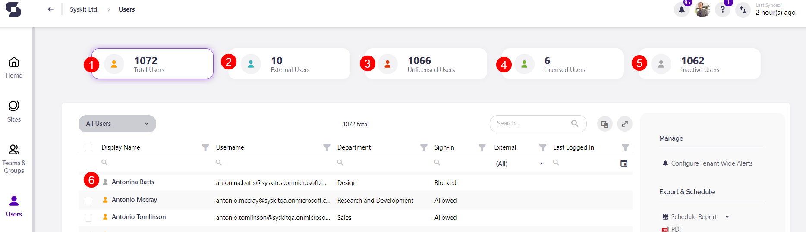

# Syskit Icons Glossary

**Syskit Point contains icons** that are placed next to different types of tracked **workspaces**, **users** and various **group types**. 

This article will **explain all of the available icons** and what they mean, which will help you navigate your Syskit Point as a collaborator. 

## Sites

Selecting **Sites** on the home page of Syskit Point will open a list with all types of workspaces you can access. 

Below is a list and explanation for all the icons, numbered and correlating to the included image. 

For more explanations of the terms, click on the names to be redirected to the Microsoft 365 Glossary.

| Icon | Workspace | Description |
|---:|---|---|
||[Microsoft Teams](https://learn.microsoft.com/en-us/microsoftteams/teams-overview)|Teams is the place to have informal chats, iterate quickly on a project, work with team files, and collaborate on shared deliverables.|
||[Microsoft 365 Group](https://learn.microsoft.com/en-us/microsoft-365/admin/create-groups/office-365-groups?view=o365-worldwide)|Microsoft 365 Groups is the foundational membership service that drives all teamwork across Microsoft 365. With Microsoft 365 Groups, you can give a group of people access to a collection of shared resources. |
||[Site](https://learn.microsoft.com/en-us/microsoft-365/community/glossary#site)|SharePoint site keeps content at the center of teamwork, making all types of content easily shareable and accessible across teams.|
||[OneDrive](https://learn.microsoft.com/en-us/sharepoint/onedrive-overview)|OneDrive is a robust but simple-to-use cloud storage platform for small businesses, enterprises, and everything in between.|
||[Yammer](https://learn.microsoft.com/en-us/microsoft-365/community/glossary#yammer)/Viva Engage|Viva Engage brings people together across the organization to connect with leaders, coworkers, and communities. It provides an experience where people can crowdsource answers and ideas, share their work and experience, and find belonging at work.|
||[Private Channel](https://learn.microsoft.com/en-us/microsoftteams/private-channels)| Private channels in Microsoft Teams create focused spaces for collaboration within your teams. Only the users on the team who are owners or members of the private channel can access the channel.|
||[Shared Channel](https://learn.microsoft.com/en-us/microsoftteams/shared-channels)|Shared channels in Microsoft Teams create collaboration spaces where you can invite people who aren't in the team.|

## Microsoft Teams & Groups

Selecting **Microsoft Teams and Groups** on the home page of Syskit Point opens a list of all teams or groups you are the owner or member of. 

Below is a list and explanation for all the icons, numbered and correlating to the included image. 

For more explanations of the terms, click on the names to be redirected to the Microsoft 365 Glossary. 

| Icon | Teams/Group | Description |
|---:|---|---|
||[Microsoft Teams](https://learn.microsoft.com/en-us/microsoftteams/teams-overview)|Teams is the place to have informal chats, iterate quickly on a project, work with team files, and collaborate on shared deliverables.|
||[Microsoft 365 Group](https://learn.microsoft.com/en-us/microsoft-365/admin/create-groups/office-365-groups?view=o365-worldwide)|Microsoft 365 Groups is the foundational membership service that drives all teamwork across Microsoft 365. With Microsoft 365 Groups, you can give a group of people access to a collection of shared resources. |
||[Yammer](https://learn.microsoft.com/en-us/microsoft-365/community/glossary#yammer)/Viva Engage|Viva Engage brings people together across the organization to connect with leaders, coworkers, and communities. It provides an experience where people can crowdsource answers and ideas, share their work and experience, and find belonging at work.|
||[Security Group](https://learn.microsoft.com/en-us/windows-server/identity/ad-ds/manage/understand-security-groups)|Use groups to collect user accounts, computer accounts, and other groups into manageable units. Working with groups instead of with individual users helps you simplify network maintenance and administration.|
||[Mail-Enabled Security Groups](https://learn.microsoft.com/en-us/exchange/recipients-in-exchange-online/manage-mail-enabled-security-groups)|A mail-enabled security group can be used to distribute messages and to grant access permissions to resources in Active Directory.|
||Security Group (On-Premises)|Security group synced to Azure Active Directory from on-premises Active Directory.|
||[Distribution List](https://learn.microsoft.com/en-us/microsoft-365/admin/setup/create-distribution-lists?view=o365-worldwide) | Use distribution lists (sometimes called distribution groups) when you want to send email to group of people without having to type each individual recipient's name.|
||Distribution List (On-Premises)|Distribution list synced to Azure Active Directory from on-premises Active Directory.|

## Users 

Selecting **Users** on the home page of Syskit Point will open a list with all users you are the manager of.  

Below is a list and explanation for all the icons, numbered and correlating to the included image. 

For more explanations of the terms, click on the names to be redirected to the Microsoft 365 Glossary. 

* **Users (1)**
* [**External Users (2)**](https://learn.microsoft.com/en-us/microsoft-365/admin/add-users/about-guest-users?view=o365-worldwide) - also known as guest users
* **Unlicensed Users (3)** - users without a license assigned
* **Licensed Users (4)** - users with a license assigned
* **Inactive Users (5)** - users that have not logged in for a certain amount of time, such as 60 days
* **Users with Blocked Sign-In (6)** - these are users that have had their log-in privileges removed, for example, an employee that has left the company and no longer has access 

## Reports

When generating any of the **Reports**, you can explore workspaces you have access to and all of the content included in those workspaces. 

Below is a list and explanation for all the icons used for the content, numbered and correlating to the included image. 

For more explanations of the terms, click on the names to be redirected to the Microsoft 365 Glossary. 

* [**Lists (1)**](https://learn.microsoft.com/en-us/microsoft-365/community/glossary#list)
* [**SharePoint Groups (2)**](https://support.microsoft.com/en-us/office/create-a-team-site-in-sharepoint-ef10c1e7-15f3-42a3-98aa-b5972711777d)
* [**Document Library (3)**](https://learn.microsoft.com/en-us/microsoft-365/community/glossary#document-library)
* [**Broken Inheritance (4)**](https://learn.microsoft.com/en-us/microsoft-365/community/glossary#inheritance)- shown as a **red square on icons** - happens when you break permissions inheritance for a list, library, or survey and then define new permission settings in a way where the list (or library) becomes a parent for items in it; items under that parent now inherit the new permission settings unless the items have uniquely defined permissions
* **Subsites (5)** - with subsites, you can only create sites based on classic templates. If you create a modern team site, it won't be connected to an Office 365 Group because it is a subsite 
* [**Task (6)**](https://support.microsoft.com/en-us/office/tasks-overview-89f8064f-2516-4036-845c-a6953e166fe0)
* [**Folder (7)**](https://learn.microsoft.com/en-us/microsoft-365/community/glossary#folders)
* [**Calendar (8)**](https://support.microsoft.com/en-us/office/introduction-to-the-outlook-calendar-d94c5203-77c7-48ec-90a5-2e2bc10bd6f8)
* [**List Item (9)**](https://learn.microsoft.com/en-us/microsoft-365/community/glossary#list)
* **File** - an object that stores data, information, settings, or commands and can be saved to OneDrive, SharePoint, or Teams

## Miscellaneous 

When browsing through reports or Overviews for your workspaces, a few icons repeat and can help you get the most out of your search. 

Below, you will find a list and explanation for those icons, numbered and correlating to the included image. 

* **Column filter (1)** - filter the selected column by selecting specific data from the available list
* **Column chooser (2)** - you can select which metadata columns will show in your report or view
* **Reset Layout (3)** - resets the view back to how it looks by default, removing any custom filters you've selected
* **Expand to full screen (4)**

