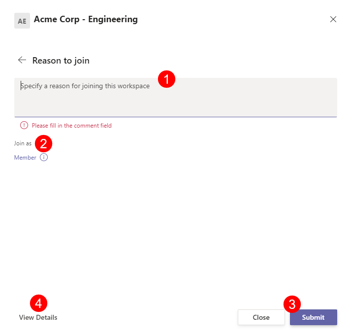

#  Request Access to Workspaces

When the Access Request policy is enabled on Workspaces, users can request to join either as a Member, Owner, or both - depending on the Access Request policy assigned to a particular Workspace. 

To request to join a Workspace, complete the following steps:

 * Open your **Microsoft Teams app** and navigate to the **SysKit Point feature (1)**
 * Under the **Workspaces section (2)**, you can see **My Workspaces and All Workspaces (3)** 
    * My Workspaces show all the workspaces you are already a part of
    * All Workspaces show all Workspaces you can request access to

You can request to join a Workspace by either:
  * Searching through the list of available Workspaces in your **All Workspaces (3)** section
  * Typing in the name of the Workspace you are looking for in the **search bar (4)** , located near the top right corner

Once you locate the Workspace you want to request access to, **click the Ask to Join button (5)**.
  * This can be found on the right side of the screen in the same line as the desired Workspace 

Clicking Ask to Join will open a pop-up screen where you can **enter the reason why you are interested in joining (1)** the specific workspace. 
  * If the Access Request policy allows for multiple access levels, you will be able to choose between Member, Owner, or both, however, if the policy is set to allow just one of the mentioned **access levels (2)**, it will be automatically selected

**Click Submit (3)** once you are ready to submit your request.

On this request form you can also find more information on the workspace by navigating to the bottom and click the **View Details button (4)**.

View Details open an information section for the group which will list the following details:
  * URL of the Workspace
  * E-mail for the Workspace
  * Privacy level
  * Description of the Workspace
  * Owners
  * Members
    * You can search for a specific user in the Workspace by using the search bar, located in the top right of the screen


After you've submitted the request, **it will need to be approved by a third party**. This will depend on who the Access Request policy lists as responsible for approving requests for that Workspace.


