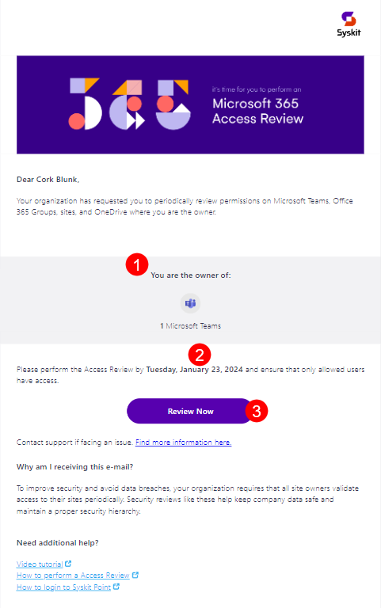
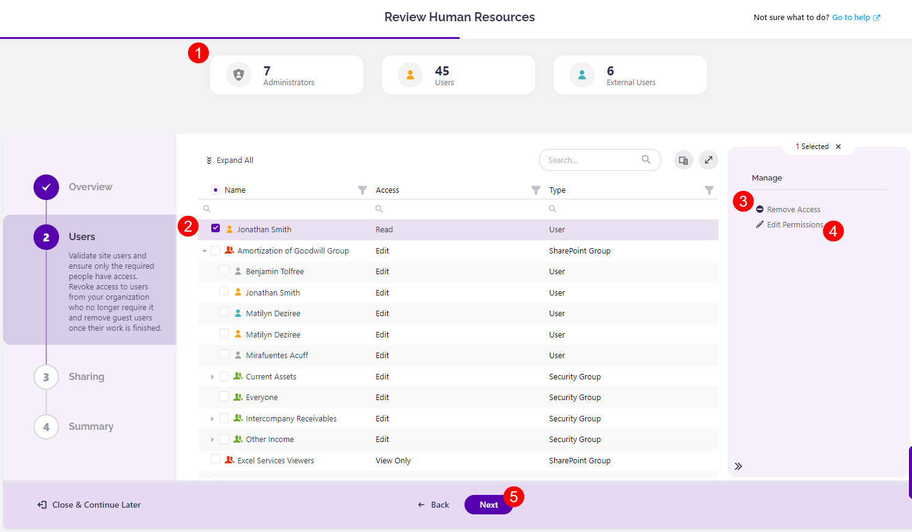
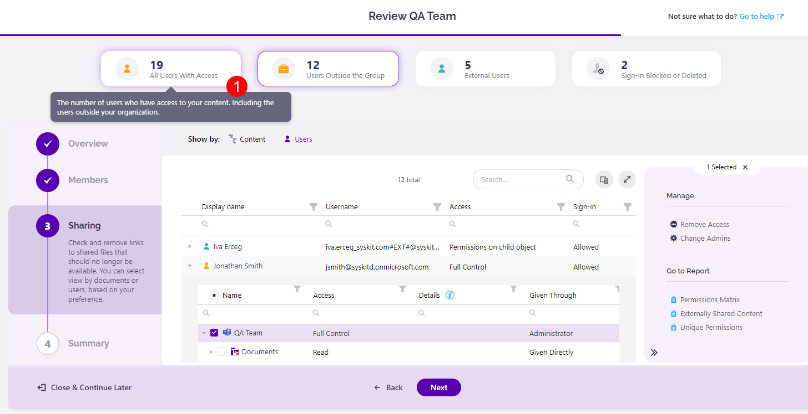
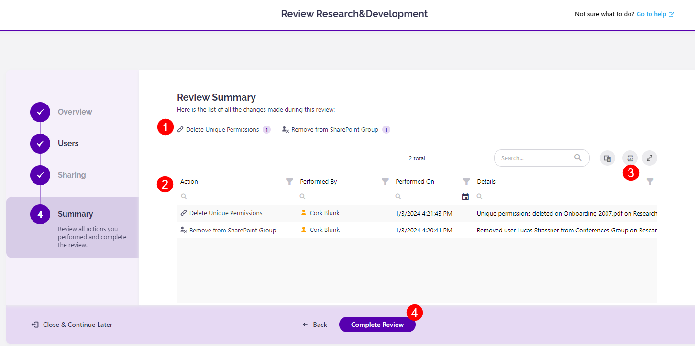
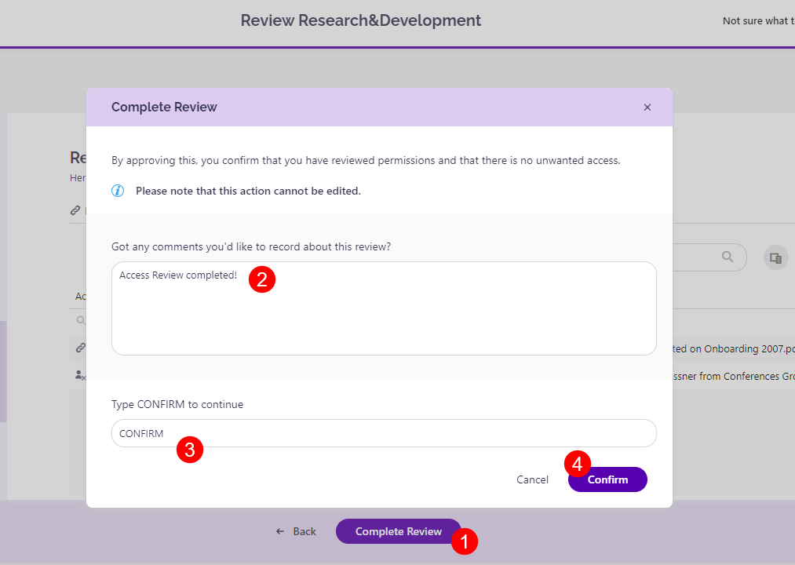
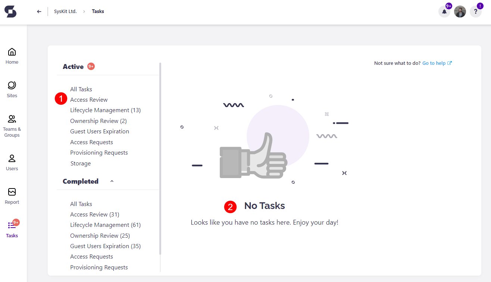
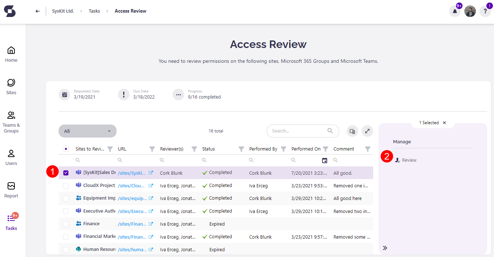
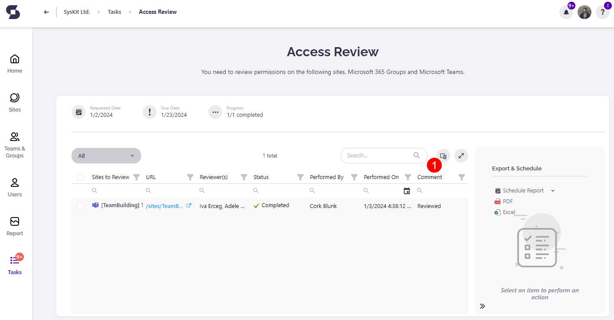
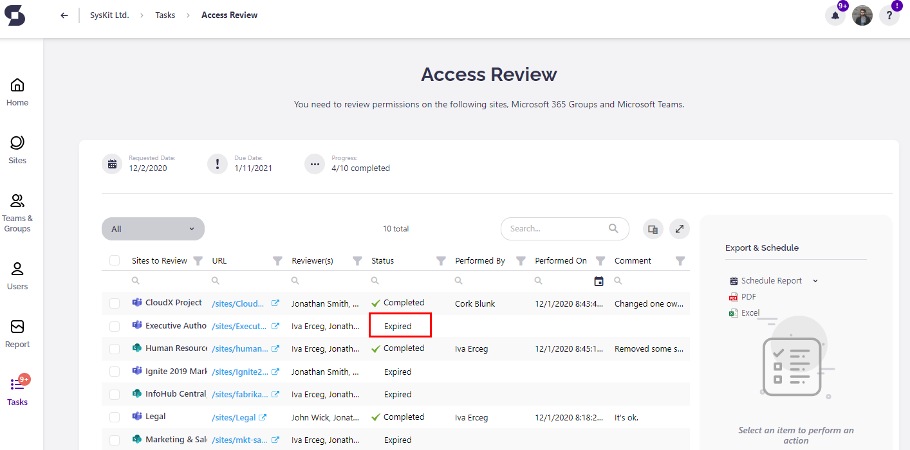

# Workspace Access Review

**Access review**, in the context of the Microsoft 365 environment, is an activity where a person responsible for a Microsoft 365 workspace verifies whether permissions are given to users inside (internal) and outside (external) of the company, and comply with the organizational rules and guidelines.

Some examples of such Microsoft 365 workspaces are:

* Communication site
* Microsoft Team
* Microsoft 365 Group
* OneDrive

The **Access Review task is usually performed by a site owner** and includes:

* **Checking if all users** - internal and external - **have access to the right workspaces.**
  * Either through being given permissions directly or through group memberships.
* **Identify unwanted permissions changes** by checking the audit logs.
* **Checking if only necessary content is externally shared.**
* **Performing correcting actions** to mitigate errors discovered in previous steps.

**Syskit Point** provides the tools the site owners need to perform these tasks.

Two different roles can view The Access Review in Syskit Point:

* **Site Owner with the Syskit Point Collaborator** role assigned in Syskit Point, as described in this article
* [Syskit Point Admin user](../governance-and-automation/permissions-review/monitor-permissions-review.md)

When working with Access Review, Syskit Point Collaborators can **perform the Access Review on workspaces where they are an owner or admin**.

For a site owner or admin assigned to the Syskit Point Collaborators role, the Access Review process begins with an email.

## Access Review Email Request

If you receive a request to review your collaboration space, your organization has most likely **started an automated Access Review policy**. That means that occasionally **you will be asked to review the sites, teams, and groups you're responsible for**.  
 
The importance of doing your part of the work will **determine how overall exposed your organization is to potential security risks or outdated sharing practices**. Syskit Point is here to help you along the way to ensure you do every step as effectively as possible. 

When the Automated Access Review starts, site owners receive an email request to review permissions on their site(s). The email contains the following important data:

* **Number of sites an owner needs to review (1)**; grouped by site type
* **Due date of the Access Review (2)**
* **Review Now button (3)**

The **Review Now** button opens the **Access Review Task** screen once clicked. On this screen, you can find:

* **Sites you are the owner of and need to review**; displayed in the grid.
* **Information regarding the Access Review task (1)**

From here, you can continue and review a site by clicking the **link in the Task column (2)** or **selecting a row (3)** and clicking the **Review action (4)**.

This screen can also be accessed from within Syskit Point by selecting **My Tasks**.

[You can learn more about the My Tasks section by taking a look at this article.](../resolve-governance-tasks/my-tasks.md) 

Once you click to start your Access Review, the next screen is the **Access Review Wizard**, which guides you through the Access Review process.

## Access Review Wizard

The **Access Review Wizard** has three steps when reviewing OneDrive, and four steps when reviewing Microsoft 365 Groups, Microsoft Teams, or sites.

The following steps are available:

* **Overview**
* **Members** (for Microsoft 365 Groups and Microsoft Teams), or **Users** (for sites)
  * This step is not available for OneDrive.
* **Sharing**
* **Summary**

These steps are explained in further detail below.

### Overview Step

This step provides general information about the workspace that you are about to review. The following is displayed:

* **List of owners**, along with the **Change Owners action (1)**
* **General workspace information (2)**
  * **Description**
  * **Creation date and time**
  * **Privacy**
  * **Sharing Policy**
  * **Workspace URL**
  * **Last Activity**
* When the workspace was **last reviewed and by whom (3)**
* **Who else got this task? information (4)**
  * This is located in the top right corner. Hover over it to see the full list of users that received the Access Review task.
* **Close & Continue Later action (5)**
  * Clicking this will close the wizard. It can be accessed again through the My Tasks tile.
* **Start Review button (6)**
  * Clicking this continues the process to the next step of the Access Review Wizard.

The **Close & Continue Later** option is available on all steps on the left-bottom and enables you to leave the Access Review wizard.


**Hint!**\
If you choose to leave the Access Review Wizard all performed actions take effect immediately and will be visible in the Summary step at the end of the Access Review.


### Members/Users Step

The **Members step** is the second one that shows **when reviewing Microsoft 365 Groups or Microsoft Teams**.

Default members are the **general users distributed into several groups that include members, visitors, and owners**. All other users that are present in your workspace have access that in some way does not fit the default owner, member, or visitor group.  

The following options are available:

* **Top filters (1)**; they are helpful when viewing a specific group of users in the workspace:
  * **Added users** - users that have now been added to the workspace
  * **Removed users** - users that have now been removed from the workspace
  * **Owners** - the owners of the workspace
  * **Members** - current members of the workspace
  * **Guests** - users that do not usually belong to your organization or team

* **When a user is selected (2)**, the following actions are available:
  * **Change to Member (3)** 
  * **Remove from Group (4)**
* **Click Next (5)** to continue to the next step of the Access Review Wizard.

The **Users step** is available **when reviewing sites**. The following options are available here:

* **Top filters (1)**; choose to view only a certain type of users on site:
  * **Administrators**
  * **Users with permissions on the site level**
  * **External Users**
* **When a principal - user, SharePoint group, or a security group - is selected (2)**; additional options are available:
  * **Remove Access (3)**
  * **Edit Permissions (4)**
* The **Grant Access** action is available when no users are selected
* **Click Next (5)** to continue to the next step of the Access Review Wizard


**Please note!**\
Members/Users step is not available when reviewing permissions for OneDrive.


### Sharing Step

The **Sharing step** provides a simple yet detailed overview of all shared content. Multiple filters and views enable you to find shared content that might need to be shared with guest users outside your organization and lets you review that decision.

* **Top filters (1)** enable you to filter content by sharing type:
  * **All Shared Content**; shows content that has been shared via sharing links or through direct access.
    * Use this when wanting to see everything that was shared.
  * **Shared Outside the Group**; selected by default.
    * Use it to find content that was shared with users that are not a part of the Microsoft 365 Group or Microsoft Team you are reviewing.
    * This can help you determine who should have access to what; for example, a person from your HR shouldn't have access to financial information, or the external consultant that should only have access to a subset of files.
  * **Shared Externally**; shows content shared with specific people outside the organization.
  * **Shared With Anyone**; shows content shared with anyone via sharing links.
    * Make sure to examine this content carefully to avoid potential security risks.
* **Views (2)** enables sharing from two different perspectives; it can be grouped by:
  * **Content**
  * **Users**
* **Advanced Filters (3)**; by default, only the content with unique permissions is visible down to the document level. With the help of the **Advanced Filters**, you can choose to:
  * **View content without unique permissions**
  * **View content down to a specific level**
    * For example, down to the document library or list level.
* **When a row is selected (4)**, available actions are displayed in the **side panel (5)**.
* **When no rows are selected**, the **Permissions Changes report link** is visible.
* **Click Next (6)** to continue to the final step of the Access Review Wizard.

**Actions displayed in the side panel depend on the type and state of the selected object**. A **file with unique permissions (1)** is selected in the image below. The following **actions are available** in that case:

* **Grant access (2)**
* **Delete Unique Permissions (3)**

If an **object with permission inheritance is selected**, the **Stop Inheriting Permissions action** is available in the side panel.

By switching to the **Users view**, the **top filters** are changed accordingly and enable filtering out specific types of users.

The descriptions for all filters can be found by **hovering your mouse over the filter tile (1)**.

In the example above, Microsoft Team was reviewed.

**Filters will slightly differ when you review sites or OneDrive** since there is no Microsoft 365 Group involved whose members would have access by default. Due to that, the Users Outside the Group filter is not applicable.

Instead, the **Access on Child Objects filter is given**, showing only users that don't have access on a site level but have access to a specific file or folder.

### Summary Step

The **Summary step** gives a recap of all actions performed during the Access Review.

Here, the following is displayed:

* **Total number of performed actions grouped by action name (1)**.
* **Grid with all actions (2)**; includes information on who performed them, when, and other details.
* **Export button (3)**; exports the data in the grid into an XLSX file.
* **Complete Review button (4)** that opens the **Complete Review dialog**.

## Complete Access Review Task

When the review is completed and if you have detected no security risks to the site, **Complete the Access Review**.

To complete the Access Review, take the following steps:

* **Click the Complete Review button (1)**; on the bottom of the Summary step, the **Complete Review dialog opens**.
* **Leave a comment**; the changes made to ensure the site is secure can be described here.
  * The comment is visible to all site owners and Syskit Point Admins.
* **Type CONFIRM (3)** in the appropriate field.
* **Click the Confirm button (4)**.


**Please note!** The **Complete Review** action cannot be undone or edited.


After completing the Access Review for a site, the **Review Completed** dialog opens, confirming the completion. Click the **Close Review** button to leave the screen and navigate to the Access Review screen, where the sites needing review can be found.

When the Access Reviews for all sites you are the owner of have been finalized, the **Access Review task will be shown as completed.**

On the **My Tasks** screen, under **Active Access Review (1)**, the **No Tasks (2)** message is displayed.

The **completed Access Review task (3)** can be found in the **Completed section (4)**, and access task details by clicking the **See Task (5)** button.

This opens the Access Review screen for the completed Access Review, where these options are available:

* **Select a site (1)**
* **Click the Review button (2)** to open the **Review Summary report**

The **Review Summary** report shows a detailed log of actions performed during the Access Review process and can be **exported to an XLSX file (1)**.

## Expired Reviews

After ten days, the Access Review cycle ends.

Syskit Point automatically changes the status of all uncompleted site reviews to **Expired**.

They can be found on the **Access Review** task screen.

After the Access Review is completed, expired tasks can no longer be finalized.

With that, **the first Access Review cycle is concluded**.

The Access Review cycle will repeat based on the schedule defined by the Syskit Point Admin or when manually requested.

## Complete Access Review Tasks

* **Watch this short video for a quick start on Access Review tasks in Syskit Point**.



## Related Topics

For information on performing **Lifecycle Management tasks as a Syskit Point Collaborator**, take a look at the following article:

* [Perform Lifecycle Management Tasks](lifecycle-management.md)