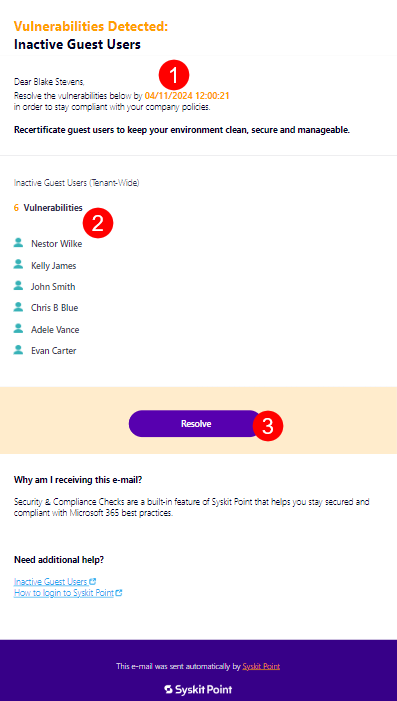
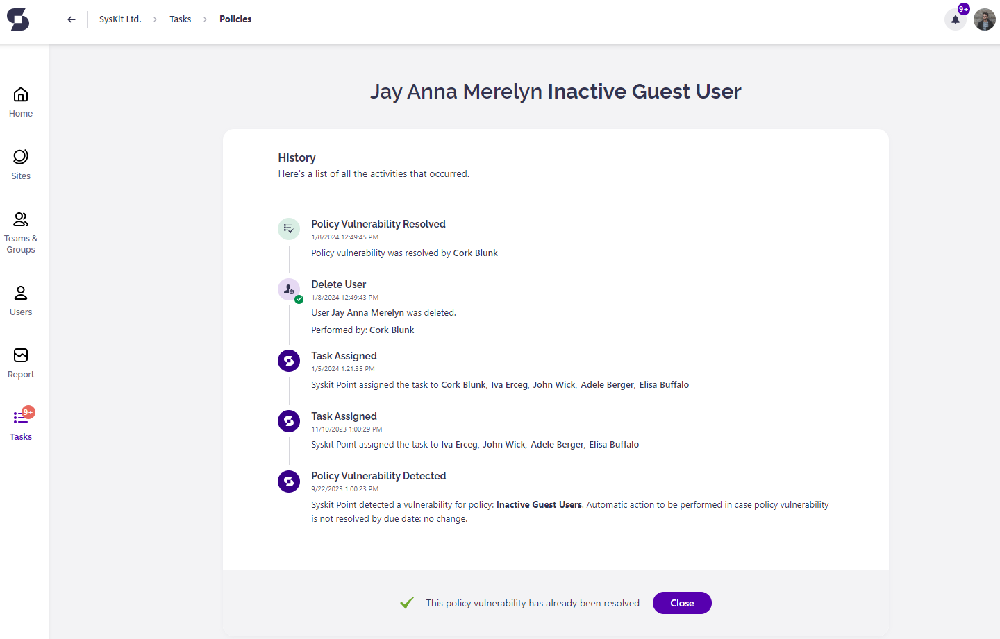

# Inactive Guest Users

**This article shows how you can resolve the Inactive Guest Users policy vulnerability** when Syskit Point detects that a guest user is inactive. 

This policy helps you ensure there are no inactive guest users with access to sites, teams, or groups. 


Syskit Point Administrators can [decide whether the guest user validation will be performed periodically or when Syskit Point detects that a guest user is inactive](../../governance-and-automation/automated-workflows/guest-users-expiration-admin.md). 


In both cases, Syskit Point will send you an e-mail to revalidate the guest user’s access.

## Inactive Guest Users E-mail

Syskit Point sends an e-mail that includes all of the detected inactive guest users. The e-mail is sent to the guest users’ managers or other users defined as points of contact in the Inactive Guest Users policy. 

You can find the following information in the e-mail:

* **Due date to resolve the policy vulnerability (1)**; you have 15 workdays to resolve the policy vulnerability
* **A list of guest users whose access should be revalidated (2)**
* **Resolve button (3) that takes you to Syskit Point**, where you can resolve the policy vulnerability

**Click the Resolve button to open the policy vulnerability task** in Syskit Point.

## Inactive Guest Users Task

Along with the e-mail, Syskit Point creates a policy vulnerability task that provides you with information and actions needed to resolve the policy vulnerability. 

The following information is available on the task screen:

* **Guest User Information (1)**; here, you can find **information about the guest user**, most importantly, the time they last signed into Microsoft 365
* **Remove button (2)**; when clicked, you need to enter a comment and confirm the action, which **results in the guest user being deleted in the Azure Active Directory**
* **Keep button (3)**; when clicked, you need to enter a comment and confirm the action, which **results in the guest user keeping the access**


**Please note!**
When keeping the guest user's access, **it is kept for the next 90 days by default**.


## Guest Users Task Resolved

**After you resolve the policy vulnerability, the History screen opens**, giving you an overview of actions performed within the workflow.

**After you resolve the policy vulnerability**, **you will also receive a confirmation e-mail** showing the following information:
* **Guest user whose access was removed or revalidated**
* **Result of the validation**; showing if the access was renewed or removed
* **View Details button that opens the History screen in Syskit Point**, showing all the information about actions performed in the workflow
