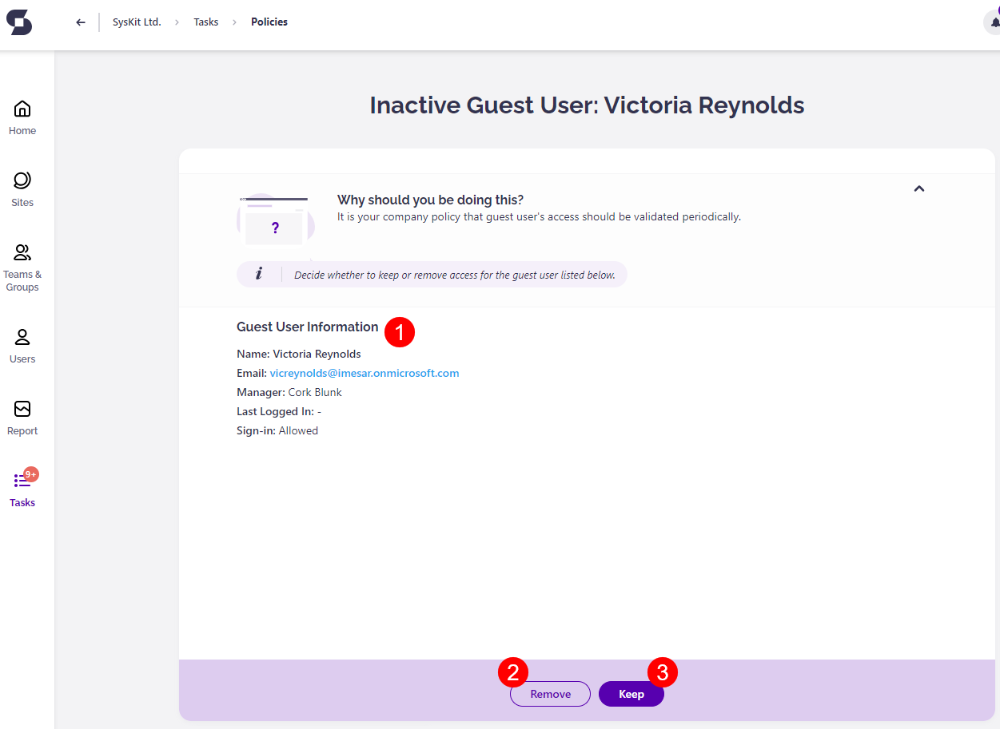

# Guest Users Expiration

**This article shows how you can resolve a Guest Users Expiration policy violation** when Syskit Point detects that a guest user is inactive or if the renewal process is defined to be performed periodically. 

This policy helps you ensure there are no inactive guest users with access to sites, teams or groups. 

If you are the manager of the guest user with expired access, you're responsible for resolving the task. Through this task, you can decide whether a guest user's access should be removed or extended.


Syskit Point Administrators can [decide whether the guest user validation will be performed periodically or when Syskit Point detects that a guest user is inactive](../../governance-and-automation/automated-workflows/guest-users-expiration-admin.md). 


In both cases, Syskit Point will send you an e-mail to revalidate the guest user’s access.

## Guest User Access Renewal E-mail

Syskit Point sends a bulk e-mail that includes all of the guest users that the policy violation detected. The e-mail is sent to the guest users’ managers or other users defined as points of contact in the Guest Users Expiration policy. 

You can find the following information in the e-mail:

* **Due date to resolve the policy violation (1)**; you have 15 workdays to resolve the policy violation
* **A list of guest users whose access should be revalidated (2)**
* **Resolve button (3) that takes you to Syskit Point**, where you can resolve the policy violation

**Click the Resolve button to open the policy violation task** in Syskit Point.

## Guest Users Expiration Task

Along with the bulk e-mail, Syskit Point creates a policy violation task that provides you with information and actions needed to resolve the policy violation. 

The following is available on the task screen:

* **Guest User Information (1)**; here, you can find **information about the guest user**, most importantly, the time they last signed into Microsoft 365
* **Remove button (2)**; when clicked, you need to enter a comment and confirm the action, which **results in the guest user being deleted in the Azure Active Directory**
* **Keep button (3)**; when clicked, you need to enter a comment and confirm the action, which **results in the guest user keeping the access**


**Please note!**
When keeping the guest user's access, the following is expected, depending on the policy settings:
* **If the guest user access is renewed periodically**, the **guest user keeps the access until the next renewal is detected**; this happens **every 3 months by default** but can be configured by Syskit Point Admins
* **If the guest user access renewal is required when a guest user is detected to be inactive**, the **guest user keeps the access for the next 20 days by default**; Syskit Point Admins can configure this value as well


## Guest Users Task Resolved

**After you resolve the policy violation, the History screen opens**, giving you an overview of actions performed within the workflow.

**After you resolve the policy violation**, **you will also receive a confirmation e-mail** showing the following information:
* **Guest user whose access was removed or revalidated**
* **Result of the validation**; showing if the access was renewed or removed
* **View Details button that opens the History screen in Syskit Point**, showing all the information about actions performed in the workflow
