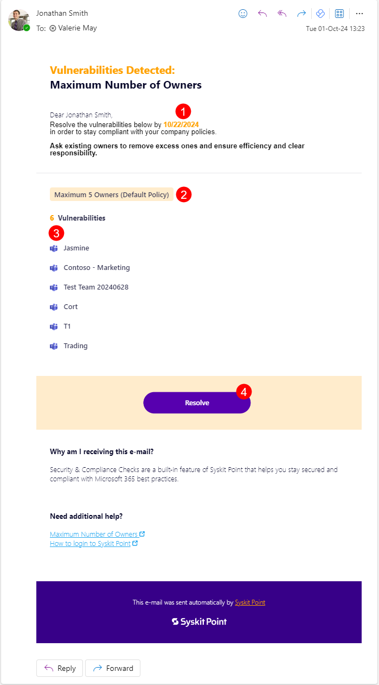

# Maximum Number of Owners

**This article shows how Microsoft Teams and Microsoft 365 Group owners can resolve a policy vulnerability regarding the maximum number of owners** allowed by the organization’s policy defined in Syskit Point.

This task helps you identify which sites, teams or groups have more than 5 owners. To avoid risks associated with having too many owners assigned, it's important to stay up to date with all current owners. 


By default, **Syskit Point suggests that Microsoft Teams and Microsoft 365 Groups should have no more than 5 owners** since no one feels accountable for access and content management if there are too many owners.
[Syskit Point Administrators can change the maximum number of allowed owners to fit the organization’s policies.](set-up-policies.md)


When Syskit Point detects that Microsoft Teams or Microsoft 365 Groups, which you are the owner of, have too many owners, **you will receive an e-mail to resolve the policy vulnerability**.

## Policy Vulnerability E-mail

**Syskit Point sends an e-mail to existing owners** when Microsoft Teams or Microsoft 365 Groups are detected that have more owners than defined in the policy settings. 

You can find the following information in the e-mail:
* **Maximum number of allowed owners (1)**
* **Microsoft Teams** or **Microsoft 365 Group where the policy vulnerability was detected (2)**
* **Due date to resolve the policy vulnerability (3)**; you have 15 workdays to resolve the policy vulnerability
* **Resolve button (4) that takes you to Syskit Point**, where you can resolve the policy vulnerability

**Click the Resolve button to open the policy vulnerability task** in Syskit Point.

## Policy vulnerability Task

Along with the e-mail, Syskit Point creates a policy vulnerability task that provides you with all information and actions needed to resolve the policy vulnerability. 
The following is available on the task screen:
* **Search (1)**, which can help you to find existing owners
* **Change to Member action (2)**; once clicked, an appropriate **message appears next to the former owner along with the Undo action (3)** 
* **Let other owners decide button (4)**, which will **result in you staying an owner and completing your policy vulnerability task** while **leaving the task for other owners** to decide whether they want to renounce their ownership or change other owners to members
* **Resolve button (5)** that gets **enabled when you change owners to members to comply with the company policy** regarding the maximum number of owners; **once clicked, a dialog opens, enabling you to input a comment and resolve the policy vulnerability**


**Please note!**  
**When you click an action within the policy vulnerability task, think of it as a preview** of what will happen after resolving the policy vulnerability.
**All actions that change users' access are performed after you click the Resolve button**. 


## Policy Vulnerability Resolved 

**After you resolve the policy vulnerability, the History screen opens**, giving you an overview of all actions performed within the workflow.

**After you resolve the policy vulnerability, a confirmation e-mail is also sent to owners**, showing the following information:
* **Microsoft Teams or Microsoft 365 Group where an owner resolved the policy vulnerability (1)**
* **Who and when (2) resolved the policy vulnerability**
* **View Details button (3)** that **opens the History screen** in Syskit Point, showing all the activities that were performed within the workflow

