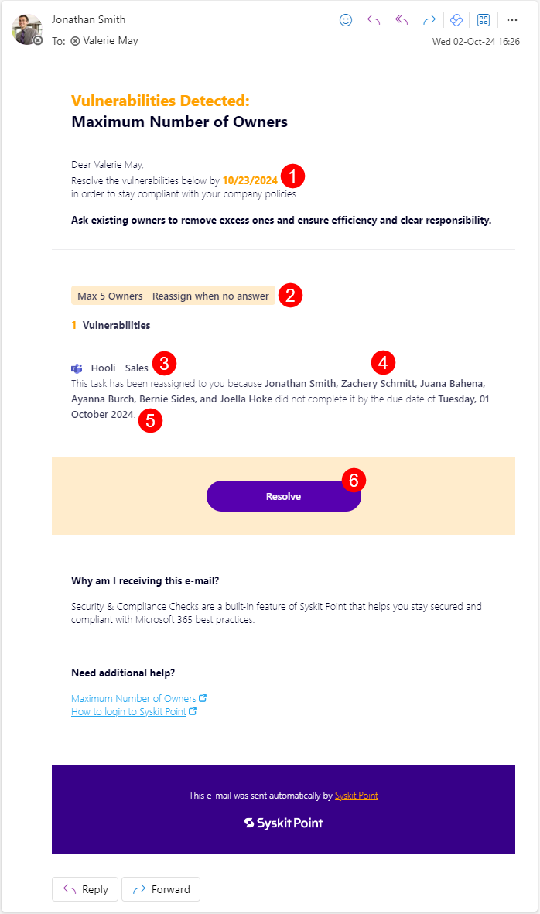

# Maximum Number of Owners

**This article shows how Microsoft Teams and Microsoft 365 Group owners can resolve a policy vulnerability regarding the maximum number of owners** allowed by the organization’s policy defined in Syskit Point.

This task helps you identify which teams or groups have more than 5 owners. To avoid risks associated with having too many owners assigned, it's important to stay up to date with all current owners. 


By default, **Syskit Point suggests that Microsoft Teams and Microsoft 365 Groups should have no more than 5 owners** since no one feels accountable for access and content management if there are too many owners.
[Syskit Point Administrators can change the maximum number of allowed owners to fit the organization’s policies.](set-up-policies.md)


When Syskit Point detects that Microsoft Teams or Microsoft 365 Groups, which you are the owner of, have too many owners, **you will receive an e-mail to resolve the policy vulnerability**.

## Policy Vulnerability E-mail

**Syskit Point sends an e-mail to existing owners** when Microsoft Teams or Microsoft 365 Groups having more than the defined maximum number of owners are detected. The e-mail includes a list of all workspaces where the policy vulnerability was detected.

You can find the following information in the e-mail:
* **Due date to resolve the policy vulnerability (1)**; you have 15 workdays to resolve the policy vulnerability
* **The name of policy (2)** the vulnerability is detected for
* **Microsoft Teams** or **Microsoft 365 Groups where the policy vulnerability was detected (3)**
* **Resolve button (4) that takes you to Syskit Point**, where you can resolve the policy vulnerability

**Click the Resolve button to open the policy vulnerability task** in Syskit Point.

## Policy Vulnerability Task

Along with the e-mail, Syskit Point creates a policy vulnerability task that provides you with all the information and actions needed to resolve the policy vulnerability. 
The following are available on the task screen:
* **Search (1)**, which can help you to find existing owners
* **Change to Member action (2)**; once clicked, an appropriate **message appears next to the former owner along with the Undo action (3)** 
* **Let other owners decide button (4)**, which will **result in you staying an owner and completing your policy vulnerability task** while **leaving the task for other owners** to decide whether they want to renounce their ownership or change other owners to members
* **Resolve button (5)** that gets **enabled when you change owners to members to comply with the company policy** regarding the maximum number of owners; **once clicked, a dialog opens, enabling you to input a comment and resolve the policy vulnerability**


**Please note!**  
**When you click an action within the policy vulnerability task, think of it as a preview** of what will happen after resolving the policy vulnerability.
**All actions that change users' access are performed after you click the Resolve button**. 


## Reassigned Task

Syskit Point admins can set the vulnerability tasks to be reassigned in case the workspace owners do not resolve the task by the due date. Tasks can be reassigned to:

* **Manager of Reviewer**
* **Syskit Point Administrators**
* **Custom Recipients**

If you are among the selected roles or users, when the due date for the initially created task passes, and the owners did not resolve the task, you will receive an e-mail stating the following:

* **The date (1)** until which you should resolve the policy
* **The name of policy (2)** the vulnerability is detected for
* **The name of the workspace(s) (3)** where the vulnerability was detected
* **The name of the workspace owner(s) (4)** that did not resolve the task
* **The expired date (5)** on which the task was due
* **The Resolve button (6)** to resolve the task in Syskit Point

**Clicking the Resolve button (6)** opens Syskit Point and the **Task screen**, where you can choose how to resolve the task.

## Policy Vulnerability Resolved 

**After you resolve the policy vulnerability, the History screen opens**, giving you an overview of all actions performed within the workflow.

**After you resolve the policy vulnerability, a confirmation e-mail is also sent to owners**, showing the following information:
* **Microsoft Teams or Microsoft 365 Group where an owner resolved the policy vulnerability (1)**
* **Who and when (2) resolved the policy vulnerability**
* **View Details button (3)** that **opens the History screen** in Syskit Point, showing all the activities that were performed within the workflow

