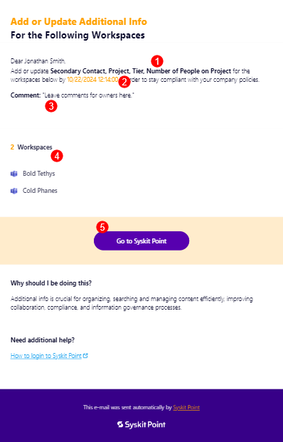
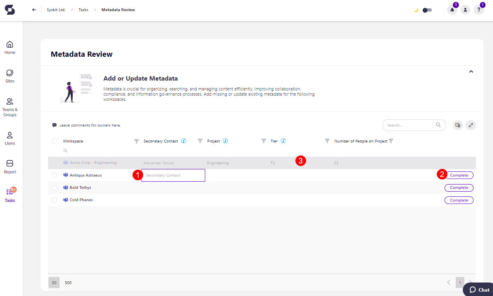
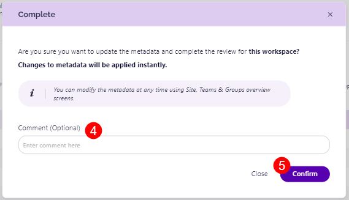
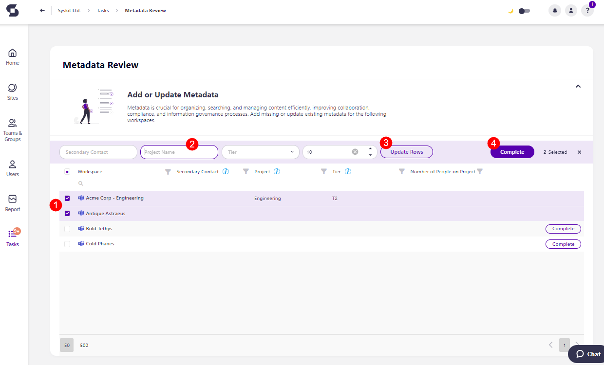

# Metadata Review 

Metadata is, simply put, data that describes other data, and is often the easiest way to structure and manage all of your workspace's content. 

However, outdated, incorrect, or missing metadata can also lead to misfiled information and inefficient sorting, making it difficult to manage your workspace successfully. 

That’s why it’s important for workspace owners to review and update metadata regularly. Regularly performing Metadata Reviews ensures that your content is accurate and relevant, ultimately improving productivity and governance.

Here's how the Metadata Review process works.

## Metadata Review Tasks 

After Syskit Point administrators determine which metadata can be edited by which users, they can request a Metadata Review from workspace owners. Admins select the workspace(s) and metadata they want reviewed and ask owners to perform the review. 

Workspace owners receive an **e-mail** stating that your company requires you to add or update additional information for the selected workspaces. The e-mail contains the following information: 

* **Name of the metadata (1)** that needs a review
* **The date (2)** until which you should perform the review
* **The comment (3)** that was left by admins when requesting the review; if any comment was left
* **The names of the workspaces (4)** where the review was requested on
* **Go to Syskit Point button (5)** that opens the task in Syskit Point


**Please note:** You can also access the task by going to Syskit Point > **Tasks** > Active > **Metadata Review**. 



## Resolve Metadata Review Tasks 

The Metadata Review task screen shows you the list of workspaces that the review was requested for, and the columns you'll see are the metadata you are requested to review. 

You can change the metadata for each workspace **individually** if the metadata information between the workspaces differs.

If the workspaces should have the same metadata information included, you can **select more than one workspaces** and update the metadata across the selected workspaces in bulk. 

When individually changing the metadata: 

* **Click the space in the column (1)** and an editable rectangle appears where you can enter a new value, keep the current value, or edit the current value
* **Click the Complete button (2)** to complete the review for the workspace
  * When the review is completed, **that workspace fades to a gray color (3)**, and **cannot be modified** anymore
* The **Complete pop-ups** appears, where you can **enter a comment (4)** that explains the actions you took and **click Confirm (5)** to finalize the changes

When changing the metadata in bulk: 

* **Select the workspaces (1)** that you want to add or change the metadata for
* **Enter the metadata information (2)** in the provided boxes
* **Click the Update Rows button (3)** and the information you entered is filled in for the selected workspaces
* **Click the Complete button (4)** to complete the review for the workspaces
* The **Complete pop-ups** appears, where you can enter a comment that explains the actions you took and **click Confirm** to finalize the changes
* After clicking confirm, **those workspaces fade to a gray color**, and **cannot be modified** anymore


**Please note the following:**
* Owners will receive a new task and e-mail notification.
* Owners will be able to update the metadata.
* Owners will have **15 days** to complete this task.
* After a **Metadata Review is completed or if it is overdue, administrators receive an e-mail** informing them of that 1 day after completion.

