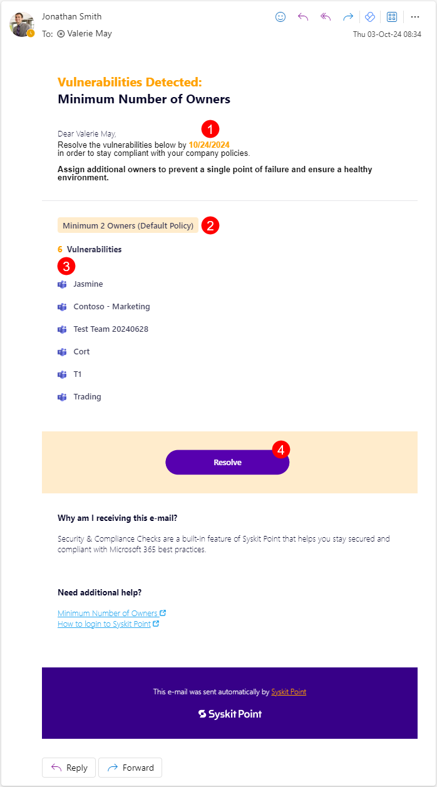
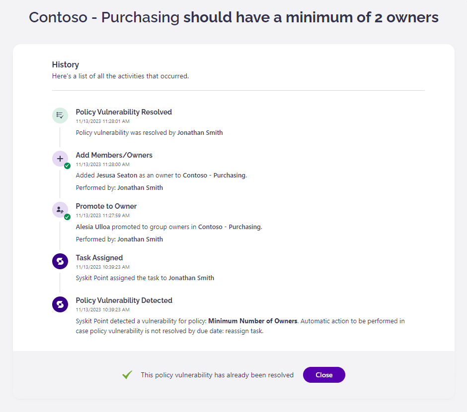

# Minimum Number of Owners

**This article shows how Microsoft Teams and Microsoft 365 Group owners can resolve a policy vulnerability regarding the minimum number of owners** required by the organization’s policy defined in Syskit Point. 

This task helps you identify which Microsoft Teams & Groups don't have the required number of owners. You will be notified only for the teams or groups where you are the owner.


By default, **Syskit Point suggests that Microsoft Teams and Microsoft 365 Groups should have at least 2 owners** so that if one owner leaves, Microsoft Teams and Microsoft 365 Groups are not left without an owner. 
[Syskit Point Administrators can change the minimum number of required owners to fit the organization’s policies.](set-up-policies.md)


When Syskit Point detects that the Microsoft Teams or Microsoft 365 Groups you are the owner of do not have a minimum number of owners predefined by your organization’s policies, **you will receive an e-mail to resolve the policy vulnerability**.

## Policy Vulnerability E-mail

**Syskit Point sends an e-mail to existing owners** when there are Microsoft Teams or Microsoft 365 Groups with less than the minimum number of owners assigned, as defined in the policy settings. The e-mail includes a list of all workspaces where the policy vulnerability was detected.

You can find the following information in the e-mail:
* **Due date to resolve the policy vulnerability (1)**; you have 15 workdays to resolve the policy vulnerability
* **Microsoft Teams** or **Microsoft 365 Group where the policy vulnerability was detected (2)**
* **Resolve button (3) that takes you to Syskit Point**, where you can resolve the policy vulnerability

**Click the Resolve button to open the policy vulnerability task** in Syskit Point.

## Policy Vulnerability Task

Along with the e-mail, **Syskit Point creates a policy vulnerability task** that provides you with all the information and actions needed to resolve the policy vulnerability. 
The following are available on the task screen:
* **List of current owners (1)**
* **Search (2)**, which can help you to find existing members
* **Promote to Owner action (3)**; once clicked, an **appropriate message appears next to the promoted user along with the Undo action (4)**
* **Add New Owner action (5)**; to add a new owner, **start typing the user's name in the input field**; once you select a user, **confirm your addition by clicking the Add New Owner link**; once clicked, an **appropriate message is displayed for the user, along with the Undo action (6)**
* **Accept Risk button (7)** that enables you to disregard the company policy and accept the risk in case there is a valid reason to do so
* **Resolve button (8)** that gets **enabled when you promote members to owners or add new ones to comply with the company policy** regarding the minimum number of owners; **once clicked, a dialog opens, enabling you to input a comment and resolve the policy vulnerability**


**Please note!**  
**When you click an action within the policy vulnerability task, think of it as a preview** of what will happen after resolving the policy vulnerability.
**All actions that change users' access are performed after you click the Resolve button**. 


## Reassign to Manager

If the policy is set as **Reassign Task** and the workspace owners do not resolve the task by the due date, you can select to have it **reassigned to the manager(s)** of the workspace owner(s).

In that case, when the due date for the task passes, the Manager of the owner(s) receives an email stating the following:

* **The name of policy** the vulnerability is detected for
* **The name of the workspace(s)** where the vulnerability was detected
* **The name of the workspace owner(s)** that did not resolve the task
* **The expired date** on which the task was due
* **The Resolve button** to resolve the task in Syskit Point

**Clicking the Resolve button** opens Syskit Point and the **Task screen**, where the manager can choose how to resolve the task. 

## Policy Vulnerability Resolved 

**After you resolve the policy vulnerability, the History screen opens**, giving you an overview of all actions performed within the workflow.



**Please note:** By default, the Minimum Number of Owners Orphaned policy vulnerability is detected when there are less than 2 active owners assigned to a workspace. If there are no active owners assigned to a workspace, the [Orphaned Workspaces](../automated-workflows/orphaned-resources-admin.md) vulnerability is detected instead. 

If 1 owner is assigned to a workspace when resolving the Orphaned Workspaces vulnerability, Syskit Point will then detect the Minimum Number of Owners vulnerability.



**After you resolve the policy vulnerability, an e-mail is also sent to owners**, showing the following information:
* **Microsoft Teams or Microsoft 365 Group where an owner resolved the policy vulnerability**
* **Who and when resolved the policy vulnerability**
* **View Details button** that **opens the History screen** in Syskit Point, showing all the activities that were performed within the workflow


**Please note!**  
**In case you decide to click Accept Risk for the policy vulnerability**, **Microsoft Teams** or **Microsoft 365 Groups where the policy vulnerability was detected is considered compliant for the duration of time you selected when accepting the risk**. Syskit Point will not send policy vulnerability e-mails or create policy vulnerability tasks for this workspace during this timeframe.


