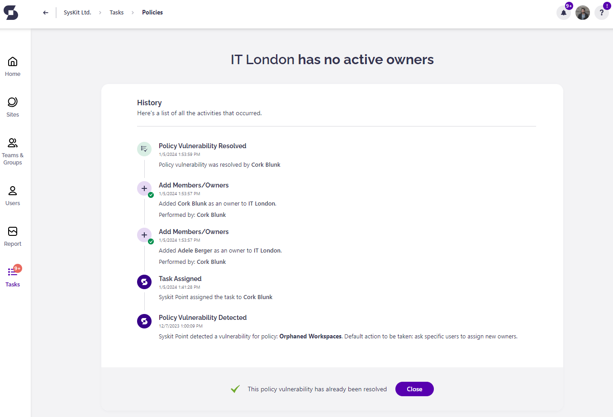

# Orphaned Workspaces

**This article shows how you can resolve the Orphaned Workspaces policy vulnerability** when Syskit Point detects that Microsoft Teams and Microsoft 365 Groups don’t have active owners. 

When a team no longer has an active owner, there is no longer a person on the other end of an automated governance policy which means the site could potentially have shared files that are outdated and pose a serious security risk. 


Syskit Point Administrators can [decide whether specific users will be responsible for assigning new owners or existing team/group members will suggest new owners](set-up-policies.md).
The first option is a **1-stage process** where the policy vulnerability is resolved when you promote members to owners or add new owners.
The second option is a **2-stage process** where after the members suggest new owners, an additional step is required from defined users to approve the suggestion. 


In both cases, Syskit Point will send you an e-mail that will guide you through the process of resolving the policy vulnerability. 

Below, both cases are separately explained in more detail.

## 1-Stage Process

### Policy Vulnerability E-Mail

Syskit Point sends you a bulk e-mail that includes all of the workspaces where the policy vulnerability was detected, **asking you to assign new owners** to Microsoft Teams or Microsoft 36 Groups that have no active owners assigned.

You can find the following information in the e-mail:
* **Due date to resolve the policy vulnerability (1)**; you have 15 workdays to resolve the policy vulnerability
* **Microsoft Teams** or **Microsoft 365 Group where the policy vulnerability was detected (2)**
* **Resolve button (3) that takes you to Syskit Point**, where you can resolve the policy vulnerability

### Policy Vulnerability Task

Along with the e-mail, Syskit Point creates a policy vulnerability task that provides you with all information and actions needed to resolve the policy vulnerability. 
The following is available on the task screen if you were selected to assign new owners:
* **List of current members along with Search to help you filter out specific ones (1)**
* **Promote to Owner action (2)**; once clicked, an **appropriate message appears next to the promoted user along with the Undo action (3)**
* **Add New Owner action (4)**; to add a new owner, start typing the user's name in the input field; once you select a user, confirm your addition by clicking the Add New Owner link; once clicked, an **appropriate message is displayed for the user, along with the Undo action (5)**
* **Archive button (6)** that enables you to Archive the Microsoft Team or Microsoft 365 Group
* **Delete button (7)** that enables you to Delete the Microsoft Team or Microsoft 365 Group
* **Resolve button (8)** that gets enabled when you promote members to owners or add new ones to comply with the company policy; once clicked, a dialog opens, enabling you to input a comment and **resolve the policy vulnerability**


**Please note!**
**When you click an action within the policy vulnerability task, think of it as a preview** of what will happen after resolving the policy vulnerability.
**All actions that change users' access are performed after you click the Resolve button**. 


### Policy Vulnerability Resolved

**After you resolve the policy vulnerability, the History screen opens**, giving you an overview of all actions performed within the workflow.

**After you resolve the policy vulnerability**, **a confirmation e-mail is sent to all users that were assigned with the task**, showing the following information:
* **Microsoft Teams or Microsoft 365 Group where the policy vulnerability was resolved**
* **Who and when resolved the policy vulnerability**
* **View Details button that opens the History screen in Syskit Point showing all the activities that were performed within the workflow**

## 2-Stage Process

### Members’ Policy Violation E-Mail

In the first stage, **if you are a member of the team/group that has no owners, you will receive an e-mail asking you to suggest new owners**. 

You can find the following information in the e-mail:
* **Microsoft Teams or Microsoft 365 Group where the policy vulnerability was detected (1)**
* **Due date to resolve the policy vulnerability (2)**; you have 15 workdays to resolve the policy vulnerability
* **Resolve button (3)** that takes you to Syskit Point, where you can resolve the policy vulnerability

**Click the Resolve button** to open the policy vulnerability task in Syskit Point.

### Members’ Policy Violation Task

**Along with the e-mail, Syskit Point creates a policy vulnerability task** that provides you with all information and actions needed to resolve it within Syskit Point. 
The following is available on the task screen:
* **List of current members along with Search to help you filter out specific ones (1)**
* **Suggest action (2)**; once clicked, an **appropriate message appears next to the suggested user along with the Undo action (3)**
* **Suggest New Owner action (4)**; to suggest a new owner, start typing the user's name in the input field; once you select a user, confirm your addition by clicking the Suggest New Owner link; once clicked, an **appropriate message is displayed for the user, along with the Undo action**
* **Suggest Archive button (5)** that enables you to **suggest archiving the Microsoft Team or Microsoft 365 Group**
* **Suggest Delete button (6)** that enables you to **suggest deleting the Microsoft Team or Microsoft 365 Group**
* **Resolve button (7)** that gets enabled when you suggest what to do with the team/group to comply with the company policy; once clicked, a dialog opens, enabling you to **input a comment and resolve the policy vulnerability**


**Please note!**
When you suggest a new owner or the team/group to be archived or deleted, **your suggestion is forwarded to the approvers along with suggestions from other members**. The **approvers will finalize the actions and resolve the policy vulnerability** based on the given suggestions. 


### Members’ Policy Vulnerability Task Resolved

**After you resolve your task, the History screen opens**, giving you an overview of all actions performed within the workflow so far.

In the second stage of the process, **if you are defined to approve members' suggestions** for the team/group that has no owners, you will receive an e-mail asking you to assign new owners and resolve the policy vulnerability. 


**Please note!**
**You will receive the e-mail after all members suggest what to do with the team/group** or **the due date for the first stage is reached**.


You can find the following information in the e-mail:
* **Microsoft Teams or Microsoft 365 Group where the policy vulnerability was detected (1)**
* **Due date to resolve the policy vulnerability (2)**; you have 15 workdays to resolve the policy vulnerability
* **Resolve button (3)** that takes you to Syskit Point, where you can resolve the policy vulnerability

**Click the Resolve button** to open the policy vulnerability task in Syskit Point.

### Approvers’ Policy vulnerability Task

**Along with the e-mail, Syskit Point creates a policy vulnerability task** that provides you with all information and actions needed to resolve the policy vulnerability. 
The following is available on the task screen:
* **Number of votes from members for each option (1)**
* **Promote to Owner action**; once clicked, an **appropriate message appears next to the promoted user along with the Undo action (2)**
* **Add New Owner action (3)**; to add a new owner, start typing the user's name in the input field; once you select a user, confirm your addition by clicking the Add New Owner link; once clicked, **an appropriate message is displayed for the user, along with the Undo action**
* **Archive action (4)** that enables you to **archive the Microsoft Team or Microsoft 365 Group**
* **Delete action (5)** that enables you to delete the **Microsoft Team or Microsoft 365 Group**
* **Accept Risk Policy button (6)** that enables you to disregard the company policy in case there is a valid reason to do so; **if risk is accepted, no further e-mails will be sent or tasks created for the number of days you select**
* **Resolve button (7)** that gets enabled when you promote members to owners or add new ones to comply with the company policy; once clicked, a dialog opens, enabling you to **input a comment and resolve the policy vulnerability**

### Policy Vulnerability Resolved

**After you resolve the policy vulnerability, the History screen opens**, giving you an overview of all actions performed within the workflow.

**After you resolve the policy vulnerability**, a **confirmation e-mail is also sent to all users that were assigned with the task**, showing the following information:
* **Microsoft Teams or Microsoft 365 Group where the policy vulnerability was resolved**
* **Who and when resolved the policy vulnerability**
* **View Details button** that opens the History screen in Syskit Point, showing all the activities that were performed within the workflow

