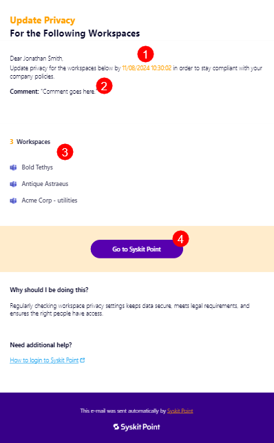
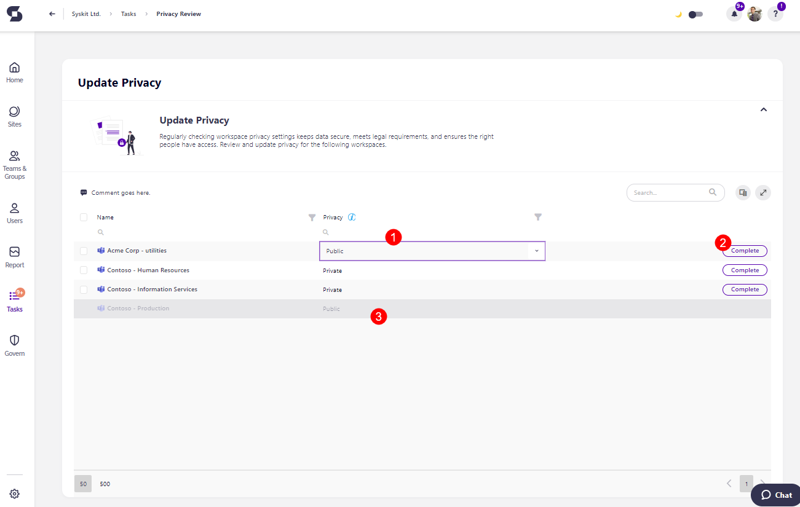
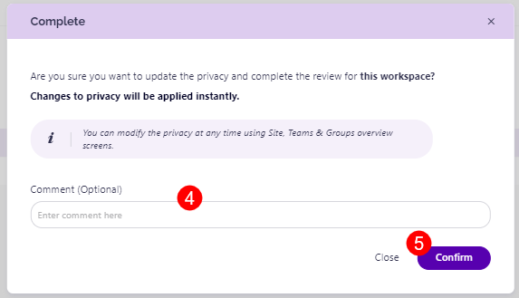
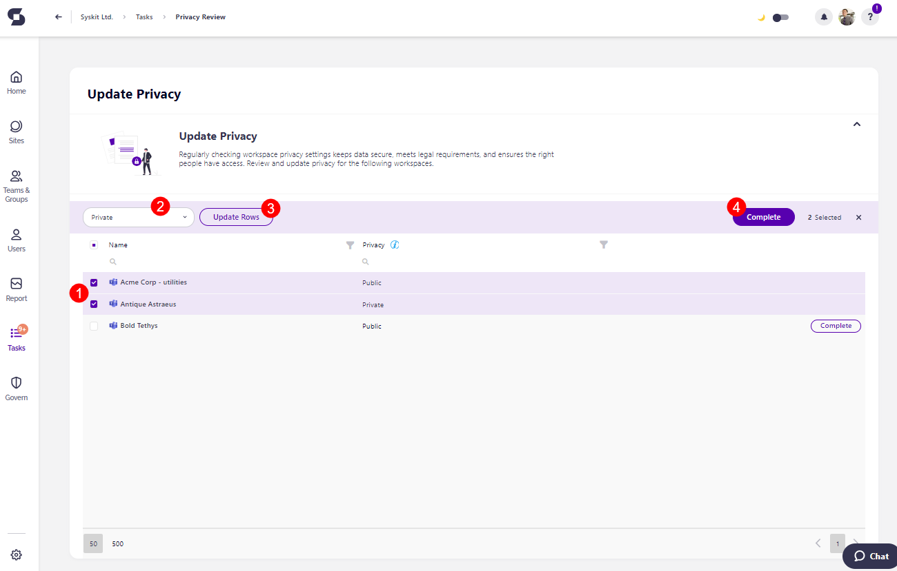

# Privacy Review 

Privacy settings help control who can see and access information within your workspace, which is essential for keeping sensitive data secure. 

As a workspace owner, you may be asked to review the privacy level of your workspace to ensure it fits your team's current needs. For instance, if your workspace was initially open to encourage brainstorming but now includes sensitive documents, you might need to adjust it to be more private.

This article walks you through reviewing and, if necessary, adjusting the privacy settings. With a few simple steps, you can help ensure your workspace’s information stays protected and can only be accessed by the right people.

Here's how to perform a privacy review on your workspace.

## Privacy Review Tasks 

Admins select the workspace(s) for which they want privacy reviewed and ask owners to perform the review. 

Workspace owners receive an **e-mail** stating that your company requires you to add or update the privacy for the selected workspaces. The e-mail contains the following information: 

* **The date (1)** until which you should perform the review
* **The comment (2)** that was left by admins when requesting the review; if any comment was left
* **The names of the workspaces (3)** where the review was requested on
* **Go to Syskit Point button (4)** that opens the task in Syskit Point


**Please note:** You can access the task by going to Syskit Point > **Tasks** > Active > **Privacy Review**. 



## Resolve Privacy Review Tasks 

The Privacy Review task screen shows the list of workspaces for which the review was requested, as well as the privacy column. 

You can change the privacy for each workspace **individually** if the privacy level between the workspaces differs.

If the workspaces should have the same privacy level, you can **select more than one workspaces** and update the privacy across the selected workspaces in bulk. 

When individually changing privacy: 

* **Click the space in column (1)** where the privacy is stated, and an **editable rectangle appears** where you can enter a new value, keep the current value, or edit the current value
* **Click the Complete button (2)** to complete the review for the workspace
    * When the review is completed, **that workspace fades to a gray color (3)**, and **cannot be modified** anymore for the duration of that review
* The **Complete confirmation dialog** appears, where you can **enter a comment (4)** that explains the actions you took and **click Confirm (5)** to finalize the changes

When changing the privacy in bulk: 

* **Select the workspaces (1)** that you want to add or change the privacy for
* **Enter the privacy information (2)** in the provided boxes
* **Click the Update Rows button (3)** and the information you entered is filled in for the selected workspaces
* **Click the Complete button (4)** to complete the review for the workspaces
* The **Complete confirmation dialog** appears, where you can enter a comment that explains the actions you took and **click Confirm** to finalize the changes
* After clicking confirm, **those workspaces fade to a gray color**, and **cannot be modified** anymore for the duration of the current review

