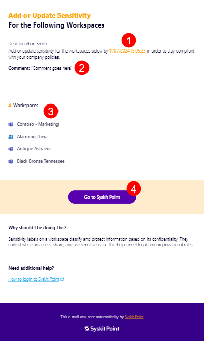
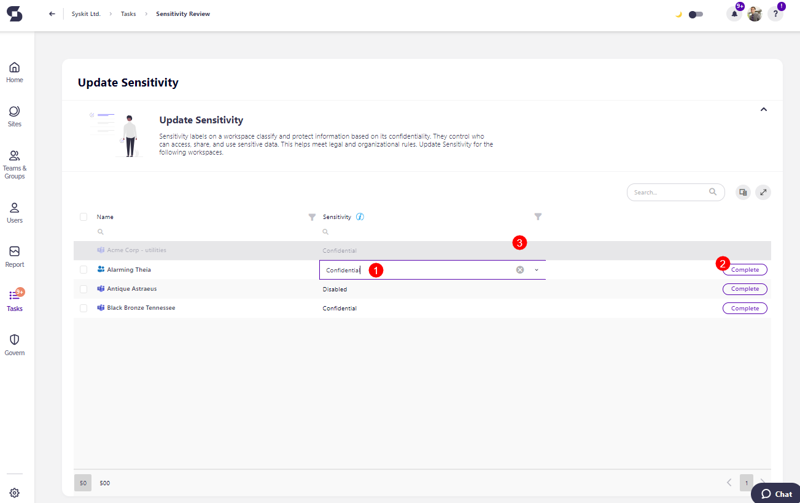
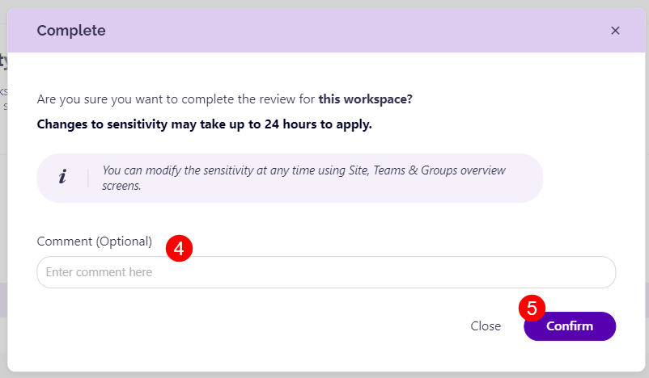
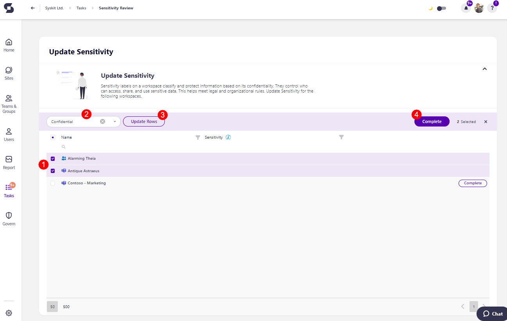

# Sensitivity Review 

Keeping your workspace's data secure is an important part of maintaining security and compliance, and sensitivity labels help by categorizing information based on its confidentiality level. 

You may be asked to review the sensitivity label on your workspace to ensure it still aligns with your team’s current needs and company policies. For example, if a project’s focus has shifted or if your workspace now includes more sensitive data, it might be time to update the label.

This article walks you through the simple steps for reviewing and, if necessary, adjusting the sensitivity label for your workspace. With just a few actions, you’ll help protect your workspace and limit data access to those who need it.

Here's how you can perform a sensitivity review.

## Sensitivity Review Tasks

Admins select the workspace(s) for which they want the sensitivity label reviewed and ask owners to perform the review. 

Workspace owners receive an **e-mail** stating that your company requires you to add or update the sensitivity for the selected workspaces. The e-mail contains the following information: 

* **The date (1)** until which you should perform the review
* **The comment (2)** that was left by admins when requesting the review; if any comment was left
* **The names of the workspaces (3)** where the review was requested on
* **Go to Syskit Point button (4)** that opens the task in Syskit Point


**Please note:** You can also access the task by going to Syskit Point > **Tasks** > Active > **Sensitivity Review**. 



## Resolve Sensitivity Review Tasks 

The Sensitivity Review task screen shows the list of workspaces for which the review was requested, as well as the sensitivity column. 

You can change the sensitivity for each workspace **individually** if the sensitivity level between the workspaces differs.

If the workspaces should have the same sensitivity level, you can **select more than one workspaces** and update the sensitivity across the selected workspaces in bulk. 

When individually changing the sensitivity: 

* **Click the space in column (1)** where the sensitivity is stated, and an **editable rectangle appears** where you can select a new value, keep the current value, or change the current value
* **Click the Complete button (2)** to complete the review for the workspace
  * When the review is completed, **that workspace fades to a gray color (3)**, and **cannot be modified** anymore for the duration of that review
* The **Complete confirmation dialog** appears, where you can **enter a comment (4)** that explains the actions you took and **click Confirm (5)** to finalize the changes

When changing the sensitivity in bulk: 

* **Select the workspaces (1)** that you want to add or change the sensitivity for
* **Enter the sensitivity information (2)** in the provided boxes
* **Click the Update Rows button (3)** and the information you entered is filled in for the selected workspaces
* **Click the Complete button (4)** to complete the review for the workspaces
* The **Complete confirmation dialog** appears, where you can enter a comment that explains the actions you took and **click Confirm** to finalize the changes
* After clicking confirm, **those workspaces fade to a gray color**, and **cannot be modified** anymore for the duration of the current review

