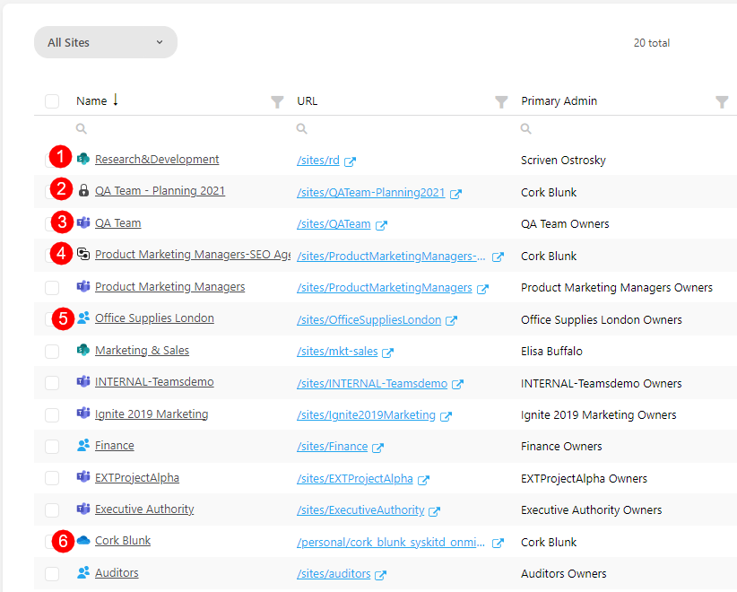
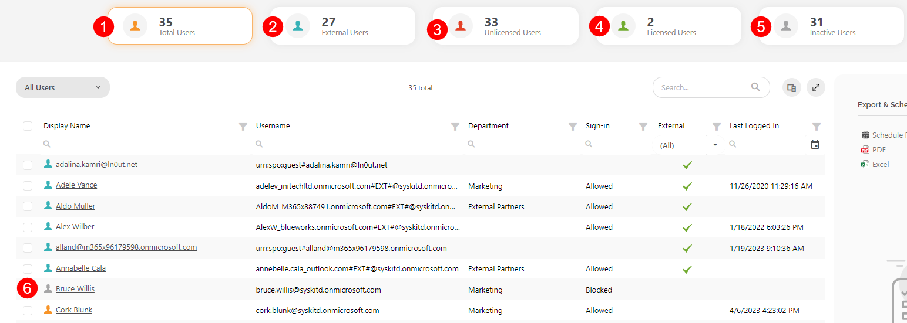
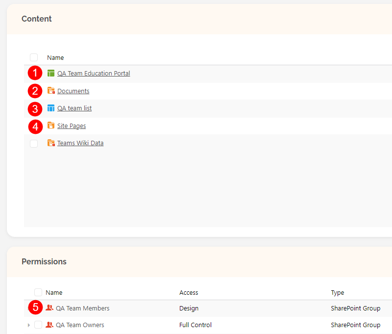
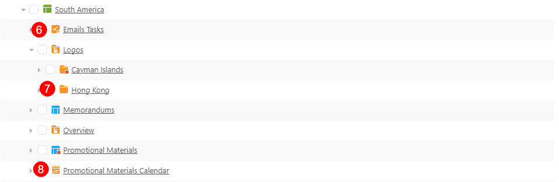
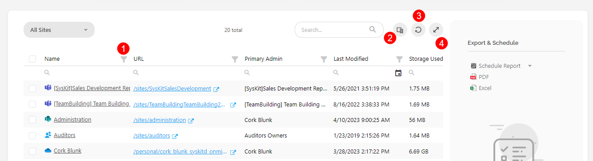

# SysKit Icons Glossary

**SysKit Point contains icons** that are placed next to different types of tracked **resources**. 

This article will **explain all of the available icons** and what they mean, which will help you navigate your SysKit Point as a collaborator. 

## Sites

Selecting **Sites** on the home page of SysKit Point will open a list with all types of workspaces you can access. 

Below is a list and explanation for all the icons, numbered and correlating to the included image. 

For more explanations of the terms, click on the names to be redirected to the Microsoft 365 Glossary. 

* [**Sites (1)**](https://learn.microsoft.com/en-us/microsoft-365/community/glossary#site)
* **Private** [**Channels (2)**](https://learn.microsoft.com/en-us/microsoft-365/community/glossary#site) - private sections within Microsoft Teams, used to give access exclusively to members of a team
* [**Microsoft Teams (3)**](https://support.microsoft.com/en-us/topic/what-is-microsoft-teams-3de4d369-0167-8def-b93b-0eb5286d7a29)
* **Shared** [**Channels (4)**](https://learn.microsoft.com/en-us/microsoft-365/community/glossary#site) - collaboration space where you can invite people who are not on your team
* [**Microsoft Groups (5)**](https://support.microsoft.com/en-us/office/learn-about-microsoft-365-groups-b565caa1-5c40-40ef-9915-60fdb2d97fa2)
* [**OneDrive (6)**](https://learn.microsoft.com/en-us/microsoft-365/community/glossary#onedrive-for-business)

## Microsoft Teams & Groups

Selecting **Microsoft Teams and Groups** on the home page of SysKit Point opens a list of all teams or groups you are the owner or member of. 

Below is a list and explanation for all the icons, numbered and correlating to the included image. 

For more explanations of the terms, click on the names to be redirected to the Microsoft 365 Glossary. 

* [**Microsoft Teams (1)**](https://support.microsoft.com/en-us/topic/what-is-microsoft-teams-3de4d369-0167-8def-b93b-0eb5286d7a29)
* [**Microsoft Groups (2)**](https://support.microsoft.com/en-us/office/learn-about-microsoft-365-groups-b565caa1-5c40-40ef-9915-60fdb2d97fa2)
* [**Mail-Enabled Security Groups**](https://learn.microsoft.com/en-us/microsoft-365/community/glossary#site) - private sections within Microsoft Teams, used to give access exclusively to members of a team
* [**Security Groups**](https://learn.microsoft.com/en-us/microsoft-365/community/glossary#site) - collaboration space where you can invite people who are not on your team
* [**Distribution Lists**](https://learn.microsoft.com/en-us/microsoft-365/community/glossary#site) - collaboration space where you can invite people who are not on your team

## Users 

Selecting **Users** on the home page of SysKit Point will open a list with all users you are the manager of.  

Below is a list and explanation for all the icons, numbered and correlating to the included image. 

For more explanations of the terms, click on the names to be redirected to the Microsoft 365 Glossary. 

* [**Users (1)**](https://learn.microsoft.com/en-us/microsoft-365/community/glossary#site)
* [**External Users (2)**](https://learn.microsoft.com/en-us/microsoft-365/admin/add-users/about-guest-users?view=o365-worldwide) - also known as guest users
* **Unlicensed Users (3)** - users without a license assigned
* **Licensed Users (4)** - users with a license assigned
* **Inactive Users (5)** - users that have not logged in for a certain amount of time, such as 60 days
* **Users with Blocked Sign-In (6)** - these are users that have had their log-in privileges removed, for example, an employee that has left the company and no longer has access 

## Access Reports

When generating any of the **Access Reports**, you can explore workspaces you have access to and all of the content included in those workspaces. 

Below is a list and explanation for all the icons used for the content, numbered and correlating to the included image. 

For more explanations on the terms, click on the names to be redirected to the Microsoft 365 Glossary. 

* **Subsites (1)** - with subsites, you can only create sites based on classic templates. If you create a modern team site, it won't be connected to an Office 365 Group because it is a subsite 
* [**Broken Inheritance (2)**](https://learn.microsoft.com/en-us/microsoft-365/community/glossary#inheritance)- shown as a **red square on icons** - happens when you break permissions inheritance for a list, library, or survey and then define new permission settings in a way where the list (or library) becomes a parent for items in it; items under that parent now inherit the new permission settings unless the items have uniquely defined permissions
* [**Lists (3)**](https://learn.microsoft.com/en-us/microsoft-365/community/glossary#list)
* [**Document Library (4)**](https://learn.microsoft.com/en-us/microsoft-365/community/glossary#document-library)
* [**SharePoint Groups (5)**](https://support.microsoft.com/en-us/office/create-a-team-site-in-sharepoint-ef10c1e7-15f3-42a3-98aa-b5972711777d)
* **Task**
* [**Folder (7)**](https://learn.microsoft.com/en-us/microsoft-365/community/glossary#folders)
* **Calendar**
* **File (6)** - an object that stores data, information, settings, or commands and can be saved to OneDrive, SharePoint, or Teams

## Miscellaneous 

When browsing through reports or Overviews for your workspaces, a few icons repeat and can help you get the most out of your search. 

Below you will find a list and explanation for those icons, numbered and correlating to the included image. 

* **Column filter (1)** - filter the selected column by selecting specific data from the available list
* **Column chooser (2)** - you can select which metadata columns will show in your report or view
* **Reset Layout (3)** - resets the view back to how it looks by default, removing any custom filters you've selected
* **Expand to full screen (4)**

