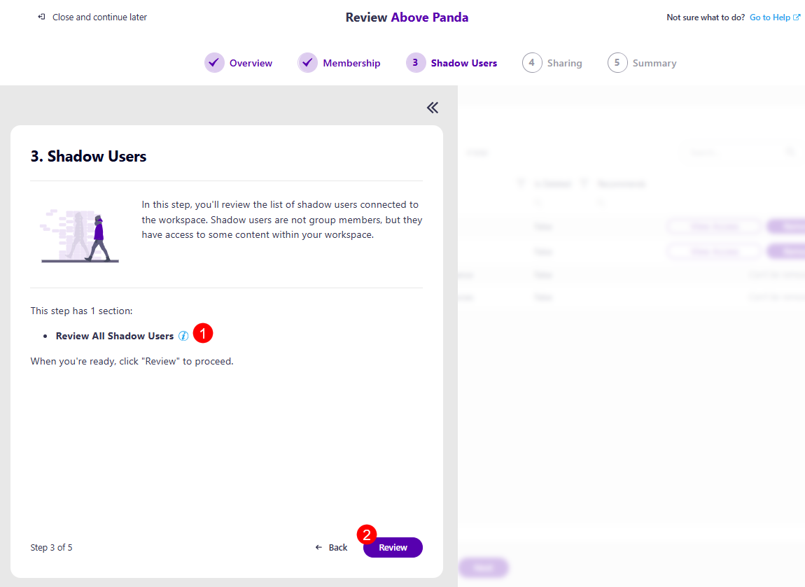
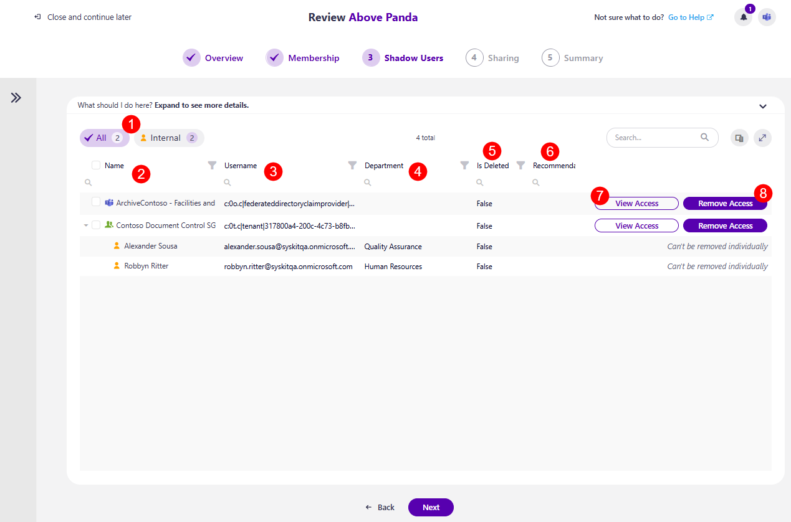

# Shadow Users Step

The first screen on the Shadow Users step is the task overview. Here, you can find information on what is expected of you for this step:

* You will be asked to **review the list of shadow users connected to the workspace**. 
  * Shadow users are users who are not group members, but they have access to some content within your workspace.
  * Review all the shadow users and make sure there is no unwanted access. Reviewing shadow users helps prevent unauthorized access and data exposure. By ensuring only the right people have access, you maintain workspace security, protect sensitive information, and keep permissions clean and compliant 

* Explanation of how many sections this step has: **Review All Shadow Users (1)**

* **Review button (2)** you can click when ready to start your review.

After **clicking the Review button**, the Shadow Users Review screen opens. On this screen, the following information and actions are available:

* On the left side, there are **filters (1)** you can use to view the list with:
  * **All**
  * **Internal** 
  * **Blocked**
  * **Orphaned**

* The columns available are: 
  * **Name (2)** - the name of the shadow user or workspace the shadow user is a part of
  * **Username (3)** - the e-mail for the shadow user or workspace
  * **Department (4)** - the department of the shadow user
  * **Is deleted (5)** - whether the user or workspace is deleted
  * **Recommendation (6)** - this section provides a recommendation from Syskit Point on what actions should be taken if there are any notable recommendations to be made. The following recommendations could be suggested:
    * **Remove Blocked Users** - these are shadow users whose sign-in has been disabled by an admin. They cannot log in, but you should remove their access to the workspace content to maintain a clean environment. 
    * **Remove Deleted Users** - these are shadow users who are deleted by an admin. They cannot log in, but you should remove their access to the workspace content to maintain a clean environment. 
    * **Remove Inactive External Users** - these are shadow users outside your organization who have not been active in the last 90 days. 
* **View Access (7)** action
  * Clicking this action shows where exactly (on which files or folders) the selected user has access across the workspace, with the following columns:
    * **Name** of the workspace
    * **Access**, shows the type of access given
    * **Details**, shows where the user got the permission from
    * **Given Through**, shows where the permission was given through
    * **Sensitivity label**, shows which sensitivity label, if any, is assigned to the workspace
    * **Remove Access button**, which removes the access for the shadow user
* **Remove Access (8)** action
  * Clicking this action opens the Remove Group Access modal, where you have to confirm the removal of the access for the shadow user

Once you have completed the actions you decide to take, clicking Next takes you to the next step, [Sharing](sharing-step.md).


**Please note!** 

If you are unsure of what to do at any point and want to **consult your co-reviewers, you can start a chat with them by clicking the Microsoft Teams icon in the top right corner** of the Syskit Point app. 

