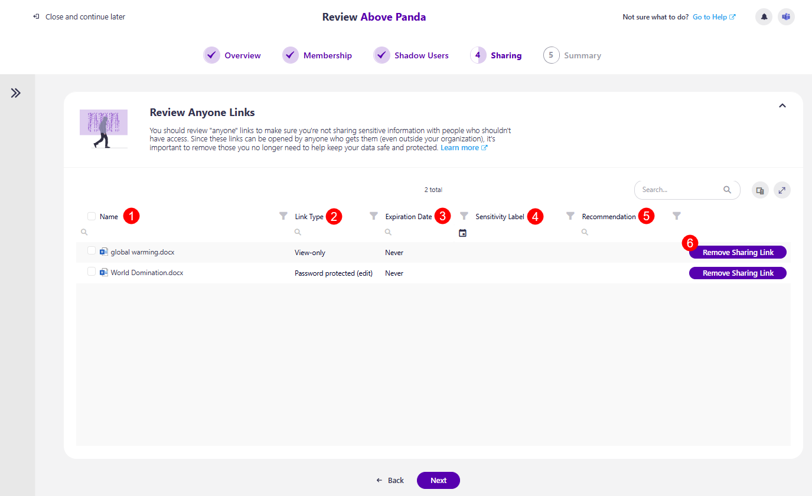
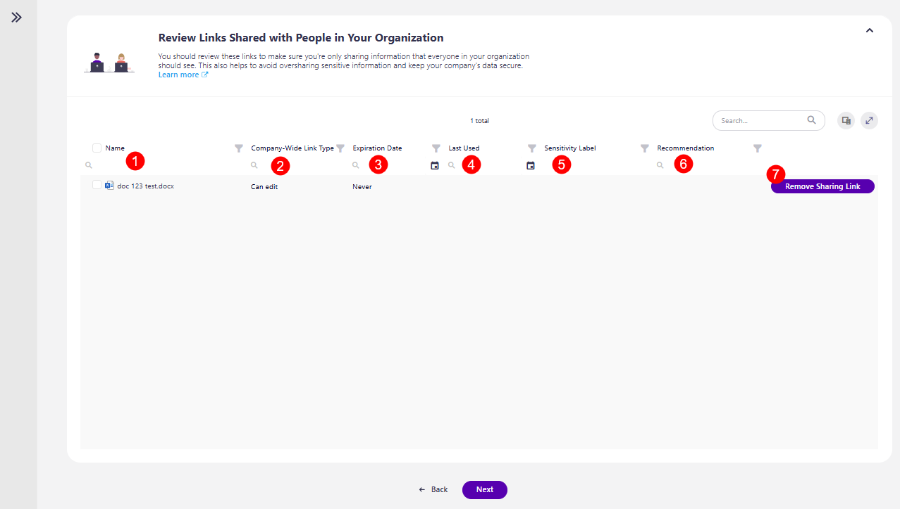

# Sharing Step

The first screen on the Sharing Users step is the task overview. Here, you can find information on what is expected of you for this step:

* You'll be asked to **review what's been shared from your workspace**. 
  * Carefully going through and removing unnecessary access helps keep your data safe. 

* Explanation of how many sections this step has: **Shared with Anyone** and **Shared with People in Your Organization**.

* The **Review button**, which you can click when you're ready to start your review.

After **clicking the Review button**, the first section opens where you can review **Links Shared with Anyone**. On this screen, the following information and actions are available:

* **Name (1)** of the content 
* **Link Type (2)** - the level of sharing given through the link, for example, view-only, password-protected (edit), etc.
* **Expiration Date (3)** - shows when the link is set to expire
* **Sensitivity label (4)** - shows if there is a sensitivity label assigned to the content
* **Recommendation (5)** - this section provides a recommendation from Syskit Point on what actions should be taken if there are any notable recommendations to be made. The following recommendation could be suggested:
   * **Remove Expired Links** - expired sharing links are no longer valid. You can safely remove them to reduce clutter and keep your workspace clean and secure. 
* The **Remove Sharing Link (6)** action
  * Clicking this action opens the Remove Sharing Link modal, where you need to confirm the removal of the sharing link

  
Once you've completed the actions you want to take, clicking Next takes you to the next section of this step, the Shared with People in Your Organization.

 On this screen, the following information and actions are available:

* **Name (1)** - of the content 
* **Company-Wide Link Type (2)** - the level of sharing given through the link, for example, can edit, view-only, etc.
* **Expiration Date (3)** - shows when the link is set to expire
* **Last Used (4)** - shows when the link was last used
* **Sensitivity label (5)** - shows if there is a sensitivity label assigned to the content
* **Recommendation (6)** - this section provides a recommendation from Syskit Point on what actions should be taken if there are any notable recommendations to be made
* **Remove Sharing Link (7)** action
  * Clicking this action opens the Remove Sharing Link modal, where you need to confirm the removal of the sharing link

Once you've taken all the necessary actions, clicking Next takes you to the last step, [Summary](sharing-step.md).


**Please note!** 

If you are unsure of what to do at any point and want to **consult your co-reviewers, you can Start a Chat with them by clicking the Microsoft Teams icon at the top right corner** of the Syskit Point app. 

