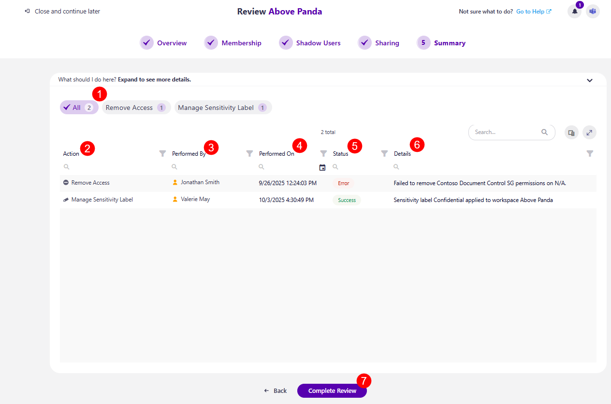

# Summary Step

The final step in the Workspace Review Wizard is the Summary step. Here, you'll see an overview of your actions taken during the review. 


**Please note!** 
Certain **actions may still be in progress** by the time you reach the Summary step. However, even if you **click the Complete Review button** and finish the review, the actions that are in progress **will still finish processing**. 



The following information is available: 

* At the very top, there's a **filter that lists all the actions you've taken (1)** and the number of times it was taken
  * Clicking an action filters the report to show only information about that action
* **Action (2)** - shows the name of the action taken
* **Performed By (3)** - shows who this action was performed by
* **Performed On (4)** - shows the date when the action was performed
* **Status (5)** - shows whether the action was completed successfully or is currently in progress
* **Details (6)** - shows any additional details available regarding the action
* **Clicking the Complete Review (7)** button opens the **Complete Review modal** where you can leave any comments about this Workspace Review. Administrators and your co-reviewers can see the comments left. 
  * **Typing CONFIRM and clicking the Complete Review button** finalizes the review process. 


**Please note!** 

If you are unsure of what to do at any point and want to **consult your co-reviewers, you can start a chat with them by clicking the Microsoft Teams icon at the top right corner** of the Syskit Point app. 

