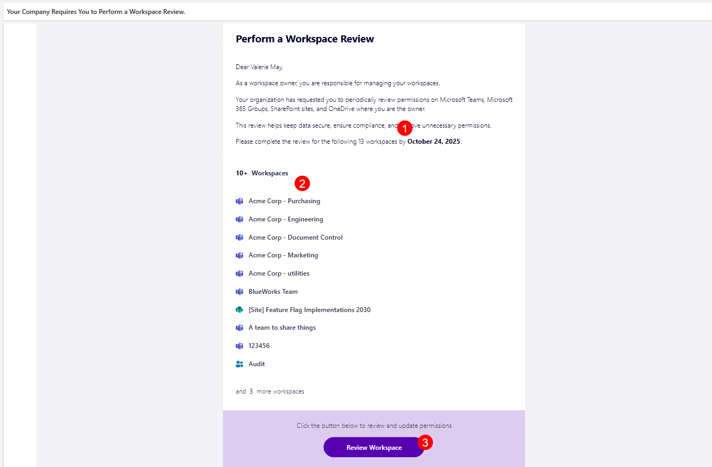
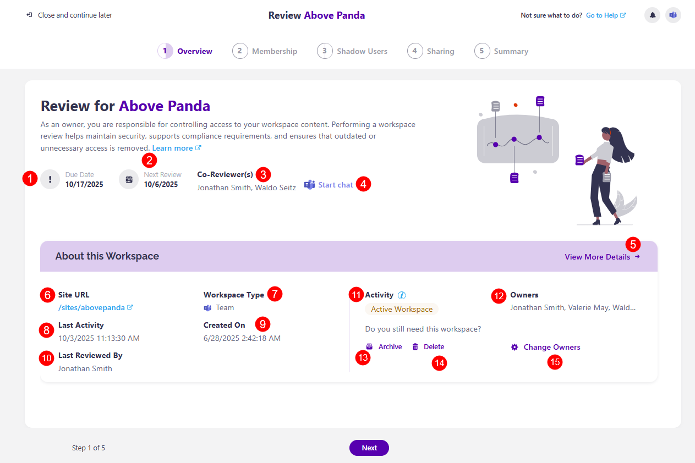
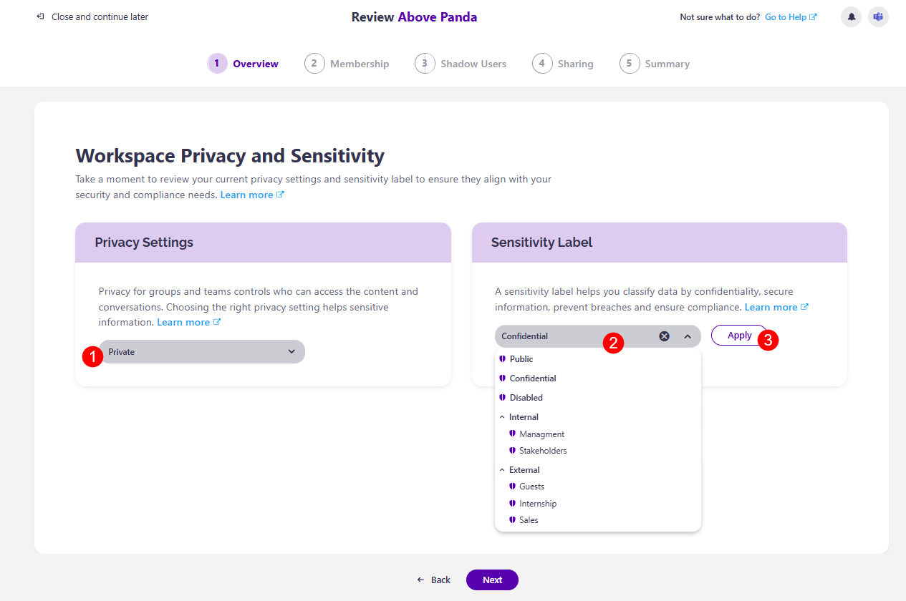

# Workspace Review

**The Workspace review**, in the context of the Microsoft 365 environment, is a scheduled review for Microsoft 365 workspaces that ensures each workspace follows your organization's governance policies.

The **Workspace Review task is usually performed by a workspace owner**; however, reviewers for workspace review policies can be defined by the Syskit Point Admins. Depending on the [settings for the workspace review policy](../../governance-and-automation/workspace-review/setup-workspace-review.md), you might be asked to:
* Confirm or edit workspace ownership
* Review external sharing and guest access
* Check file and folder sharing
* Accept or resolve any policy vulnerabilities
* Decide if a workspace should be kept or deleted

Two different roles can view and complete the Workspace Review in Syskit Point:

* **Workspace Owners with the Syskit Point Collaborator** role assigned in Syskit Point who were set as reviewers in the policy settings, as described in this article
* [Syskit Point Admin users](../../governance-and-automation/workspace-review/monitor-workspace-review.md)

When working with Workspace Review, Syskit Point Collaborators can **perform the Workspace Review on workspaces where they are an owner or admin**.

If you've been asked to complete a Workspace Review task and you want some guidance as you go through the steps, you can find more details in these step-specific articles:
* [Membership](membership-step.md)
* [Shadow Users](shadow-users-step.md)
* [Sharing](sharing-step.md)
* [Summary](summary-step.md)

This article explains how the Workspace Review task begins and where you can complete it. 

## Workspace Review E-mail Request

If you receive a request to review your workspace, your organization has most likely **created a Workspace Review policy**. This means that periodically, **you are asked to review the sites, teams, and groups you're responsible for**.  

Ensuring your workspace review tasks are resolved on time is important and can **determine how overall exposed your organization is to potential security risks or outdated sharing practices and unauthorized permissions**. Syskit Point is here to help you along the way and ensure you complete every step as effectively as possible. 

When the Workspace Review starts, workspace owners receive an e-mail request to review permissions on their site(s). The e-mail contains the following important data:

* **The number of workspaces and the due date for the Workspace Review completion (1)**
* **The list of workspaces an owner needs to review (2)**
* **The Review Workspace button (3)**

The **Review Workspace** button opens the **Workspace Review Task** screen once clicked. 

This screen can also be accessed within Syskit Point by selecting **My Tasks**. [You can learn more about the My Tasks section by taking a look at this article.](../resolve-governance-tasks/my-tasks.md) 

## Workspace Review Wizard Overview Step

The first step of the Workspace Review is the Overview. Here, you can find the following information:

* **Due date (1)** for the resolution of the workspace review task
* **Next review date (2)**, which shows when the next workspace review ocurs
* **Co-reviewer(s) (3)**, shows who the other reviewers are for this workspace review
* **Start Chat button (4)**, which lets you start a Microsoft Teams chat with your co-reviewers to discuss the workspace review task


**Please note!** When a **workspace is inactive**, you'll see an information box here, asking if you still need the workspace. You can then complete the **Keep, Archive, or Delete** actions on the workspace. 



In the About this Workspace section, you can see the following:
* **View More Details button (5)** - clicking on this opens the workspace details screen
* **Site URL (6)** - shows the workspace URL
* **Workspace Type (7)** - shows what type of workspace it is
* **Last Activity (8)** - shows when the last activity date was
* **Created On (9)** - shows when the workspace was created
* **Last Reviewed By (10)** - shows who last reviewed the workspace
* **Activity (11)** - shows the current activity status of the workspace
* **Owners (12)** - shows who the owners of the workspace are
* **Archive button (13)** - clicking this archives the workspace
* **Delete button (14)** - clicking this delete the workspace
* **Change Owners button (15)** - clicking this opens the Change Owners modal, where you can add or remove owners from the workspace

The **Workspace Review Wizard** has a total of five steps: 

* **Overview**, which includes a **Privacy and Sensitivity review** if they were enabled in settings
* [Membership](membership-step.md)(for Microsoft 365 Groups and Microsoft Teams), or **Users** (for sites)
  * This step is not available for OneDrive
* [Shadow Users](shadow-users-step.md)
* [Sharing](sharing-step.md)
* [Summary](summary-step.md)

These steps are explained in more detail in their designated articles, linked above.

In the remainder of this article, you can find out how to resolve the sensitivity and privacy task as part of the Workspace Review. 

## Sensitivity and Privacy - Overview Step

If Sensitivity and Privacy reviews were set up as a part of the Workspace Review, they will be a part of the Overview step. 

**Clicking Next** after the Overview step opens the **Workspace Privacy and Sensitivity screen**. 

**Privacy (1)** for groups and teams controls who can access the content and conversations, and choosing the right privacy settings helps protect sensitive information. 
* From the **drop down bar**, you can select between two options:
  * **Private** - private groups or teams are only accessible to approved members, keeping files, chats, and information visible only to these members.
  * **Public** - public groups or teams are open to everyone in your organization - they can find and join them without approval.

A **Sensitivity Label (2)** helps you classify data by confidentiality, lets you secure information, prevent breaches, and ensure compliance. 
* From the **drop-down bar**, you can select between the sensitivity label options available for your company.
* **Click the Apply button (3)** next to the drop-down bar to apply your chosen sensitivity label

Once you've made your changes, click Next to proceed to the next step, [Membership](membership-step.md).

