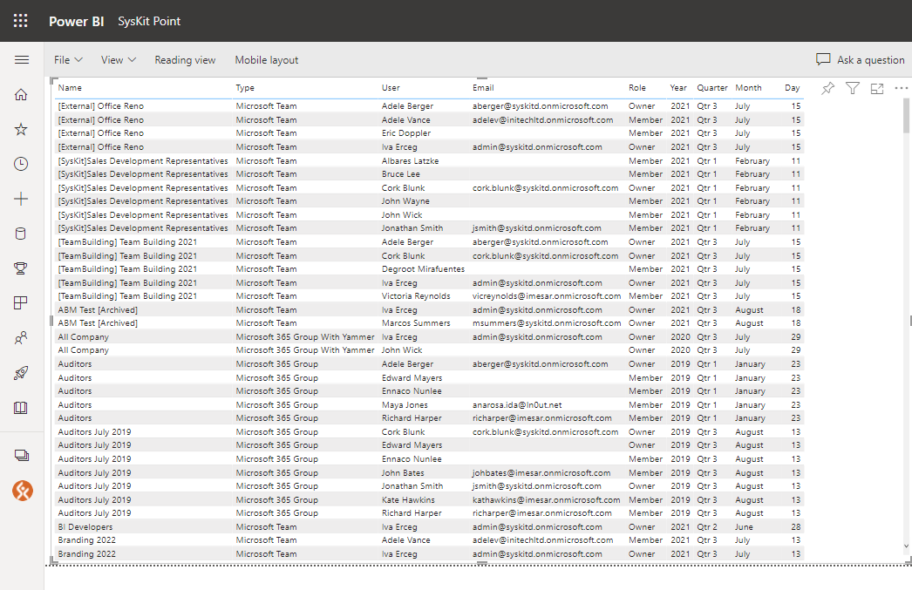

# Create Custom Reports in SysKit Power BI Workspace

This article will guide you through creating a custom report in the SysKit Power BI workspace.


**Please note!**
Customization of SysKit Point Power BI Companion app requires a Power BI Pro or Premium Per User license.


## SysKit Point Workspace

Follow these steps to access SysKit Point Workspace:
* **Open [Power BI](https://app.powerbi.com/)**
* **Click the Workspaces icon (1)**
* **Find and click the SysKit Point workspace (2)**

A new screen opens, showing you the **SysKit Point dataset** and **SysKit Point report** inside the SysKit Point workspace.

To create a new report based on the available SysKit Point dataset:
* **mouseover the SysKit Point dataset and click the More options icon (1)**
* **click the Create report option (2)** from the displayed menu

## Build Reports

After clicking the Create report option, a new screen opens, providing you with all tools needed to build a report. 
The following **main control panes and options are available**:
* **Filters (1)** - you can drag fields to this section and select which filters are applied to visuals, a single page, or all pages
* **Visualizations (2)** - enables selection of visuals to be added to the page and their configuration
* **Fields (3)** - lists all the tables and fields available for report creation
* **Page navigation (4)** - enables you to add a new page, delete a page, or hide it

## Example: New Teams & Groups Report

Let's start by adding a table. To do so:
* **click the table icon (1) available on the Visualizations tab**
* **an empty table object (2) appears**

Next, the table needs to be populated with appropriate fields. To add fields:
* **find wanted fields by entering a term in the search input field(1)**; you can also scroll and find fields in appropriate tables
* **select (2) or drag and drop (3) one or more fields from the Fields pane to the table visual**
* **selected field appears in the table (4)**

Make sure to add the following fields to the Table visual:
* [Microsoft Teams and Groups].Teams and Groups Name 
* [Microsoft Teams and Groups].Type 
* [Microsoft Teams and Groups].Created On Date 
* [Microsoft Teams and Groups <-> Users].User Name 
* [Microsoft Teams and Groups <-> Users].Users.Email 
* [Microsoft Teams and Groups <-> Users].Microsoft Teams and Groups.Role Type 

The image below shows the report after adding all mentioned fields.


**Tip!**
You can rename fields by double-clicking the current name in the Visualizations pane.


The last thing left to do is to **filter the report data** to show new Teams and Groups only.
To filter the report:
* **select the Created On Date option (1)** instead of **Date Hierarchy** - this will change date display from multiple columns into a single date column 
* **adjust the filter settings for the Created On Date field (2)** - here, you can adjust the settings to suit your specific business needs
* **adjust the filter settings for the Role field (3)** - select Owner role only for the report to show Teams and Groups along with owners

Below, you can see the final look of the created report.

