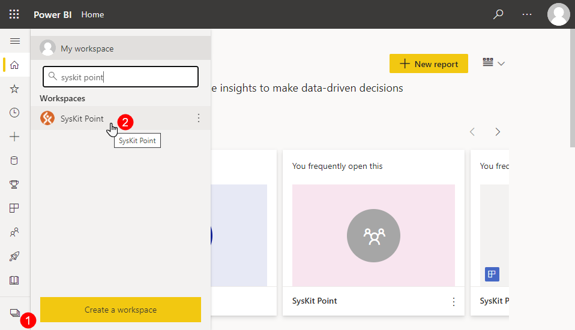

# Create Custom Reports in SysKit Power BI Workspace

This article will guide you through the creation of custom reports in SysKit Power BI workspace. 2 custom reports examples are given:
* **New Teams & Groups** 
* **Inactive Teams & Groups** 


**Please note!**
Customization of SysKit Point Power BI Companion app requires a Power BI Pro or Premium Per User license.


## SysKit Point Workspace

Follow these steps to access SysKit Point Workspace:
* **Open [Power BI](https://app.powerbi.com/)**
* **Click the Workspaces icon (1)**
* **Find and click the SysKit Point workspace (2)**

New screen opens showing you the **SysKit Point dataset** and **SysKit Point report** inside SysKit Point workspace.

To create a new report based on available SysKit Point dataset:
* **mousover the SysKit Point dataset and click the More options icon (1)**
* **click the Create report option (2)** from the displayed menu

## Build Reports

After clicking the Create report option, a new screen opens providing you with all tools needed to build a report. 
The following **main control panes and options are available**:
* **Filters (1)** - you can drag fields to this section and select which filters are applied to visuals, a single page, or all pages
* **Visualizations (2)** - enables selection of visuals to be added to the page and their configuration
* **Fields (3)** - lists all the tables and fields available for report creation
* **Page navigation (4)** - enables you to add a new page, delete a page, or hide it

## Example: New Teams & Groups Report

Let's start by adding a table. To do so:
* **click the table icon (1) available on the Visualizations tab**
* **an empty table object (2) appears**

Next, the table needs to be populated with appropriate fields. To add fields:
* **find wanted fields by entering a term in the search input field(1)**; you can also scroll an find fields in appropriate tables
* **select (2) or drag and drop (3) one or more fields from the Fields pane to the Table visual**
* **selected field appears in the Table (4)**

Make sure to add the following fields to the Table visual:
* [Microsoft Teams and Groups].Teams and Groups Name 
* [Microsoft Teams and Groups].Type 
* [Microsoft Teams and Groups].Created On Date 
* [Microsoft Teams and Groups <-> Users].User Name 
* [Microsoft Teams and Groups <-> Users].Users.Email 
* [Microsoft Teams and Groups <-> Users].Microsoft Teams and Groups.Role Type 

The image below shows the report after adding all mentioned fields.


**Tip!**
You can rename fields by double clicking the current name in the Visualizations pane.


The last thing left to do is to **filter the report data** to show data that meets certain criteria.
Here, we're dealing with a report that shows new Teams and Groups. Therefore, only Teams and Groups with Created On date within the last 120 days or less should be displayed.

To filter the report **click the Created On field (1)**. 
Here you can **choose between different filter types and additional options** which can help you modify the report to suit your business needs

On the first page, we start to: 

Add a table  from the Visualizations tab. 

Add the following Fields to the table: 

[Microsoft Teams and Groups].Display Name 

[Microsoft Teams and Groups].Group Type 

[Microsoft Teams and Groups].Created On Date 

[Microsoft Teams and Groups <-> Users].Users.Display Name 

[Microsoft Teams and Groups <-> Users].Users.Email 

[Microsoft Teams and Groups <-> Users].Microsoft Teams and Groups.Role Type 

Tip: use the search bar on top of the Fields plane to identify which fields are available, based on the name. 

On the visualizations plane, let’s rename the Fields: 

Display Name -> Team 

[Microsoft Teams and Groups].Group Type -> Type 

Users.Display Name -> Users Name, 

Users.Email -> Email, 

Microsoft Teams and Groups.Role Type -> User Type 

 

At this point, our table should look like this: 

Note: the Date can be displayed in a date hierarchy (as in the figure) or one-liners. For this, select the Created on Date and change to the field itself. 

Final result. 

Filter Page for Teams, Owners, and Creation Date: 

expand the Filter Tab and drag it into:  

[Microsoft Teams and Groups].Type, 

select Microsoft Team 

[Microsoft Teams and Groups <-> Users].Microsoft Teams and Groups.Role Type 

select Owner. 

[Microsoft Teams and Groups].Created On Date 

Select Filter Type - Relative Date and customize the filter for the time interval that better suits your business needs. 

 

This is the final look of the Report: 

## Example: Inactive Teams & Groups Report