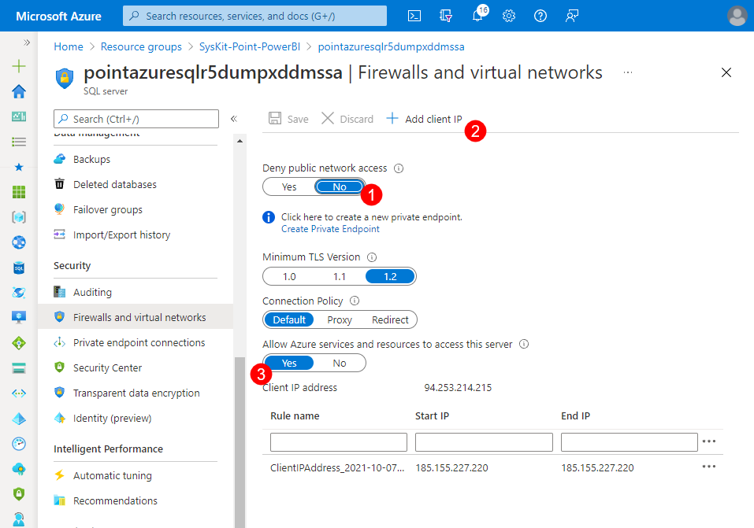
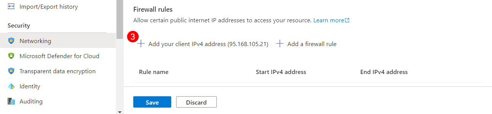
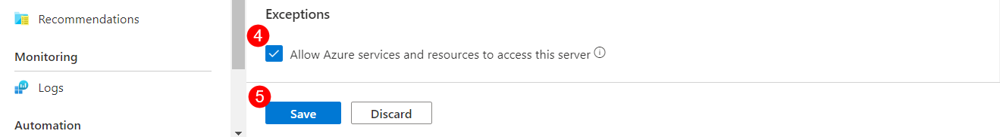
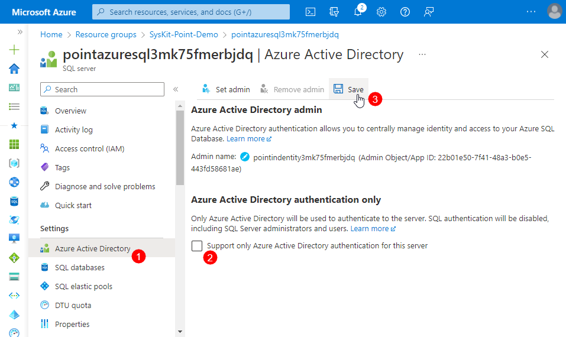


Before you begin ensuring that the requirements for the Azure Power BI app are met, verify the following:
* **SysKit Point is deployed**
* **SQL Server Management Studio is installed on your client machine**
* **You have the Azure SQL Server name and Server admin credentials on hand**


For the Power BI app to access SysKit Point data, the following steps need to be completed:

* **Allow access to Azure SQL Server for Power BI app and client machine**
* **Enable SQL authentication on Azure SQL Server**
* **Create a SQL Server Login and Database User for the Power BI app**
* **Grant select permission on Power BI schema for the created Power BI user**

## Allowing Access to Azure SQL Server

To enable the Power BI app to access data in the SysKit Point database, access to the Azure SQL Server needs to be allowed. 
To do so:
* **Navigate to [Azure Portal](https://portal.azure.com/) and open the SysKit Point resource group**
* **Find and open the SQL Server resource**
* **Open Security > Networking (1)**
* **For the Public network access option, set it to Selected resources (2)**
* **Click Add Your Client IPv4 address (3) to allow access from your client machine**; this is needed to connect to the SysKit Point database via the SQL Server Management Studio
* **Click the checkbox to Allow Azure services and resources to access this server (4);** enabling this will allow access from the Power BI App and is located under Exceptions at the bottom of the screen
* Click **Save (5)** to store preferences

## Enabling SQL Authentication on Azure SQL Server

The next step that should be completed while setting up the Azure SQL server is the following:

* On the home page of the SQL server, under **Features**, click the **Active Directory admin** option
  * The **Azure Active Directory (1)** site will open
* **Deselect (2)** the Support only Azure Active Directory authentication for this server
  * This option needs to be turned off and is located under the Azure Active Directory authentication section
* **Click Save (3)** to  finalize 
  * After that, the SQL authentification can be used normally 

## Creating Server Login and Database User for Power BI App

Before running the SQL scripts listed below, open **SQL Server Management Studio** and connect to the Azure SQL server holding the SysKit Point database.
[Learn how to connect to an Azure SQL Database here](https://docs.microsoft.com/en-us/sql/ssms/quickstarts/ssms-connect-query-azure-sql?view=sql-server-ver15#connect-to-an-azure-sql-database-or-azure-sql-managed-instance).


To connect, use the SQL credentials created when [deploying SysKit Point](../installation/deploy-syskit-point.md).


### New Server Login
Now that you have access from your client machine to the Azure SQL Server, you can create a new server login for the Power BI app.
Before running the script on **master database**, **modify the password**.
`
CREATE LOGIN powerbireader
    WITH PASSWORD = 'Password1234!'
`

### New Database User

To create a new database user, **run the following script on the SysKitPointDB database**:
`
CREATE USER powerbireader
    FOR LOGIN powerbireader
    WITH DEFAULT_SCHEMA = PowerBI
`

### Grant SELECT on PowerBI Schema

To grant the SELECT permission for the created database user, **run the following script on the SysKitPointDB database**:
`
GRANT SELECT ON Schema :: [PowerBI] TO powerbireader
`

## Next Steps

Once you are done with the configuration described in this article, [continue with the Power BI app deployment](deploy-power-bi-app.md).