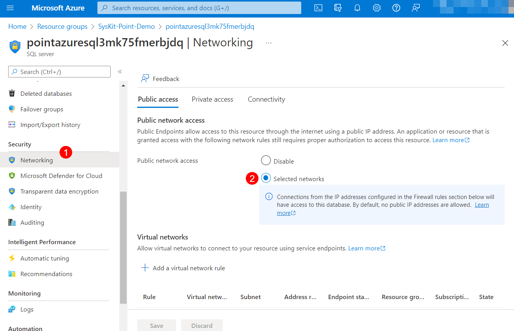


Before you begin ensuring that the requirements for the Azure Power BI app are met, verify the following:
* **SysKit Point is deployed**
* **SQL Server Management Studio is installed on your client machine**
* **You have the Azure SQL Server name and Server admin credentials on hand**


For Power BI app to access SysKit Point data, you will need to do the following:

* **Allow access to Azure SQL Server for Power BI app and client machine**
* **Create a SQL Server Login and Database User for Power BI app**
* **Grant select permission on Power BI schema for the created Power BI user**

## Allowing Access to Azure SQL Server

To enable Power BI app to access data in SysKit Point database, you will need to allow access to the Azure SQL Server. 
To do so:
* **Navigate to [Azure Portal](https://portal.azure.com/) and open the SysKit Point resource group**
* **Find and open the SQL Server resource**
* **Open Security > Firewalls and virtual networks**
* **Set the Deny public network access option to No (1)** > **Save**
* **Click Add Client IP (2) to allow access for your client machine** > **Save**; this is needed to connect to SysKit Point database via SQL Server Management Studio
* **Set the Allow Azure services and resources to access this server option to Yes (3) to allow access for Power BI App** > **Save**

## Creating Server Login and Database User for Power BI App

Before running the SQL scripts listed below, open **SQL Server Management Studio** and connect to Azure SQL server holding SysKit Point database.
[Learn how to connect to an Azure SQL Database here](https://docs.microsoft.com/en-us/sql/ssms/quickstarts/ssms-connect-query-azure-sql?view=sql-server-ver15#connect-to-an-azure-sql-database-or-azure-sql-managed-instance).


To connect, use the SQL credentials created when [deploying SysKit Point](../installation/deploy-syskit-point.md).


### New Server Login
Now that you have access from your client machine to the Azure SQL Server, you can create a new server login for Power BI app.
Before running the script on **master database**, **modify the passoword**.
`
CREATE LOGIN powerbireader
	WITH PASSWORD = 'Password1234!' 
GO
`

### New Database User

To create a new database user, **run the following script on SysKitPointDB database**:
`
CREATE USER powerbireader
	FOR LOGIN powerbireader
	WITH DEFAULT_SCHEMA = PowerBI
GO
`

### Grant SELECT on PowerBI Schema

To grant the SELECT permission for created database user, **run the following script on SysKitPointDB database**:
`
GRANT SELECT ON Schema :: [PowerBI] TO powerbireader
`

## Next Steps

Once you are done with the configuration described in this article, [continue with the Power BI app deployment](deploy-power-bi-app.md).

