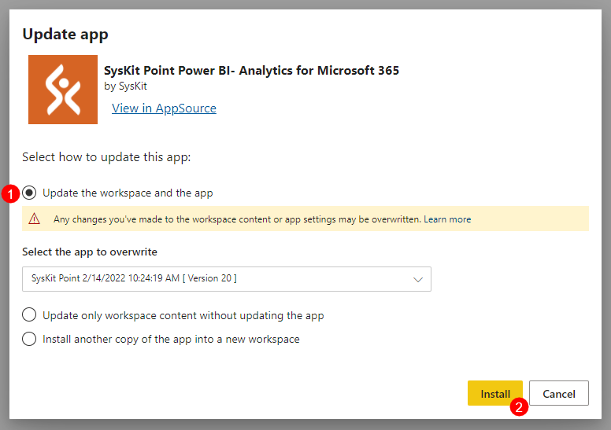

# Update SysKit Point Power BI App

To update the SysKit Point Power BI app:

* **Open [Power BI](https://app.powerbi.com/)**
* **Navigate to Apps**
* **Click Get apps**
* **Find SysKit Point - Power BI Companion**
* **Click Get it now**

**You might be asked to permit usage of your account information and enter your contact data**. Fill in your information and click **Continue**.

The **Update app** dialog opens. 
**Select the Update the workspace and the app (1)** option, and **click Install (2)**


**Please note!**
The update will overwrite the old Power BI app.


Once the update is complete, a pop-up notification with the workspace link appears.