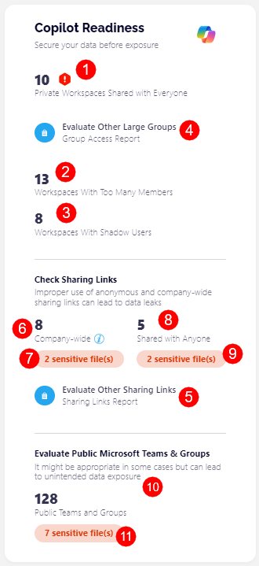

# Copilot Readiness

The new Copilot Readiness tile on the Syskit dashboard is a helpful addition for businesses preparing to integrate Copilot into their workflow or those that want to stay on top of policy vulnerabilities or overshared workspaces that could pose a security risk. 

By providing a clear and comprehensive Copilot Readiness score, you are able to quickly identify vulnerabilities or areas for improvement. With insights into policy vulnerabilities, overshared workspaces, and risky sharing practices, you can ensure your environment is secure and address potential security concerns upfront, which makes your Copilot integration smoother and safer.

The following is counted for the Copilot Readiness:

* Number of vulnerabilities detected for the Workspaces with **Too Many Members (1), Workspaces with Shadow Users (2), and Workspaces Shared with Everyone policies (3)**
* The **Group Access (4) and Sharing Links reports (5)**
* The number of **company-wide sharing links (6) and links shared with everyone (7)**
* The number of **public workspaces (8)**

## Reports

The following reports can be generated through the Copilot Readiness tile:

* [Private Workspaces Shared with Everyone](../governance-and-automation/security-compliance-checks/private-workspaces-shared-with-everyone.md)
* [Group Access](../reporting/access-reports.md#group-access-report)
* [Workspaces with Too Many Members](../governance-and-automation/security-compliance-checks/workspaces-with-too-many-members.md)
* [Workspaces with Shadow Users](../governance-and-automation/security-compliance-checks/workspaces-with-shadow-users.md)
* [Sharing Links](../reporting/external-sharing-reports.md#sharing-links)
  * You can generate the report to show links that were shared company-wide and links shared with anyone
* [Public Microsoft Teams & Groups](../microsoft365-inventory/microsoft-teams-and-groups.md)
  * The report automatically applies the public Groups & Teams view when being generated

