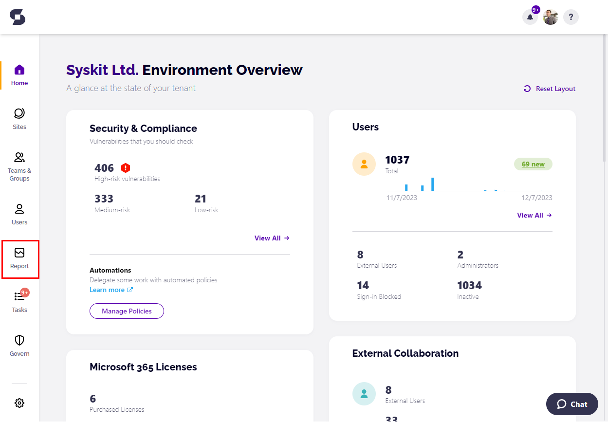
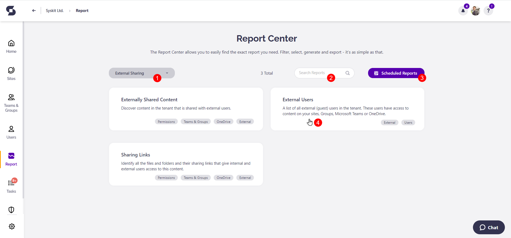
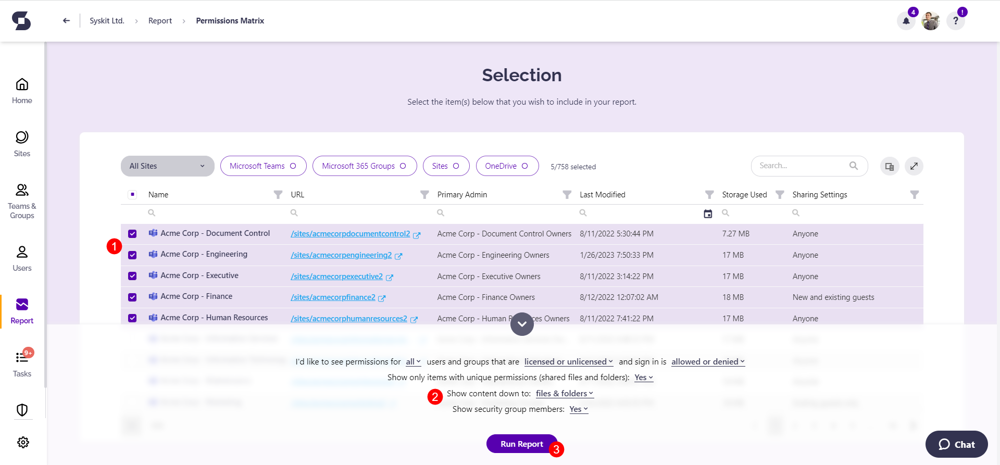

# Reports in Syskit Point

Syskit Point Reports provide insight into what's happening within your Microsoft 365 environment. 

The following **actions are available when working with Syskit Point reports**:
* Advanced filtering
* High-level overview
* Exporting reports as PDF or XLSX files
* Scheduled report delivery

## Generate Reports

The **Inventory Reports** can be generated directly from the main menu on the left side of the screen by clicking Sites, Microsoft Teams & Groups, or Users. 

To generate reports in all the other categories available in Syskit Point, **click the Report icon** in the main menu, which opens the Report Center.

In the Report Center, you can:
* **See all reports available in Syskit Point** along with a short description of what each provides
* **Filter reports by category (1)**; only reports within the selected category are displayed
* **Search for a report (2)** by typing a search term into the input field
* **Navigate to Scheduled Reports (3)** where you can view and manage recurring delivery of reports 
* **Click a report tile (4)** to generate the wanted report

After you click the report tile, the **Selection screen** opens.
Here, you can:
* **Select one or multiple workspaces (1)**
* **Adjust additional filters (2)**
* **Click Run Report (3) to generate the report**


**Please note!**  
Different reports show different objects to select and different filters to adjust. 


In the example given, **the Selection step for the Permissions Matrix report shows Microsoft Teams, Microsoft 365 Groups, OneDrive, and sites to select**. 

On the other hand, if we look at **the User Access Report, it lists all users for selection**. 

Some reports, such as **the External Users report, generate right after clicking the report tile and don't show the Selection step**. 
* Since the selection and filters can differ, reports are further described within the category-specific articles below.

## Report Categories


Check the articles below for information on what [subscription plans](https://www.syskit.com/products/point/pricing/) the reports will be available in.


Reports in Syskit Point can be divided into the following categories:
* [External Sharing Reports](external-sharing-reports.md)
* [Access Reports](access-reports.md)
* [Audit Reports](audit-reports.md)
* [Cleanup & Health Reports](cleanup-and-health-reports.md)
* [Licenses Reports](licenses-reports.md)
* [Analytics Reports](analytics-reports.md)
* [Sensitivity Labels Report](sensitivity-labels.md)
* [Power BI Reports](power-bi-reports.md)

**Click a link from the list to open an article showing all reports in the selected category.**
