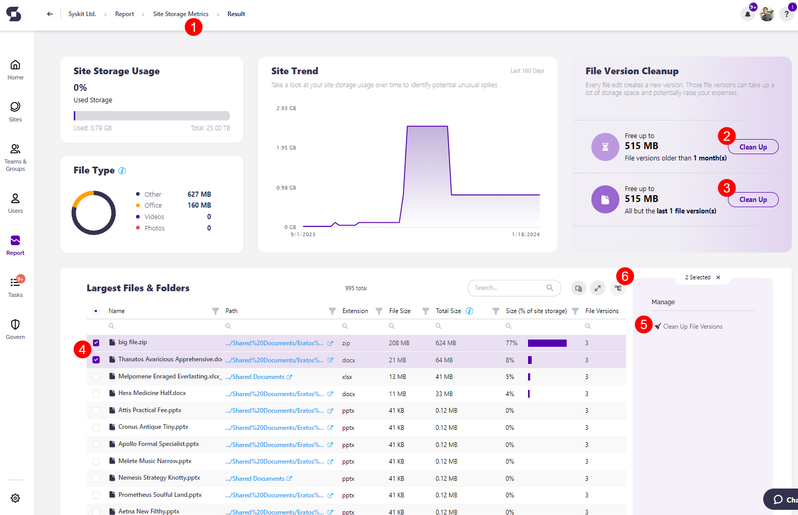
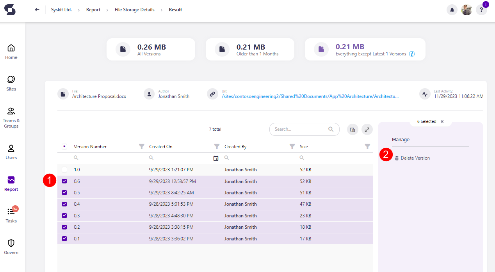

# Storage Management

**Storage management in Microsoft 365 is an important task, as it directly impacts your monthly expenses**. 
When talking about storage in Microsoft 365, we usually refer to the SharePoint space an organization has at its disposal, which depends on the number of purchased licenses.

[Read this article provided by Microsoft to learn more about SharePoint storage limits](https://learn.microsoft.com/en-us/office365/servicedescriptions/sharepoint-online-service-description/sharepoint-online-limits).

After you run out of storage for your SharePoint sites, depending on your plan, you can use the Office 365 Extra File Storage add-on to buy more storage in 1GB increments.
The best thing you can do **to avoid additional costs is to proactively clean up your storage and use tools that are available to manage your storage**.

In the sections below, you can find ways to utilize Microsoft 365 built-in options, as well as Syskit Point, to stay on top of your storage management tasks.

This article contains details on:

  * [Storage Metrics Reports in Syskit Point](../storage-management/storage-management.md#storage-metrics-report-in-syskit-point)
  * [How to Free Up Storage](../storage-management/storage-management.md#free-up-storage)

[To find more information and see if your plan is eligible to buy extra storage, explore the following Microsoft article](https://learn.microsoft.com/en-us/microsoft-365/commerce/add-storage-space?view=o365-worldwide).

## Storage Metrics Reports in Syskit Point

The new [Storage Metrics report](../../reporting/storage-management/storage-reports.md#storage-metrics) is available in the latest Syskit Point version and helps you:
* **Discover the percentage of used storage in your tenant (1)**
* **See a trend of your storage usage over time (2)**
* **Find the largest sites in your tenant (3)**

You can also find the most important storage-related information for the largest sites:
* **State (4)** - current state of the site 
* **Size (5)** - storage used up by the SharePoint site
* **Storage Limit (6)**
    * Storage limit defined per site
    * By default, set in SharePoint to 25TB if not otherwise defined manually for the observed site; 25TB represents the pool of total available storage, although the actual size of available storage can be smaller, depending on the number of purchased licenses
    * Storage Limit for soft deleted sites is set to = KB
* **% of Limit (7)** - shows the percentage of the site's size in the defined site storage limit
* **Alert on % of Limit (8)** - shows the site's defined percentage limit when email notifications are sent to owners

Once you detect the largest sites with the help of the Storage Metrics report, use the **link in the Storage Metrics URL column (9)** to open the site-specific Storage Metrics report. From there, you can start to clean up versions and files on your site.

You can also access the [Site Storage](../../reporting/storage-management/storage-reports.md#site-storage-metrics) and the [File Storage](../../reporting/storage-management/storage-reports.md#file-storage-details) reports.

With the help of these reports, you can:

 * Gain deeper **insight into how your storage is used by specific file types**, such as videos, photos, office documents, and others. 

 * See how much **storage you can save per site** if you delete file versions older than a certain number of months or every file version except for the most recent one. 

 * **Complete the Clean Up File Versions action and free up space**. 

For more details on exactly what information can be found in the reports, [take a look at the Storage Reports article](../../reporting/storage-management/storage-reports.md)

## Free Up Storage

To **free up storage directly in Syskit Point**, you can generate the **Site Storage Metrics report** directly from Reports and filtering to the **Cleanup & Health Check** section.

It can also be generated from the tenant-wide **Storage Metrics Report** in the following way:
 
 * **Click the View All** button on the Storage tile located on the dashboard.
   * Alternatively, **click the Reports button** located on the left side of the screen, **select Cleanup & Health Check** in the filter, and **click the Storage Metrics report**.

Once the Storage Metrics Report is generated, under the Largest Sites section, **click the name of the site** you want to remove storage from. This opens the **Site Storage Metrics report (1)**. 

There are three different ways to clean up the storage space across your sites. 

 * In the File Version Cleanup tile, you can:
   * **Choose to Clean Up file versions older than X month(s) (2)**
   * **Choose to Clean Up all but the last X file version(s) (3)**
     * The exact numbers shown here can be customized in your Syskit Point settings; for more details on this, take a look at the [Configure Storage Management article](../../configuration/configure-storage-management.md)

  * **Selecting the site (4)**, or the files included in the site and clicking the **Clean Up File Versions button (5)**, located on the right side of the screen under the **Manage section**. 

Once you click the **Clean Up button** on the File Version Cleanup tile or the **Clean Up File Versions button** in the Manage section, a **Clean Up File Versions pop-up opens (1)**.
  * To premanantly delete the file(s), check the **Permanantly delete checkbox (2)**; doing this instantly frees up space for your site.
    * If the checkbox is not selected, the file(s) are sent to the site's Recycle bin for the defined retention period; doing this does not instantly free up space for your site, and the space is only cleared once the file(s) are removed from recycle bin. 
  * **Type Clean Up (3)** in the the available space to proceed.
  * **Click the Clean Up button (4)** to finalize.

You can complete this action on the File Storage details screen as well. To navigate there, repeat the above steps until you reach the Site Storage Metrics report. 

From there:

 * Under the Largest Files & Folders section, **click the arrow next to the folders** to expand them until you reach the list of files within the folder.
 * **Click the name of the file** you want to generate the report for.
 * Once the report is generated, **select one or more of the file versions (1)**, and the **action to Delete Version (2)** is then available on the right side of the screen under the **Manage section**. 


**Hint!** The latest version is never deleted, even if you select all versions and run the Delete Version or Clean Up File Versions action.


You can also remove storage directly from SharePoint by clicking the **link in the Storage Metrics URL column**. 
  * The SharePoint site-specific Storage Metrics report opens in your browser.


[Learn about the site storage limits in Microsoft 365 in this article.](../../reporting/storage-management/site-storage-limits.md)


## Related Articles

* [Configure Storage Management](../../configuration/configure-storage-management.md)
* [Configure Tenant Storage Limit Policy](../../governance-and-automation/automated-workflows/tenant-storage-admin.md)
* [Site Storage Limits in Microsoft 365](../../reporting/storage-management/site-storage-limits.md)
* [Tenant Storage Security & Compliance Check](../../governance-and-automation/security-compliance-checks/tenant-storage.md)
* [Resolve Tenant Storage Limit Task](../../point-collaborators/resolve-governance-tasks/tenant-storage-limit.md)
* [Storage Metrics Report](../../reporting/storage-management/storage-reports.md#storage-metrics)
* [Site Storage Metrics Report](../../reporting/storage-management/storage-reports.md#site-storage-metrics)
* [File Storage Details Report](../../reporting/storage-management/storage-reports.md#file-storage-details)