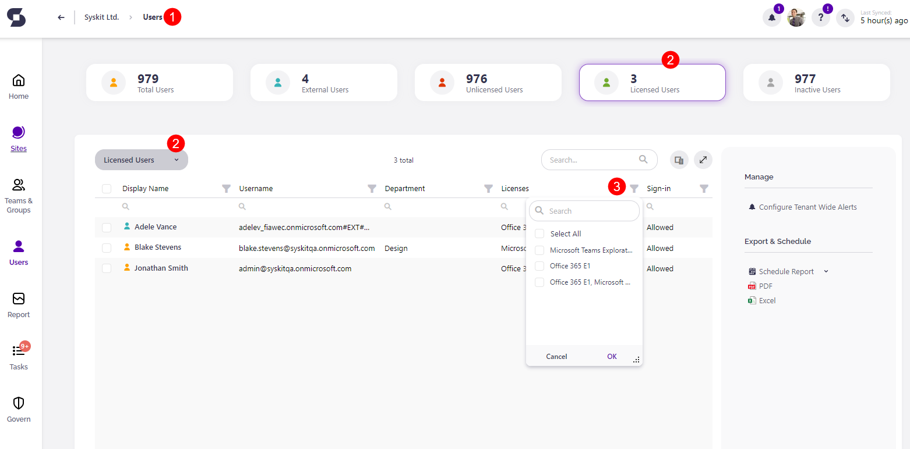
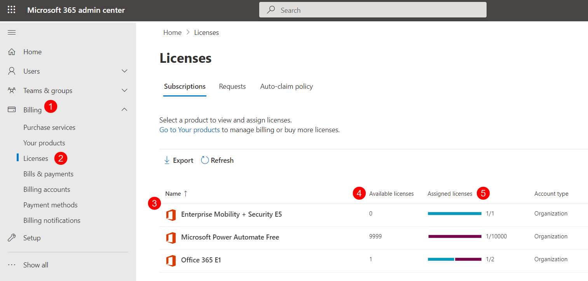
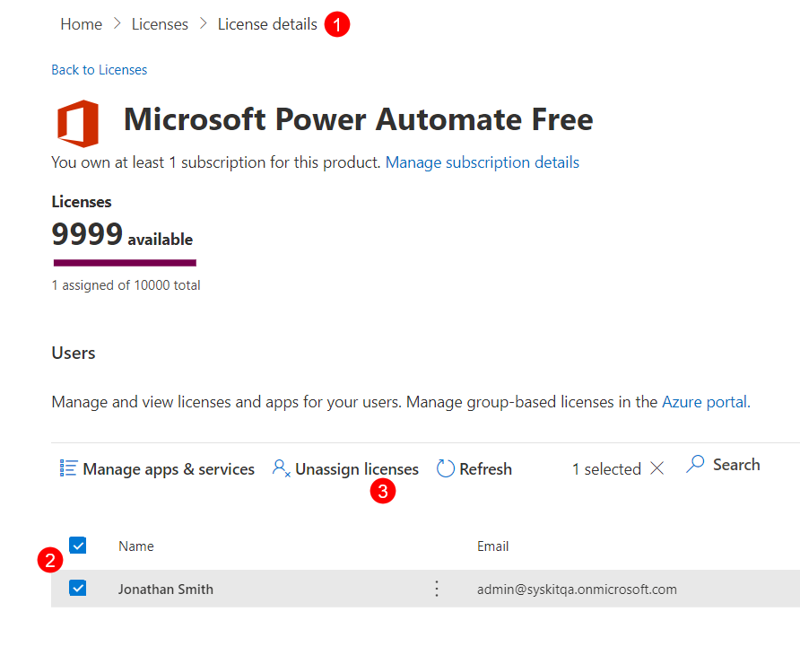
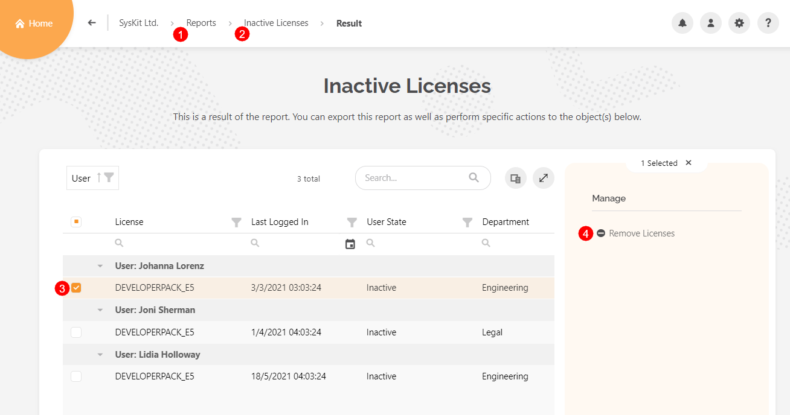

# Licensed Users Count

The licensing of the SysKit Point subscription **depends on the number of licensed users within the Microsoft 365 tenant connected to SysKit Point**.

**Licensed Users are all users with any type of Microsoft 365 license attached to them**.
 * Only **unique Licensed Users or Guest Users will be counted**, regardless of how many licenses the unique User has assigned to them. 
 * **Guest Users** only fit into that category **if they have a license assigned**. 
   * Having a license assigned to Guest Users is unnecessary for rudimentary use cases such as sharing content and using the Microsoft Teams app.


**Please note!**  
Free Microsoft licenses assigned - for example, Microsoft Flow Free - are also counted when calculating licensed users in SysKit Point.


The number of licensed Users within Syskit Point can be found by going to **Settings (1) > General (2) > Point License (3) > Number of Users M/N (4)**.

 * **M** is the **number of licensed users in the tenant** 
 * **N** is the **number of Paid users that are included in the SysKit Point license**

**The exact number and type of licenses** that are counted toward your SysKit Point subscription can be found on the **Licensed Users tile**. 
* Click **Users (1)** on the Home page
* Select **Licensed Users (2)** from the drop-down menu or tile
* **Browse (3)** by type of license assigned to users under the Licenses section

To access information on how many assigned licenses there are in your Microsoft 365, visit the admin center and take the following steps. 

Under **Billing (1)**, select **Licenses (2)**. The list of **owned licenses (3)** will then be shown. 
 * The **Available Licenses (4)** section is the number of licenses that are still available to be assigned to users. 
 * The **Assigned Licenses (5)** section shows the number of assigned licenses compared to the available number. 

Selecting each license allows you to **Assign** it to additional users or **Unassign** it from current ones. This can help with optimizing the cost of the SysKit Point subscription to suit your needs better.

**To unassign users from a license** click on the license name to select it. The **License details (1)** screen will open.

 * Once there, **select either the individual Users to unassign or the top box to select all Users (2)**.
 * This will provide the option to click on **Unassign licenses (3)**; a pop-up will open requesting you click the **Unassign button to confirm**.

The pricing for SysKit Point is **calculated based on each User that has a license assigned to them**. 
For example, if one User has three licenses, the charge would still be for that one User, regardless of the number of licenses assigned to them. 


**Please note!**  
SysKit Point **does** count the free Microsoft 365 licenses while calculating cost.  


## License Cleanup

If you have Inactive Users, you can remove their license through SysKit Point through the following steps:
 * **On the Home screen, click the Reports tile (1)**; the Reports page will open with several available options
 * **Scroll to the bottom of the site and select Inactive Licenses (2)**; this will open the report section that will show you all of the licenses that are currently assigned to inactive Users or Guest Users

 * **Select the license of an inactive User (3)**; you can select one or multiple licenses. 
    * To select all inactive licenses at once, press the top checkbox on the left, next to the title 'License.' 
 * **Press the Remove Licenses button (4)**; the button is located on the right side of the screen. 
    * Once selected, a pop-up will appear. **Type REMOVE and click the Remove button to proceed**. 

## Related Articles

For more information on customizing license reports, take a look at the [Customize License Reports article](../configuration/customize-license-reports.md). 
