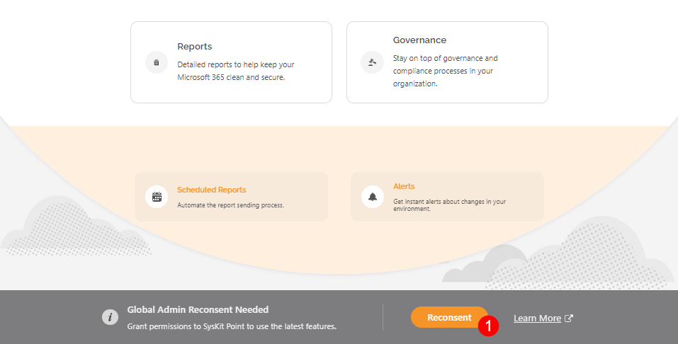

# Change Log

SysKit Point is constantly evolving and adding new features. Sometimes, we require additional consent from a Global administrator in your organization for these new features to work. This might be needed after you upgraded to the latest version of SysKit Point.

## How To Tell if Global Admin Re-Consent Is Needed After the Upgrade?
If the latest SysKit Point version has some new permissions requirements to which your Global Administrator has not consented before, you will get a notification at the bottom of the Welcome Home screen after your first sign in to the new version:

**Global Admin Reconsent Needed** - Grant permissions to SysKit Point to use the latest feature.

To resolve this and ensure all the new features work properly, ask your Global Administrator to sign in to SysKit Point and click **Reconsent (1)** on the shown notification.

Depending on which version you are upgrading to, below you can find the list of changes in permissions requested and which features depend on them.

## SysKit Point 2023.1

**SysKit Point 2023.1 supports sync and management of distribution lists and email enabled security groups**. In order to sync all needed data and for the end-users to perform management actions, additional permissions were added to access the Exchange service.

**Global Admin must re-consent permissions after the upgrade to SysKit Point 2023.1**. 

**The following permissions were added to the existing SysKit Point app registrations**:

| App Registration | API/Permissions Name | Permission | Type | Reason |
| :--- | :--- | :--- | :--- | :--- |
| SysKit Point Service | Exchange.ManageAsApp | Manage Exchange as application | Application | Allows SysKit Point to sync distribution lists and email enabled security groups. |
| SysKit Point Permissions Loader | Exchange.ManageAsApp | Manage Exchange as application | Application | Allows SysKit Point to sync distribution lists and email enabled security groups. |
| SysKit Point Client | Exchange.Manage | Manage Exchange configuration | Delegated | Allows SysKit Point users to manage owners and members in distribution lists and email enabled security groups. |

## SysKit Point 2022.5

Due to [Outlook REST APIs being fully decommissioned on November 30, 2022](https://devblogs.microsoft.com/microsoft365dev/outlook-rest-api-v2-0-deprecation-notice/),  **with version 2022.5**, **SysKit Point migrates to Microsoft Graph API**. **The newly added permissions listed below are used to send all automatic and on-demand emails in SysKit Point**.

**Global Admin must re-consent permissions after the upgrade to SysKit Point 2022.5**. 

**The following permissions were added to the existing SysKit Point service app registration**:

| App Registration | API/Permissions Name | Permission | Type | Reason |
| :--- | :--- | :--- | :--- | :--- |
| SysKit Point Service | Microsoft Graph/Mail.ReadWrite | Read and write mail in all mailboxes | Application | Allows SysKit Point to send emails as a part of the Access Review, Lifecycle Management, Scheduled Reports, Alerts, and other features. |
| SysKit Point Service | Microsoft Graph/Mail.Send | Send mail as any user | Application | Allows SysKit Point to send emails as a part of the Access Review, Lifecycle Management, Scheduled Reports, Alerts, and other features. |

**The following permissions were removed from the existing SysKit Point service app registration**:

| App Registration | API/Permissions Name | Permission | Type | Reason |
| :--- | :--- | :--- | :--- | :--- |
| SysKit Point Service | Microsoft 365 Exchange Online/Mail.Send | Send mail as any user | Application | Allows SysKit Point to send emails as a part of the Access Review, Lifecycle Management, Scheduled Reports, and Alerts features. |

## SysKit Point 2022.4.1

**Additional permissions for the Access Review feature were added** to the existing app registrations regarding private channels support.

Therefore, **a Global Admin will have to re-consent in the SysKit Point Welcome Home screen**.

## SysKit Point 2022.4

**The following app registration was added**:
  * **SysKit Point Power Platform**
    * created during the upgrade to the new SysKit Point version
    * used to collect Power BI data
    * by default, no permissions are added

Due to listed permission changes, **Global Admin is required to re-consent permissions**.

[To see the complete list of used App Registrations and assigned permissions, navigate to the Permission Requirements article](permission-requirements.md).

**The following permissions were added to existing app registrations**:

| App Registration | Permissions | Type | Reason |
| :--- | :--- | :--- | :--- |
| SysKit Point Service | Read the members of all channels | Application | Allows SysKit Point to collect membership data for private and shared channels. |
| SysKit Point Permissions Loader | Read the members of all channels | Application | Allows SysKit Point to collect membership data for private and shared channels. |
| SysKit Point Client | Add and remove members from channels | Delegated | Enables users to manage private channels in SysKit Point. |

Due to listed permission changes, **Global Admin is required to re-consent permissions**.

[To see the complete list of used App Registrations and assigned permissions, navigate to the Permission Requirements article](permission-requirements.md).

## SysKit Point 2022.3

**The following app registration was added**:
  * **SysKit Point Configuration Inventory** - created when the Configuration Inventory module is deployed with SysKit Point; used to collect Microsoft 365 configuration data

Therefore, a **Global Admin will have to re-consent in the SysKit Point Welcome Home screen**.

[To see the complete list of permissions assigned to the SysKit Point Configuration Inventory app registration, navigate to the following article](../configuration-inventory/configuration-inventory-requirements.md#configuration-inventory-app-permissions).

## SysKit Point 2022.2

* A **redirect URI was added to the SysKit Point Service app registration** that **enables SysKit Point Admins to access the new Hangfire dashboard**. The Hangfire dashboard offers an overview of the status of all the background jobs SysKit Point is periodically running. Therefore, a **Global Admin will have to**:
  * **Re-Consent in the SysKit Point Welcome Home screen**
  * **Navigate to the Hangfire dashboard URL and grant permissions to the SysKit Point Service** so that it can log in users from the tenant securely.
* **No new permissions were added**

## SysKit Point 2021.10

**The following app registrations were added**:
* **SysKit Point Permissions Loader** - used for optimized data sync of SharePoint sites and OneDrive
* **SysKit Point API** - used for third-party app integration to get SysKit Point data and use it in other business applications and web services; **currently in Beta stage**; by default, the app registration has **no permissions added**

**The following permissions were added**:

| App Registration | Permissions | Type | Reason |
| :--- | :--- | :--- | :--- |
| SysKit Point Client | Read all users' relevant people lists | Delegated | Allows SysKit Point to display users' relevant people lists in People Picker within SysKit Point Teams app. |
| SysKit Point Service | Read files in all site collections | Application | Enables SysKit Point to perform partial site syncs, containing changed files only.  |
| SysKit Point Service | Read all published labels and label policies for an organization | Application | Enables SysKit Point to sync published sensitivity labels and store them in the database. | 
| SysKit Point Permissions Loader | Uses the same set of permissions as SysKit Point Service App Registration  | Application | Used for optimized SharePoint and OneDrive sync. |
| SysKit Point API | No permissions added  | - | Used for third-party app integration. |

[To see the complete list of used App Registrations and assigned permissions, navigate to the Permission Requirements article](permission-requirements.md).

