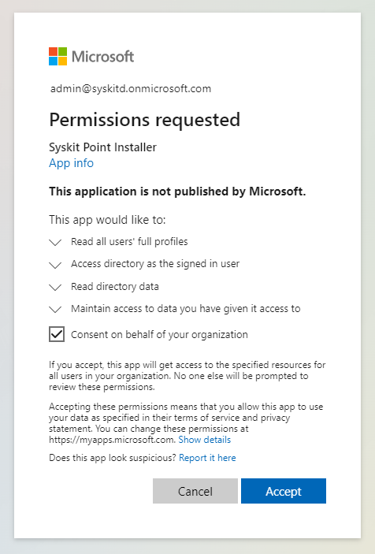

# Permission Requirements

## Microsoft 365

When [connecting to your Microsoft 365 tenant](../set-up-point-data-center/deployment/connect-to-tenant.md), it is **required for you to connect with a Global Administrator account**.


**Please note!**\
Microsoft 365 Global Admin credentials are only needed when connecting for the first time.


Below, the reasons for such requirements are described in greater detail.

## Global Administrator

When [connecting to a Microsoft 365 tenant](../set-up-point-data-center/deployment/connect-to-tenant.md) for the first time, **you must connect with a Global Administrator account.**

**The first time you connect to your Microsoft 365 tenant, you will be prompted to consent** to a set of permissions that Syskit Point requires to function correctly. Additional prompts may appear in the future when installing a newer version of Syskit Point because of new functionality and, consequently, new permissions required.

## Syskit Point App Permissions


**Please note!**\
Permissions described below are automatically granted to Syskit Point by giving consent during the initial connection process.


To achieve its functionality, Syskit Point is registered as an **Enterprise Application in Azure Active Directory.** The permissions model is based on OAuth and OpenID Connect flows. This enables Syskit Point to consume all of the APIs provided by Microsoft in a standard and well-defined way. It also allows the use of modern authentication, including Multi-Factor Authentication.\
Syskit Point requires permissions to access several Microsoft APIs. There are two types of required permissions:

* **Application permissions** - define what Syskit Point can do without a signed-in user.
* **Delegated permissions** - define what Syskit Point can do in the name of the signed-in user.

The following permissions are required for **Syskit Point Installer** Enterprise Application:

**Microsoft Graph**

| Permissions                              | Type      | Reason                                                                                                                     |
| ---------------------------------------- | --------- | -------------------------------------------------------------------------------------------------------------------------- |
| Read all users' full profiles            | Delegated | Allows Syskit Point to read your users' profiles and show you reports based on that data.                                  |
| Access directory as the signed-in user   | Delegated | Allows Syskit Point to access your directory.                                                                              |
| Read directory data                      | Delegated | Allows Syskit Point to autodiscover your sites, groups, and users.                                                         |
| Sign users in                            | Delegated | Allows Syskit Point to scan your environment as a signed-in user                                                           |
| View users' basic profile                | Delegated | Allows Syskit Point Microsoft Teams application to show users basic data and allow secure communication with Syskit Point. |
| **Windows Azure Service Management API** |           |                                                                                                                            |

| Permissions                                           | Type      | Reason                                                                                        |
| ----------------------------------------------------- | --------- | --------------------------------------------------------------------------------------------- |
| Access Azure Service Management as organization users | Delegated | Allows Syskit Point to create an additional application in your tenant for safer data access. |

To allow safer access to your Microsoft 365 tenant data and optimize the data sync process, additional app registrations are created during the [initial connect](../set-up-point-data-center/deployment/connect-to-tenant.md) process:

* **Syskit Point Service**
* **Syskit Point Client**
* **Syskit Point Permissions Loader**
* **Syskit Point API** - currently in Beta stage and not being used by default

### Syskit Point Service

**Syskit Point Service** app registration is used for [data Sync](../get-to-know-syskit-point/collect-office-365-data.md), [audit log collection](../configuration/customize-audit-logs-collection.md), and sending emails. The following permissions enable Syskit Point to perform these actions:

**Microsoft Graph**

| Permissions                                                      | Type        | Reason                                                                                                                                                                                                                       |
| ---------------------------------------------------------------- | ----------- | ---------------------------------------------------------------------------------------------------------------------------------------------------------------------------------------------------------------------------- |
| Read all audit log data                                          | Application | Enables Syskit Point to access data used to determine the time of the last sign-in for guest users.                                                                                                                          |
| Read the members of all channels                                 | Application | Allows Syskit Point to collect membership data for private and shared channels.                                                                                                                                              |
| Read directory data                                              | Application | Allows Syskit Point to autodiscover your sites, groups, and users.                                                                                                                                                           |
| Read files in all site collections                               | Application | Enables Syskit Point to perform partial site syncs containing changed files only.                                                                                                                                            |
| Read and write all groups                                        | Application | Allows Syskit Point to read Microsoft 365 Group data and show you reports based on that data. Additionally, it allows you to manage your groups from Syskit Point.                                                           |
| Read and write all group members                                | Application | Allows Syskit Point to add members and owners to all types of groups in the access request process after the request is approved. |   
| Read all published labels and label policies for an organization | Application | Enables Syskit Point to sync published sensitivity labels and store them in the database.                                                                                                                                    |
| Read and write mail in all mailboxes                             | Application | Allows Syskit Point to send emails as a part of the Access Review, Lifecycle Management, Scheduled Reports, Alerts, and other features.                                                                                      |
| Send mail as any user                                            | Application | Allows Syskit Point to send emails as a part of the Access Review, Lifecycle Management, Scheduled Reports, Alerts, and other features.                                                                                      |
| Read all usage reports                                           | Application | Allows Syskit Point to read usage reports generated by Microsoft.                                                                                                                                                            |
| Read and write users' full profiles                              | Application | Allows Syskit Point to read your users' profiles and show you reports based on that data. Additionally, it allows Syskit Point to automatically remove inactive guest users if defined in the Inactive Guest Users policy. |
| Read and write all directory RBAC settings                       | Application | Allows Syskit Point to add members and owners to all types of groups in the access request process after the request is approved. |  

**Microsoft 365 Exchange Online**

| Permissions                    | Type        | Reason                                                                            |
| ------------------------------ | ----------- | --------------------------------------------------------------------------------- |
| Manage Exchange as application | Application | Allows Syskit Point to sync distribution lists and email enabled security groups. |

**Microsoft 365 Management APIs**

| Permissions                                           | Type                   | Reason                                                      |
| ----------------------------------------------------- | ---------------------- | ----------------------------------------------------------- |
| Read activity data for your organization              | Delegated, Application | Allows Syskit Point to read your organization's audit logs. |
| Read service health information for your organization | Delegated, Application | Allows Syskit Point to read your organization's audit logs. |

**SharePoint**

| Permissions                    | Type        | Reason                                                                                                                |
| ------------------------------ | ----------- | --------------------------------------------------------------------------------------------------------------------- |
| Have full control on all sites | Application | Allows Syskit Point to read documents and list items in all site collections and show you reports based on that data. |



**Please note:** The Syskit Point Service Principal is also added to the Exchange Administrator; this enables syncing the distribution list and email-enabled security group owners and running management actions for such groups in Syskit Point.



### Syskit Point Client

The second app registration, **Syskit Point Client**, enables users to securely sign in to Syskit Point and perform actions they are entitled to, based on their permissions in Microsoft 365 environment. The following permissions are used:

**Microsoft Graph**

| Permissions                                                 | Type      | Reason                                                                                                                                                             |
| ----------------------------------------------------------- | --------- | ------------------------------------------------------------------------------------------------------------------------------------------------------------------ |
| Add and remove members from channels                        | Delegated | Enables users to manage private channels in Syskit Point.                                                                                                          |
| Access directory as the signed-in user                      | Delegated | Allows Syskit Point to access your directory.                                                                                                                      |
| Read and write directory data                               | Delegated | Allows Syskit Point to autodiscover your sites, groups, and users; allows license management actions to be performed.                                              |
| View users' email address                                   | Delegated | Allows Syskit Point to log users in Microsoft Teams application.                                                                                                   |
| Read and write all groups                                   | Delegated | Allows Syskit Point to read Microsoft 365 Group data and show you reports based on that data. Additionally, it allows you to manage your groups from Syskit Point. |
| Maintain access to data you have given it access to         | Delegated | Allows Syskit Point always to show you the latest data about your environment.                                                                                     |
| Sign users in                                               | Delegated | Allows Syskit Point to scan your environment as the signed-in user.                                                                                                |
| Read all users' relevant people lists                       | Delegated | Allows Syskit Point to display users' relevant people lists in People Picker within Syskit Point Teams app.                                                        |
| Read presence information of all users in your organization | Delegated | Allows Syskit Point Microsoft Teams application to show the status of users.                                                                                       |
| View users' basic profile                                   | Delegated | Allows Syskit Point Microsoft Teams application to show users basic data and allow secure communication with Syskit Point.                                         |
| Add and remove members from teams | Delegated | Allows Syskit Point to add newly created users in AAD to Microsoft Teams and private channels. |
| Send a teamwork activity to any user                        | Application | Allows Syskit Point Microsoft Teams application to send notifications to users.                                                                                    |
| Read and write all users' full profiles                     | Delegated | Allows Syskit Point to read your users' profiles and show you reports based on that data; allows license management actions to be performed.                       |

When using Microsoft Authentication Flow to connect a service account, the following Microsoft Graph permissions are added to the Syskit Point Client app registration:

| Permissions                                                      | Type      | Reason                                                        |
| ---------------------------------------------------------------- | --------- | ------------------------------------------------------------- |
| Read all published labels and label policies for an organization | Delegated | Enables service account to read published sensitivity labels. |
| Read users' full profiles                                        | Delegated | Allows service account to read your users' profiles.          |

**Microsoft 365 Exchange Online**

| Permissions                   | Type      | Reason                                                                                                          |
| ----------------------------- | --------- | --------------------------------------------------------------------------------------------------------------- |
| Manage Exchange configuration | Delegated | Allows Syskit Point users to manage owners and members in distribution lists and email enabled security groups. |

**SharePoint**

| Permissions                               | Type      | Reason                                                                 |
| ----------------------------------------- | --------- | ---------------------------------------------------------------------- |
| Have full control of all site collections | Delegated | Allows you to manage your Site Collections directly from Syskit Point. |

**Power Platform**


By default, the following permissions are not added during the initial connection to your tenant.
Permissions are added when Power Apps and Power Automate data collection is enabled. 


**When Power Apps and Power Automate data collection is configured**, new permissions are added to the following app registrations when the Global Administrator provides consent.

| App Registration | Permission Name | Reason |
| --- | --- | --- |
| Syskit Point Client | PowerAppManagementApp | Allows Syskit Point to access the PowerApps Service API and collect Power Platform resources data.  |
| Syskit Point Power Platform | PowerAppManagementApp | Allows Syskit Point to access the PowerApps Service API and collect Power Platform resources data. |


**Please note!**  
Added permissions for Power Apps and Power Automate data collection are not visible in the Microsoft Entra interface. 
To manage the permissions, you can run the related PowerShell cmdlets described in the following articles:
* [Get-PowerAppManagementApp](https://learn.microsoft.com/en-us/powershell/module/microsoft.powerapps.administration.powershell/get-powerappmanagementapp?view=pa-ps-latest)
* [Remove-PowerAppManagementApp](https://learn.microsoft.com/en-us/powershell/module/microsoft.powerapps.administration.powershell/remove-powerappmanagementapp?view=pa-ps-latest)


**With introduction of Power Platform Actions in Point Cloud v2025.2.88, reconsent is required from the Global Administrator.** With reconsent, the following permission is added:

| API/Permissions Name                     | Permission                        | Type      | Reason                                                                                         |
| ---------------------------------------- | --------------------------------- | --------- | ---------------------------------------------------------------------------------------------- |
| PowerApps Service/User | Access the PowerApps Service API | Delegated | Allows you to run Power Platform actions in Syskit Point. |

### Syskit Point Permissions Loader

**Syskit Point Permissions Loader** app registration is used for optimized [data Sync](../get-to-know-syskit-point/collect-office-365-data.md) for SharePoint and OneDrive data paired with the Syskit Point Service app registration. The following permissions enable Syskit Point to perform these actions:

**Microsoft Graph**

| Permissions                                                      | Type        | Reason                                                                                                                                                                                                                       |
| ---------------------------------------------------------------- | ----------- | ---------------------------------------------------------------------------------------------------------------------------------------------------------------------------------------------------------------------------- |
| Read all audit log data                                          | Application | Enables Syskit Point to access data used to determine the exact time of the last sign-in for guest users.                                                                                                                    |
| Read the members of all channels                                 | Application | Allows Syskit Point to collect membership data for private and shared channels.                                                                                                                                              |
| Read directory data                                              | Application | Allows Syskit Point to autodiscover your sites, groups, and users.                                                                                                                                                           |
| Read files in all site collections                               | Application | Enables Syskit Point to perform partial site syncs, containing changed files only.                                                                                                                                           |
| Read and write all groups                                        | Application | Allows Syskit Point to read Microsoft 365 Group data and show you reports based on that data. Additionally, it allows you to manage your groups from Syskit Point.                                                           |
| Read all published labels and label policies for an organization | Application | Enables Syskit Point to sync published sensitivity labels and store them in the database.                                                                                                                                    |
| Read and write mail in all mailboxes                             | Application | Allows Syskit Point to send emails as a part of the Access Review, Lifecycle Management, Scheduled Reports, Alerts, and other features.                                                                                      |
| Send mail as any user                                            | Application | Allows Syskit Point to send emails as a part of the Access Review, Lifecycle Management, Scheduled Reports, Alerts, and other features.                                                                                      |
| Read all usage reports                                           | Application | Allows Syskit Point to read usage reports generated by Microsoft.                                                                                                                                                            |
| Read and write users' full profiles                              | Application | Allows Syskit Point to read your users' profiles and show you reports based on that data. Additionally, it allows Syskit Point to automatically remove inactive guest users if defined in the Inactive Guest Users policy. |

**Microsoft 365 Exchange Online**

| Permissions                    | Type        | Reason                                                                            |
| ------------------------------ | ----------- | --------------------------------------------------------------------------------- |
| Manage Exchange as application | Application | Allows Syskit Point to sync distribution lists and email enabled security groups. |

**Microsoft 365 Management APIs**

| Permissions                                           | Type                   | Reason                                                      |
| ----------------------------------------------------- | ---------------------- | ----------------------------------------------------------- |
| Read activity data for your organization              | Delegated, Application | Allows Syskit Point to read your organization's audit logs. |
| Read service health information for your organization | Delegated, Application | Allows Syskit Point to read your organization's audit logs. |

**SharePoint**

| Permissions                    | Type        | Reason                                                                                                                |
| ------------------------------ | ----------- | --------------------------------------------------------------------------------------------------------------------- |
| Have full control on all sites | Application | Allows Syskit Point to read documents and list items in all site collections and show you reports based on that data. |



**Please note:** The Syskit Point Permissions Loader Principal is also added to the Exchange Administrator role; this enables syncing the distribution list and email-enabled security group owners and running management actions for such groups in Syskit Point.



### Syskit Point Power Platform


By default, no permissions are added during the initial connection to your tenant.
Permissions are added when Power BI or Power Apps and Power Automate data collection is enabled. 


**Power BI**

**If Power BI data collection is configured**, the following Admin API permissions are given through a specified security group:

* read-only access to all the information available through Power BI admin APIs; for example, user names and emails, dataset and report detailed metadata
* read-only access to detailed metadata about Power BI items; for example, responses from GetScanResult APIs will contain the names of dataset tables and columns

[Read the following article to learn how to enable Power BI data collection in Syskit Point.](../configuration/enable-powerBI-data-collection.md)

**Power Apps and Power Automate**

**When Power Apps and Power Automate data collection is configured**, new permissions are added to the following app registrations when the Global Administrator provides consent.

| App Registration | Permission Name | Reason |
| --- | --- | --- |
| Syskit Point Client | PowerAppManagementApp | Allows Syskit Point to access the PowerApps Service API and collect Power Platform resources data.  |
| Syskit Point Power Platform | PowerAppManagementApp | Allows Syskit Point to access the PowerApps Service API and collect Power Platform resources data. |


**Please note!**  
Added permissions for Power Apps and Power Automate data collection are not visible in the Microsoft Entra interface. 
To manage the permissions, you can run the related PowerShell cmdlets described in the following articles:
* [Get-PowerAppManagementApp](https://learn.microsoft.com/en-us/powershell/module/microsoft.powerapps.administration.powershell/get-powerappmanagementapp?view=pa-ps-latest)
* [Remove-PowerAppManagementApp](https://learn.microsoft.com/en-us/powershell/module/microsoft.powerapps.administration.powershell/remove-powerappmanagementapp?view=pa-ps-latest)


[See the following article to learn how to enable Power Apps and Power Automate data collection in Syskit Point.](../configuration/power-platform.md)

### Syskit Point API

**Syskit Point API** app registration is used for third-party app integration, meaning you can get Syskit Point data via Syskit Point API and use it in other business applications and web services.\
**This feature is currently in the Beta stage**.

By default, the **app registration has no permissions added**.

## Related Topics

* [System Requirements for Data Center](../set-up-point-data-center/deployment/system-requirements.md)
* [Deploy Syskit Point for Data Center](../set-up-point-data-center/deployment/deploy-syskit-point.md)
