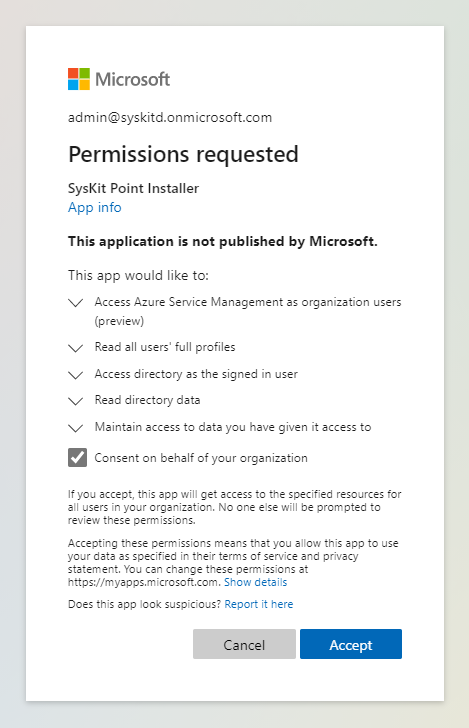

#Permission Requirements
## Microsoft 365

After SysKit Point deployment, when [connecting to your Microsoft 365 tenant](../installation/connect-to-tenant.md), it is __required for you to connect with a Global Administrator account__.


**Please note!**  
Microsoft 365 Global Admin credentials are only needed when connecting for the first time.


Below, reasons for such requirements are described in greater detail.

### Global Administrator

When [connecting to a Microsoft 365 tenant](../installation/connect-to-tenant.md) for the first time, **you need to connect with a Global Administrator account.**

**The first time you connect to your Microsoft 365 tenant, you will be prompted to consent** to a set of permissions that SysKit Point requires to function correctly. Additional prompts may show up in the future when installing a newer version of SysKit Point because of new functionality, and in consequence, potentially new required permissions.

### SysKit Point App Permissions


**Please note!**  
Permissions described below are automatically granted to SysKit Point by giving consent during the initial connection process.


To achieve its functionality, SysKit Point is registered as an **Enterprise Application in Azure Active Directory.** The permissions model is based on OAuth and OpenID Connect flows. This enables SysKit Point to consume all of the APIs provided by Microsoft in a standard and well-defined way. It also allows the use of modern authentication, including Multi-Factor Authentication.  
SysKit Point requires permissions to access several Microsoft APIs. There are two types of required permissions:

* **Application permissions** - define what SysKit Point can do without a signed-in user.
* **Delegated permissions** - define what SysKit Point can do in the name of the signed-in user.

The following permissions are required for __SysKit Point Installer__ Enterprise Application:

**Microsoft Graph**

| Permissions | Type | Reason |
| :--- | :--- | :--- |
| Read all users' full profiles | Delegated | Allows SysKit Point to read your users' profiles and show you reports based on that data. |
| Access directory as the signed-in user | Delegated | Allows SysKit Point to access your directory. |
| Read directory data | Delegated | Allows SysKit Point to autodiscover your sites, groups, and users. |
| Sign users in | Delegated | Allows SysKit Point to scan your environment as a signed-in user |
| View users' basic profile | Delegated | Allows SysKit Point Microsoft Teams application to show users basic data and allow secure communication with SysKit Point. |
**Windows Azure Service Management API**

| Permissions | Type | Reason |
| :--- | :--- | :--- |
| Access Azure Service Management as organization users | Delegated | Allows SysKit Point to create an additional application in your tenant for safer data access. |

To allow safer access to your Microsoft 365 tenant data and to use Microsoft Authentication for signing in your users to SysKit Point, two additional app registrations are created during the [initial connect](../installation/connect-to-tenant.md) process:

* **SysKit Point Service**
* **SysKit Point Client**

### SysKit Point Service

**SysKit Point Service** app registration is used for [data Sync](../faq/collect-office-365-data.md), [audit log collection](../configuration/customize-audit-logs-collection.md), and sending emails. The following permissions enable SysKit Point to perform these actions:

**Microsoft Graph**

| Permissions | Type | Reason |
| :--- | :--- | :--- |
| Read all audit log data | Application | Enables SysKit Point to access data used to determine the exact time of the last sign-in for guest users. |
| Read directory data | Application | Allows SysKit Point to autodiscover your sites, groups, and users. |
| Read and write all groups | Application | Allows SysKit Point to read Microsoft 365 Group data and show you reports based on that data. Additionally, it allows you to manage your groups from SysKit Point. |
| Read all usage reports | Application | Allows SysKit Point to read usage reports generated by Microsoft. |
| Read and write users' full profiles | Application | Allows SysKit Point to read your users' profiles and show you reports based on that data. Additionally, it allows SysKit Point to automatically remove inactive guest users if defined in the Guest Users Expiration policy. |

**Microsoft 365 Exchange Online**

| Permissions | Type | Reason |
| :--- | :--- | :--- |
| Send mail as any user | Application | Allows SysKit Point to send emails as a part of the Access Review, Lifecycle Management, Scheduled Reports, and Alerts features. |

**Microsoft 365 Management APIs**

| Permissions | Type | Reason |
| :--- | :--- | :--- |
| Read activity data for your organization | Delegated, Application | Allows SysKit Point to read your organization's audit logs. |
| Read service health information for your organization | Delegated, Application | Allows SysKit Point to read your organization's audit logs. |

**SharePoint**

| Permissions | Type | Reason |
| :--- | :--- | :--- |
| Have full control on all sites | Application | Allows SysKit Point to read documents and list items in all site collections and show you reports based on that data. |

### SysKit Point Client

The second app registration, **SysKit Point Client**, enables users to securely sign in to SysKit Point and perform actions they are entitled to, based on their permissions in Microsoft 365 environment. The following permissions are used:

**Microsoft Graph**

| Permissions | Type | Reason |
| :--- | :--- | :--- |
| Maintain access to data you have given it access to | Delegated | Allows SysKit Point always to show you the latest data about your environment. |
| Sign users in | Delegated | Allows SysKit Point to scan your environment as the signed-in user. |
| Read and write all users' full profiles | Delegated | Allows SysKit Point to read your users' profiles and show you reports based on that data; allows license management actions to be performed. |
| Access directory as the signed-in user | Delegated | Allows SysKit Point to access your directory. |
| Read and write directory data | Delegated | Allows SysKit Point to autodiscover your sites, groups, and users; allows license management actions to be performed. |
| Read and write all groups | Delegated | Allows SysKit Point to read Microsoft 365 Group data and show you reports based on that data. Additionally, it allows you to manage your groups from SysKit Point. |
| View users' email address | Delegated | Allows SysKit Point to log users in Microsoft Teams application. |
| Read presence information of all users in your organization | Delegated | Allows SysKit Point Microsoft Teams application to show the status of users. |
| View users' basic profile | Delegated | Allows SysKit Point Microsoft Teams application to show users basic data and allow secure communication with SysKit Point. |
| Send a teamwork activity to any user | Delegated | Allows SysKit Point Microsoft Teams application to send notifications to users. |

**SharePoint**

| Permissions | Type | Reason |
| :--- | :--- | :--- |
| Have full control of all site collections | Delegated | Allows you to manage your Site Collections directly from SysKit Point. |

## Related Topics

* [System Requirements](system-requirements.md)
* [Deploy SysKit Point](../installation/deploy-syskit-point.md)

