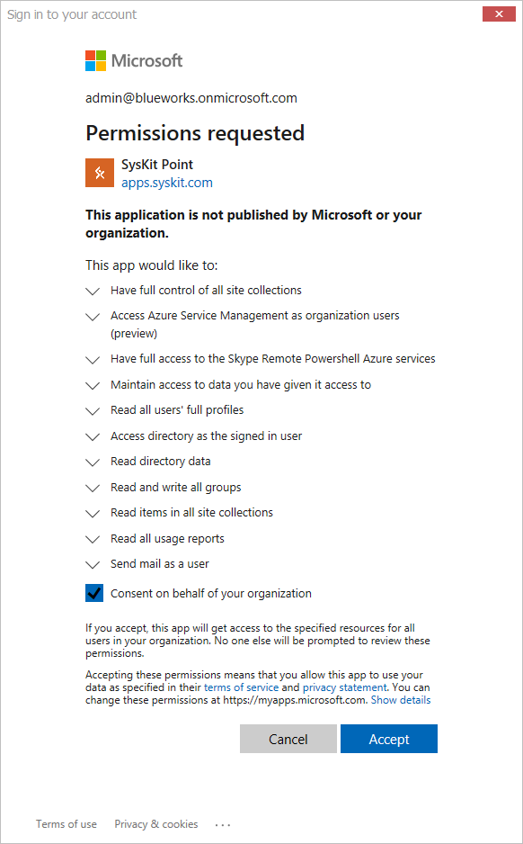

# Permission Requirements

## Installation

To install SysKit Point, you need to have **Local Administrator** privileges on the target installation computer. Once installed, SysKit Point can be used with a non-privileged user account.

## SQL Database

### Creating a new database

To be able to create a new SysKit Point dedicated database, the **user account running the installation and configuration wizard should have the following rights** on the preferred SQL server:

* **dbcreator** 
* **securityadmin**

This allows the account to create a new database and to assign proper privileges after database creation. The install account will be automatically given **db\_owner** privileges on the newly created database, if possible. Otherwise, it is advised that the account is given that privilege manually, as it is needed for upgrading the database.

### Using the existing database

User running SysKit Point installation will need to be granted the **db\_owner** rights on the existing Syskit Point database.

## Service Account

**Service Settings** page in Configuration Wizard requires appropriate [service account](https://docs.microsoft.com/en-us/windows/security/identity-protection/access-control/service-accounts) details.

A service account is a user account that is created explicitly to provide a security context for services running on Windows Server operating systems. The security context determined the service’s ability to access local and network resources. The Windows operating systems rely on services to run various features. These services can be configured through the applications, the Services snap-in, or Task Manager, or by using Windows PowerShell.

**The service account needs to have the following privileges** to be able to run the service, [collect Office 365 data](../how-to/collect-office-365-data.md) and run other associated jobs:

* **local administrator** privileges on the installation computer with UAC control disabled so we can verify your credentials
* **db\_owner** privileges on the created SysKit Point dedicated database
* **log on as Service** rights configured


If the service account is outside your domain the account name must be typed in the down-level logon name format: **domain\accountname**


## Office 365

### Global Administrator

**When connecting to an Office 365 tenant** during the [configuration](https://github.com/SysKitTeam/docs-point/tree/6f0316e1f15f779c3c2e530ae1384197b23c8607/installation-and-configuration/configure-syskit-point.md#connect-to-office-365) process, **you need to connect with a Global Administrator account.**

**The first time you connect to your Office 365 tenant, you will be prompted to give consent** to a set of permissions that SysKit Point requires to function correctly. Additional prompts may show up in the future when installing a newer version of SysKit Point because of new functionality, and in consequence, potentially new required permissions.

### SysKit Point App Permissions


**Please note!**  
Permissions described bellow are automatically granted to SysKit Point by giving consent during the configuration process.


To achieve its functionality, SysKit Point is registered as an **Enterprise Application in Azure Active Directory.** The permissions model is based on OAuth and OpenID Connect flows. This enables us to consume all of the APIs provided by Microsoft in a standard and well defined way. It also enables us to use modern authentication including Multi-Factor Authentication.  
SysKit Point requires permissions to access several Microsoft APIs. There are two types of required permissions:

* **Application permissions** - define what SysKit Point can do without a signed in user.
* **Delegated permissions** - define what SysKit Point can do in the name of the signed in user.

The following permissions are required for SysKit Point Enterprise Application:

**Microsoft Graph**

| Permissions | Type | Reason |
| :--- | :--- | :--- |
| Maintain access to data you have given it access to | Delegated | Allows SysKit Point to always show you the latest data about your environment. |
| Sign users in | Delegated | Allows SysKit Point to scan your environment as signed in user |
| Read all users' full profiles | Delegated | Allows SysKit Point to read your users profiles and show you reports based on that data. |
| Access directory as the signed in user | Delegated | Allows SysKit Point to access your directory. |
| Read directory data | Delegated | Allows SysKit Point to autodiscover your sites, groups and users. |
| Read and write all groups | Delegated | Allows SysKit Point to read Office 365 group data and show you reports based on that data. Additionally, allows you to manage your groups from SysKit Point. |
| Read items in all site collections | Delegated | Allows SysKit Point to read documents and list items in all site collections and show you reports based on that data. |
| Read all usage reports | Delegated | Allows SysKit Point to read usage reports generated by Microsoft. |
| Send mail as a user | Delegated | Allows SysKit Point to send emails as signed in user so you can be notified if something important happens. \(coming soon\) |

#### Office 365 SharePoint Online

| Permissions | Type | Reason |
| :--- | :--- | :--- |
| Have full control of all site collections | Delegated | Allows you to manage your Site Collections directly from SysKit Point. |

#### Skype For Business PowerShell Server Application

| Permissions | Type | Reason |
| :--- | :--- | :--- |
| Have full access to the Skype Remote PowerShell Azure services | Delegated | Allows SysKit Point to gather additional data about your Microsoft Teams. |

#### Windows Azure Service Management API

| Permissions | Type | Reason |
| :--- | :--- | :--- |
| Access Azure Service Management as organization users | Delegated | Allows SysKit Point to create an additional application in your tenant for safer data access. |

To allow safer access to your Office 365 tenant data and to use Microsoft Authentication for signing in your users to SysKit Point, two additional app registrations are created:

* **SysKit Point Service**
* **SysKit Point Client**

#### SysKit Point Service

**SysKit Point Service** app registration is used for [data Sync](../how-to/collect-office-365-data.md) and [audit log collection](../installation-and-configuration/customize-audit-logs-collection.md). The following permissions enable SysKit Point to perform these actions:

#### Microsoft Graph

| Permissions | Type | Reason |
| :--- | :--- | :--- |
| Read directory data | Application | Allows SysKit Point to autodiscover your sites, groups and users. |
| Read and write all groups | Application | Allows SysKit Point to read Office 365 group data and show you reports based on that data. Additionally, allows you to manage your groups from SysKit Point. |
| Read all usage reports | Application | Allows SysKit Point to read usage reports generated by Microsoft. |
| Have full control on all sites | Application | Allows SysKit Point to read documents and list items in all site collections and show you reports based on that data. |
| Read all users' full profiles | Application | Allows SysKit Point to read your users profiles and show you reports based on that data. |

#### Office 365 Management APIs

| Permissions | Type | Reason |
| :--- | :--- | :--- |
| Read activity data for your organization | Delegated, Application | Allows SysKit Point to read your organizations audit logs. |
| Read service health information for your organization | Delegated, Application | Allows SysKit Point to read your organizations audit logs. |

#### Skype For Business PowerShell Server Application

| Permissions | Type | Reason |
| :--- | :--- | :--- |
| Have full access to the Skype Remote PowerShell Azure services | Delegated | Allows SysKit Point to gather additional data about your Microsoft Teams. |

#### SysKit Point Client

The second app registration, **SysKit Point Client**, enables users to securely log in to SysKit Point and perform actions they are entitled to do, based on their permissions in Office 365 environment. The following permissions are used:

**Microsoft Graph**

| Permissions | Type | Reason |
| :--- | :--- | :--- |
| Maintain access to data you have given it access to | Delegated | Allows SysKit Point to always show you the latest data about your environment. |
| Sign users in | Delegated | Allows SysKit Point to scan your environment as signed in user |
| Read all users' full profiles | Delegated | Allows SysKit Point to read your users profiles and show you reports based on that data. |
| Access directory as the signed in user | Delegated | Allows SysKit Point to access your directory. |
| Read directory data | Delegated | Allows SysKit Point to autodiscover your sites, groups and users. |
| Read and write all groups | Delegated | Allows SysKit Point to read Office 365 group data and show you reports based on that data. Additionally, allows you to manage your groups from SysKit Point. |
| Read items in all site collections | Delegated | Allows SysKit Point to read documents and list items in all site collections and show you reports based on that data. |
| Read all usage reports | Delegated | Allows SysKit Point to read usage reports generated by Microsoft. |
| Send mail as a user | Delegated | Allows SysKit Point to send emails as signed in user so you can be notified if something important happens. \(coming soon\) |

#### Office 365 SharePoint Online

| Permissions | Type | Reason |
| :--- | :--- | :--- |
| Have full control of all site collections | Delegated | Allows you to manage your Site Collections directly from SysKit Point. |

