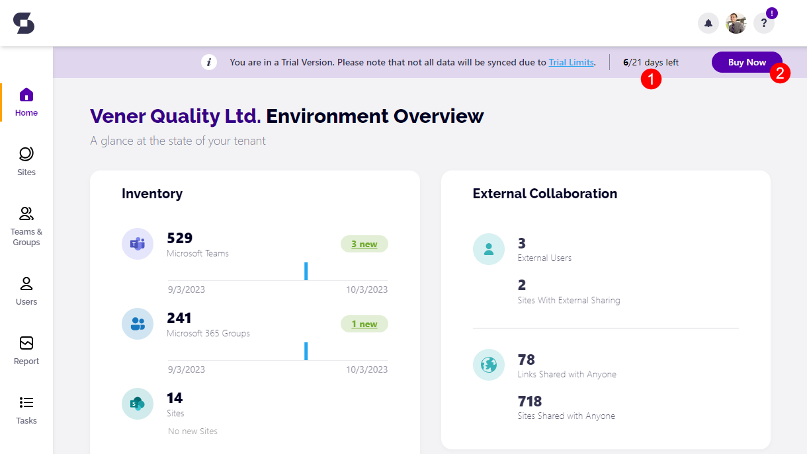

# Syskit Point Free Trial Limits

**Syskit Point trial** enables you to **test drive Syskit Point for free for 21 days**. To find out how to start your 21-day free trial, take a look at the [Syskit Point Trial article](free-trial.md). 

In this article, you can find information on the **limitations when using Syskit Point during your trial period**.

## Free Trial Limits

With the Syskit Point trial, you will receive **21 days of free usage of the Syskit Point Governance plan**. During that time, you'll be able to **explore everything Syskit Point offers and see what makes it the best governance and security software for Microsoft 365**. 

You'll be able to utilize most of the Syskit Point features while in the free trial; however, there will be some limitations:

* **When Syskit Point syncs above ten million items**, **the remaining workspaces will no longer be synced**
* **PDF exports will have a watermark** stating you exported the file during the Syskit Point Trial
* **OneDrive data will not be synced** and will not be available for access to gain more details
* **You will have a limit** of running 10 File Version Cleanup actions
* **The Set Version Limit action** for Storage is not available during your trial period 


**Please note!**&#x20;

**The Configuration Inventory Module** is only available in the Data Center plan and cannot be utilized with any of the Syskit Point Cloud plans. For more information on available plans for Syskit Point, follow [this link](https://www.syskit.com/products/point/pricing/).


In the Syskit Point web app, you will notice the **trial banner** located at the top of the screen for the trial duration.

Here you can find the following:

* **The amount of time that is left for your free trial (1)** out of the 21 available days
* **Buy Now button (2)** redirects you to the Subscriptions portal, where you can purchase a Point Cloud subscription, manage your subscription, and add additional administrators to help you with subscription management.

## Free Trial Expiration

When the trial expires, you can expect the following:
* **You can no longer use Syskit Point**
    * When trying to open Syskit Point, you will see the following message: `Your Subscription is not active`
* **Data collected in Syskit Point is kept for 21 days after the trial expiration** 
    * New changes in your environment will not be synced (for example, permission changes, newly added Teams, and so on)
    * 21 days after the last day of your trial, all of the data collected in Syskit Point will be erased as per the [DPA (Data Processing Addendum)](https://www.syskit.com/data-processing-addendum/)
    * If, during 21 days after trial expiration, you purchase a Syskit Point license, all of your data will remain intact; Syskit Point will continue to sync changes after license purchase
