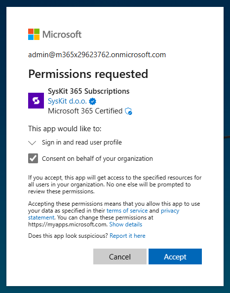

# SysKit Point Free Trial

**SysKit Point trial** enables you to **test drive SysKit Point for free for 21 days** and discover how to utilize it when managing your Microsoft 365 environment. 

In this article, you can find out **how and where to get your 21 days of SysKit Point trial**.


**Please note!**&#x20;
This article shows how to get a free trial of the SysKit Point solution as a service. If your company policies require using a self-hosted solution, please [contact us](https://www.syskit.com/company/contact-us) to acquire a trial key.


## Get a Free Trial


**Please note!**&#x20;
We recommend Global Administrators perform the initial activation since consent is required multiple times during the initial setup process, giving SysKit Point permissions to collect your Microsoft 365 tenant data.


To start the trial registration process:

* Navigate to the [Free Trial start page](https://www.syskit.com/products/point/free-trial/)
* Enter your information and click **Start a Free Trial**
* Click the **Sign in button (1)** on the next screen

Next, sign in with your Microsoft credentials.

Permitting us to read your user profile **requires consent** and enables SysKit to determine your Microsoft 365 tenant. **Click Accept** to continue. 

A new page opens showing the Configure step of the four-step wizard where the rest of the trial activation takes place:

* **Enter the Name of your organization (1)**
* **Enter the syskit365 subdomain you want to use (2)**
  * If the entered subdomain is already in use, an appropriate message is displayed
* **Select the preferred time zone (3)**
  * SysKit Point will display date and time data in reports and emails as specified here
* **Select the region where SysKit Point data will be stored (4)**; the following regions are currently supported:
  * **USA**
  * **Europe**
  * **Asia-Pacific & Australia**
* **Mark the checkbox (5)** to confirm you read and agree with the [SysKit End User Software License Agreement](https://www.syskit.com/wp-content/uploads/2022/10/EULA_SysKit-Point-2022.pdf)
* **Click Next (6) when finished**

Next, consent is required on the Connect step, permitting SysKit Point to collect your Microsoft 365 tenant data.
* Click **Grant Consent (1)** to proceed and provide your consent.
* [Learn more about permission requirements here](../requirements/permission-requirements.md).

 

 

After the consent, your SysKit Point instance starts to provision.
You can track the progress on the Complete step.

After the SysKit Point instance is created, you can find the following in the Complete step:

* **Open SysKit Point button (1)**
  * Opens SysKit Point web app URL in a new browser tab
* **Manage Subscription button (2)**
  * Opens the Subscription portal where you can [manage your SysKit Point subscription](syskit-point-subscriptions.md)


**Please note!**&#x20;
The SysKit Point trial comes with limitations. To learn about the limits of your SysKit Point trial, see the [SysKit Point trial limits article](free-trial-limits.md). 
