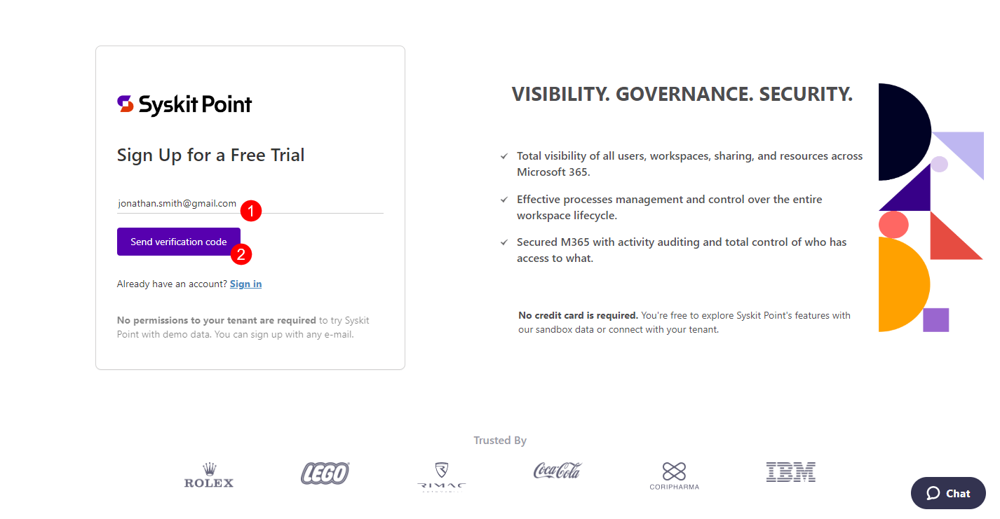
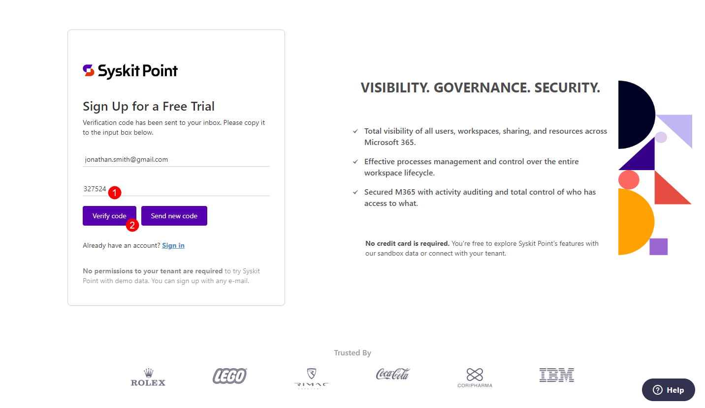
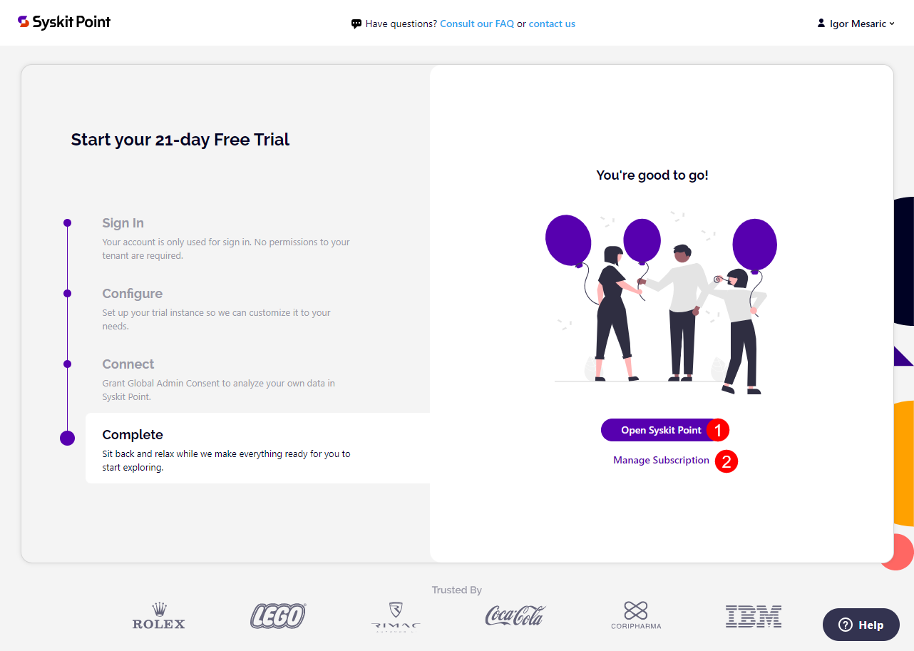

# SysKit Point Free Trial

**SysKit Point trial** enables you to **test drive SysKit Point for free for 21 days** and discover how to utilize it when managing your Microsoft 365 environment. 

In this article, you can find out **how and where to get your 21 days of SysKit Point trial**.


**Please note!**&#x20;
This article shows how to get a free trial of the SysKit Point solution as a service. If your company policies require using a self-hosted solution, please [contact us](https://www.syskit.com/company/contact-us) to acquire a trial key.


There are two options on how to explore SysKit Point:
* **Try SysKit Point with demo data**
  * No additional permissions or consents are required
  * SysKit Point shows demo data 
  * Automatically available after signing up
* **Try SysKit Point with real data**
  * You will be prompted to connect to your Microsoft 365 tenant and provide Global Admin consent
  * SysKit Point will collect and display data from your Microsoft 365 tenant


**Please note!**&#x20;
In order to connect your Microsoft 365 tenant, you first need to sign up. 


## Get SysKit Point with Demo Data
To get started:
* **Navigate to the [Free Trial start page](https://www.syskit.com/products/point/free-trial/)**
* **Click the Start a Free Trial button**; you are redirected to a Sign Up form 
* **Enter your e-mail (1)**
* **Click the Send verification code button(2)**

You will receive an email with the verification code.

Copy the verification code and return to the Sign Up form:
* **Paste the received verification code (1)**
* **Click Verify code (2)** to continue
  * Use the Send new code button if the prior verification code expires

Next, provide information in the Sign Up form:
* **Define and confirm your password**
  * The sign up results in a SysKit account that only you can access with the defined password
* **Enter your first and last name**
* **Enter the number of Microsoft 365 users in your company**
* **Agree to the terms of service and privacy policy**
* **Click Sign Up to finish**
  * note that all fields are required

**After a successful sign up**, **SysKit Point web app opens**, **and shows demo data**.
TODO list demo data limits

## Connect Your Tenant


**Please note!**&#x20;
We recommend Global Administrators perform the initial connection since consent is required multiple times during the initial setup process, giving SysKit Point permissions to collect your Microsoft 365 tenant data.


To connect your tenant:

* Navigate to [SysKit Point with demo data](https://demo.syskit.com/) acquired in the previous step
* Click the **Connect Tenant button(1)** 

Subscriptions portal opens, where you will be guided through the initial connection.
First, **sign in with your Microsoft 365 credentials (1)**.

Permitting us to read your user profile **requires consent** and enables SysKit to determine your Microsoft 365 tenant. **Click Accept** to continue. 

A new page opens showing the Configure step:

* **Enter the Name of your organization (1)**
* **Enter the syskit365 subdomain you want to use (2)**
  * If the entered subdomain is already in use, an appropriate message is displayed
* **Select the preferred time zone (3)**
  * SysKit Point will display date and time data in reports and emails as specified here
* **Select the region where SysKit Point data will be stored (4)**; the following regions are currently supported:
  * **USA**
  * **Europe**
  * **Asia-Pacific & Australia**
* **Mark the checkbox (5)** to confirm you read and agree with the [SysKit End User Software License Agreement](https://www.syskit.com/wp-content/uploads/2022/10/EULA_SysKit-Point-2022.pdf)
* **Click Next (6) when finished**

Next, consent is required on the Connect step, permitting SysKit Point to collect your Microsoft 365 tenant data.
* Click **Grant Consent (1)** to proceed and provide your consent.
* [Learn more about permission requirements here](../requirements/permission-requirements.md).

 

 

After the consent, your SysKit Point instance starts to provision.
You can track the progress on the Complete step.

After the SysKit Point instance is created, you can find the following in the Complete step:

* **Open SysKit Point button (1)**
  * Opens SysKit Point web app URL in a new browser tab
* **Manage Subscription button (2)**
  * Opens the Subscription portal where you can [manage your SysKit Point subscription](syskit-point-subscriptions.md)


**Please note!**&#x20;
The SysKit Point trial comes with limitations. To learn about the limits of your SysKit Point trial, see the [SysKit Point trial limits article](free-trial-limits.md). 
