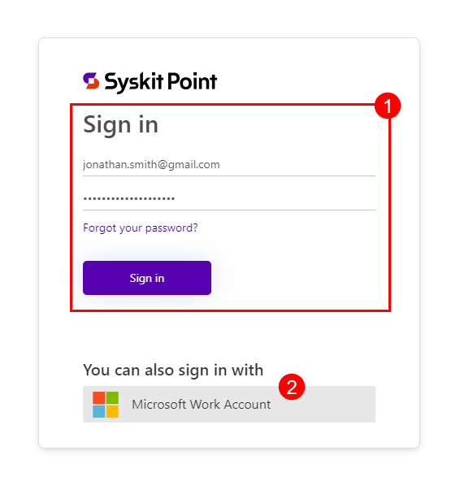

# Manage SysKit Point Subscriptions

Once you have your SysKit Point free trial, the [**SysKit Point Subscriptions Portal**](https://subscriptions.syskit.com/) is where you can manage the state of your Point Cloud subscriptions.

The **My Subscriptions** portal provides insight into the current state of your subscription and provides the ability to modify or upgrade it.

In this article, you will find information on the following:

* [Purchase Your SysKit Point Cloud Subscription](syskit-point-subscriptions.md#purchase-your-syskit-point-cloud-subscription)
* [Purchase Additional User Licenses](syskit-point-subscriptions.md#purchase-additional-user-licenses)
* [Upgrade Your Subscription Plan](syskit-point-subscriptions.md#upgrade-your-subscription-plan)


**Please note!** If you didn't start your free 21-day trial, take a look at the [**SysKit Point trial article**](free-trial.md) for details on getting started. At any point during the 21 days of the free trial, you can purchase a SysKit Point Cloud subscription. In order to retain your data after your free trial has expired, a SysKit Point subscription needs to be purchased within 21 days of your trial period ending.


## Purchase Your SysKit Point Cloud Subscription

To purchase the subscription, complete the following steps:

* Click the **Buy Now** button, located in the top right corner of your SysKit Point trial screen
* On the **SysKit Subscriptions** site that opens, **click the Sign in (1)** button

**SysKit Sign in screen opens**, where you can either:

* **Sign in with your SysKit credentials (1)** - created in the [process of acquiring SysKit Point with demo data](free-trial.md#get-syskit-point-with-demo-data); or
* **Sign in with Microsoft Work Account (2)** - used to [connect your Microsoft 365 tenant to get the free trial](free-trial.md#connect-your-tenant)

After signing in, a new screen opens showing **information about your SysKit Point subscription**.

The **Overview section (1)** provides insight into general information on the status of your subscription and contains the following details:

* **Name (2)** entered at the start of your trial
* **Status (3)** of your SysKit Point license
* **Next renewal date (4)** of your SysKit Point subscription or expiration date of your free trial
* **Users (5)** the number of users for your SysKit Point
* **Purchased Plan (6)** for your subscription
  * This shows as Trial while your free trial period is still active
* Next to **Purchased Plan** you can click on the **Buy Now button (7)** to purchase your SysKit Point subscription or manually click the **Subscriptions section (8)** on the left side of the screen under Overview

The **Subscription section (1)** is where you can purchase your subscription and select the specific details that suit your needs.

Your preferences for the following information need to be selected:

* **Select a Plan (2)** - clicking on it opens a drop-down menu where you can select which subscription plan suits you best:
  * SysKit Point - Management Plan
  * SysKit Point - Security and Compliance Plan
  * SysKit Point - Governance Plan
  * If you are unsure which subscription suits your needs, clicking the **Compare Plans button (3)** underneath opens the [Pricing page](https://www.syskit.com/products/point/pricing/) with more details on each plan
* **Billing Cycle (4)** - clicking on it opens a drop-down menu where you can select how often you want to be billed for your subscription:
  * Annually
  * Monthly
* **Currency (5)** - clicking on it opens a drop-down menu where you can select the currency in which you want to be charged in:
  * USD - US Dollar
  * GBP - British Pound
  * EUR - Euro
* **Number of Licensed Microsoft 365 Users (6)** - here, you can write the number of users you expect will be utilizing SysKit Point
  * The number of licensed users affects the pricing of your SysKit Point subscription; [for more information on licensed users count, take a look at this article ](../licensing-activation/licensed-users-count.md).
* **Summary (7)** - located on the right side of the screen, it shows a quick summary of the selection you've made with a cost estimate for your chosen subscription
* Click the **Buy Now button (8)** for the final step to complete your purchase

After clicking **Buy Now**, you are redirected to the purchasing site.

* On the left side of the screen, you can find an **overview of your selected subscription (1)**
* On the right side of the screen, you will need to input your **credit card details (2)** to finalize the purchase

Once you've purchased your SysKit Point subscription, you are redirected back to the SysKit Point Subscriptions site.

If your purchase was successful, when you click **Overview**, the information for your **Next Renewal Data** will reflect the renewal period you selected for your subscription.

The **Purchased Plan** section will now show the name of the subscription you purchased.

## Purchase Additional User Licenses

To increase the number of user licenses included in your plan, take the following steps:

* Log into your **SysKit Subscriptions** site
* Under **Overview**, navigate down to the **Users section (1)**
* Click the **Buy More button (2)** located in the Users section
  * This opens a pop-up where you can edit your current subscription and enhance your user licenses
* Click the **Update plan (3)** button, located on the right side of the screen
* Select your current plan by clicking the **Continue button** on the right side, next to your current plan

 

The **Quantity section (1)** shows the number of Users you currently have a license for.

To increase the user license amount:

* Type the desired **number of licenses** in the space available under Quantity or use the + and - signs to adjust
* The two sections below show:
  * **What you'll be paying** - the amount you will be paying once your plan renews
  * **Amount due today** - the amount you will need to pay instantly to increase your license number
    * This number will show the necessary payment based on the price of the added licenses; you will not be charged for the licenses you already purchased
* Click **Confirm (2)** to finalize your selection and proceed with your payment

## Upgrade Your Subscription Plan

To change or upgrade the SysKit Point subscription plan you currently have, complete the following:

* Log into your **SysKit Subscriptions** site
* Under **Overview**, navigate down to the **Purchased Plan section (1)**
* Click the **Manage Subscription button (2)** located in the Purchased Plan section
  * This opens a pop-up where you can edit your current subscription and upgrade your subscription plan
* Click the **Update plan (3)** button, located on the right side of the screen
  * This opens a pop-up where you can edit your current subscription and enhance your user licenses

 

On the bottom, you will see the **Plans Available section (1)** where you can change your plan to being charged **Monthly or Yearly**.

You will also see all the available subscription plans listed. Change your subscription to a different plan by:

* Clicking the **Continue button (2)** located next to the new subscription plan of your choice

* The site that opens will show the **Changing To section (1)**, which lists the new plan you selected
* The two sections below show:
  * **What you'll be paying** - the amount you will be paying once your plan renews
  * **Amount due today** - the amount you will need to pay instantly to upgrade to a different plan
    * This number will be the increased amount based on the pay difference between your initial plan and the new one; the amount paid for the initial plan is deducted from the price of the new plan
* Click **Confirm (2)** to finalize your selection and proceed with your payment

