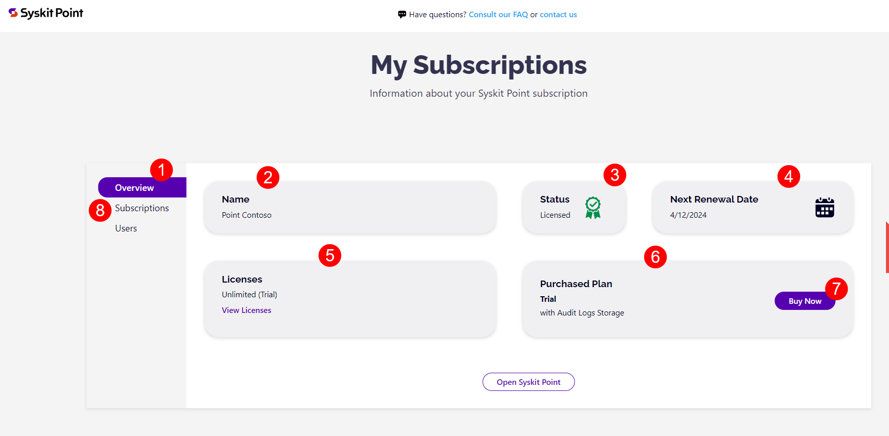
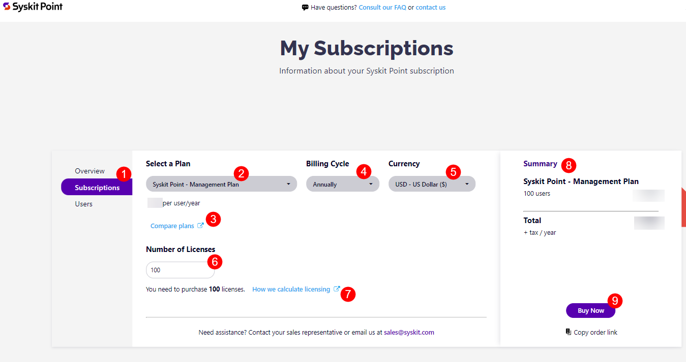
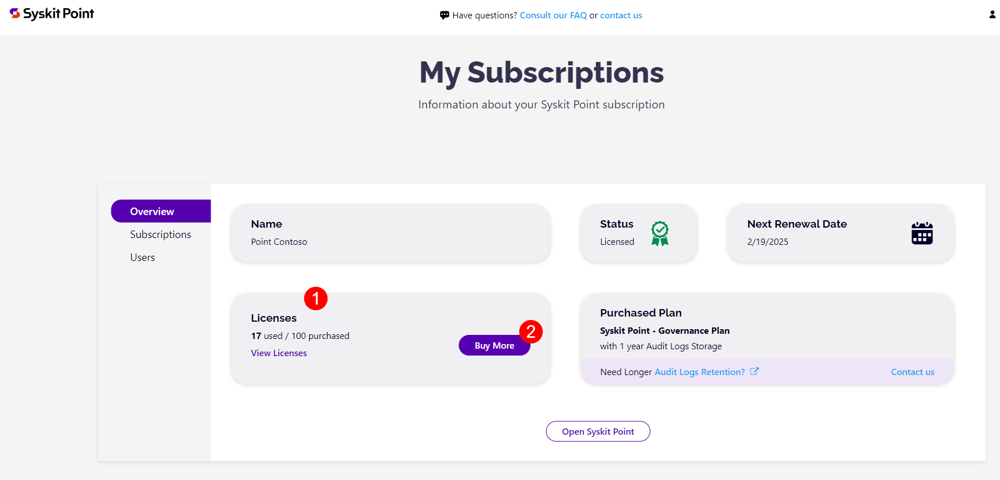
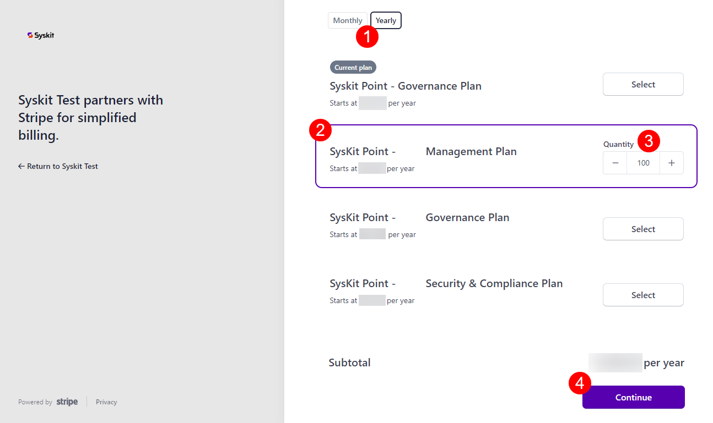
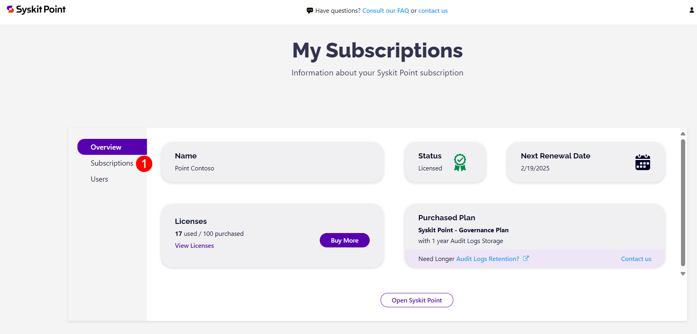
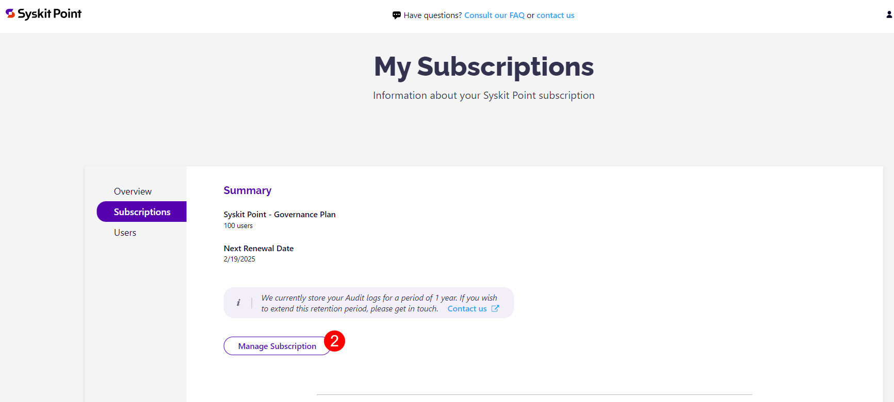
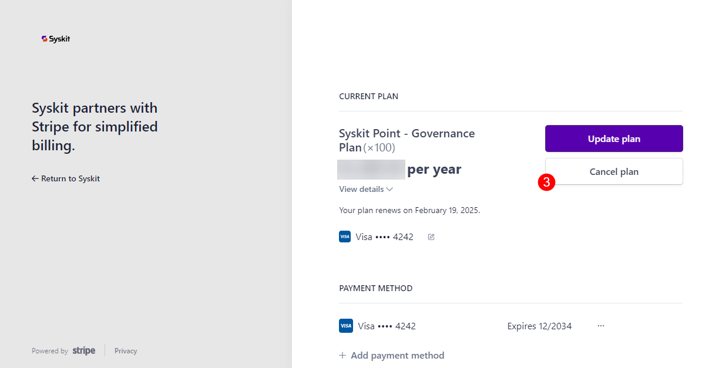
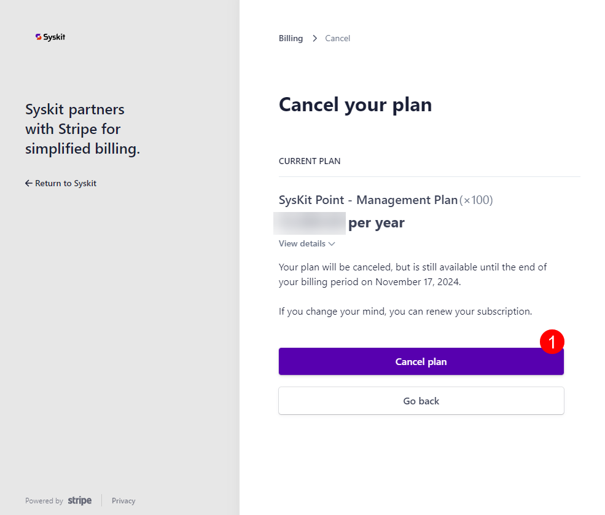
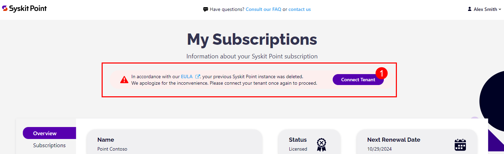

# Manage Syskit Point Subscriptions

Once you have your Syskit Point free trial, the [**Syskit Point Subscriptions Portal**](https://subscriptions.syskit.com/) is where you can manage the state of your Point Cloud subscriptions.

The **My Subscriptions** portal provides insight into the current state of your subscription and provides the ability to modify or upgrade it.

In this article, you will find information on the following:

* [Purchase Your Syskit Point Cloud Subscription](syskit-point-subscriptions.md#purchase-your-syskit-point-cloud-subscription)
* [Purchase Additional User Licenses](syskit-point-subscriptions.md#purchase-additional-user-licenses)
* [Upgrade Your Subscription Plan](syskit-point-subscriptions.md#upgrade-your-subscription-plan)
* [Cancel Your Subscription](syskit-point-subscriptions.md#cancel-your-subscription)
* [Reconnect After Purchasing](syskit-point-subscriptions.md#reconnect-after-purchasing)
* [Purchasing Additional Audit Logs Storage](syskit-point-subscriptions.md#purchasing-additional-audit-logs-storage)


**Please note!** If you didn't start your free 21-day trial, take a look at the [**Syskit Point trial article**](free-trial.md) for details on getting started. At any point during the 21 days of the free trial, you can purchase a Syskit Point Cloud subscription. In order to retain your data after your free trial has expired, a Syskit Point subscription needs to be purchased within 21 days of your trial period ending.


## Purchase Your Syskit Point Cloud Subscription

To purchase the subscription, complete the following steps:

* Click the **Buy Now** button, located in the top right corner of your Syskit Point trial screen
* On the **Syskit Subscriptions** site that opens, **click the Sign in (1)** button

**Syskit Sign in screen opens**, where you can either:

* **Sign in with your Syskit credentials (1)** - created in the [process of acquiring Syskit Point with demo data](free-trial.md#get-syskit-point-with-demo-data); or
* **Sign in with Microsoft Work Account (2)** - used to [connect your Microsoft 365 tenant to get the free trial](free-trial.md#connect-your-tenant)

After signing in, a new screen opens showing **information about your Syskit Point subscription**.

The **Overview section (1)** provides insight into general information on the status of your subscription and contains the following details:

* **Name (2)** entered at the start of your trial
* **Status (3)** of your Syskit Point license
* **Next renewal date (4)** of your Syskit Point subscription or expiration date of your free trial
* **Licenses (5)** the number of licenses included in your Syskit Point
   * The number of licensed users affects the pricing of your Syskit Point subscription
   * A minimum of 100 licenses need to be purchased for your Syskit Point subscription. For more details on this, take a look at the [**Licensed Users Count article**](../licensing-activation/licensed-users-count.md). 
* **Purchased Plan (6)** for your subscription as well as the amount of Audit Logs Storage years you have available
  * This shows as Trial while your free trial period is still active

* Next to Purchased Plan, you can click on the **Buy Now button (7)** to purchase your Syskit Point subscription or manually click the **Subscriptions section (8)** on the left side of the screen under Overview

The **Subscription section (1)** is where you can find details and manage your subscription.

Here, you can find the **Summary (1)** section, which shows: 
   * **The subscription plan (2)** you purchased, along with the number of users included in your subscription 
   * **The next renewal date (3)** for your subscription

* To manage your subscription, **click the Manage Subscription button (4)**


In the summary section, you can also find the information box explaining that you have 1 year of Audit Logs storage available with your subscription, but you can also extend the retention period. Additional Audit Logs storage years can be purchased by clicking the [**contact us button**](https://www.syskit.com/contact-us/). 


After clicking **Manage Subscription**, you are redirected to the purchasing site.

* On the left side of the screen, you can find an **overview of your selected subscription (1)**.
* On the right side of the screen, you can **pay with link (2)** or you need to input your **credit card details (3)**. 
  * **Click the Pay and subscribe button (4)** to finalize the purchase.

Once you've purchased your Syskit Point subscription, you are redirected back to the Syskit Point Subscriptions site.

If your purchase was successful, when you click **Overview**, the information for your **Next Renewal Data** will reflect the renewal period you selected for your subscription.

The **Purchased Plan** section will now show the name of the subscription you purchased.

## Purchase Additional User Licenses

To increase the number of user licenses included in your plan, take the following steps:

* Log into your **Syskit Subscriptions** site
* Under **Overview**, navigate down to the **Licenses section (1)**
* Click the **Buy More button (2)** located in the Licenses section
  * This opens a pop-up where you can edit your current subscription and enhance your user licenses
* Click the **Update plan (3)** button, located on the right side of the screen
* Select your current plan by clicking the **Continue button** on the right side, next to your current plan

 

The screen to update your plan opens. Here you can:

* **Select the plan (1)** you want to change to
* **Select the number of licenses (2)** you want to purchase
* **Click Continue (3)** when you are satisfied with your selection

You are redirected to the confirmation screen, where the following information is shown: 

* **The name and price (1)** of the new plan
* **What you'll be paying (2)** - the amount you will be paying once your plan renews
* **Amount due today (3)** - the amount you will need to pay instantly to increase your license number
    * This number will show the necessary payment based on the price of the added licenses; you will not be charged for the licenses you have already purchased
* Click **Confirm (4)** to finalize your selection and proceed with your payment

## Upgrade Your Subscription Plan

To change or upgrade the Syskit Point subscription plan you currently have, complete the following:

* Log into your **Syskit Subscriptions** site
* Under **Subscriptions (1)**, navigate down to the **Manage Subscription**
* Click the **Manage Subscription button (2)**
  * This opens a pop-up where you can edit your current subscription and upgrade your subscription plan
* Click the **Update plan (3)** button, located on the right side of the screen
  * This opens a pop-up where you can edit your current subscription and enhance your user licenses

 

The **Update your plan screen** opens where you can:
 * Change your plan to being charged **Monthly or Yearly (1)**.
 * Change your subscription to a different plan by:
   * **Selecting the plan (2)** you want to change to
   * **Selecting the number of licenses (3)** you want to purchase
* Click the **Continue button (4)** to finalize your choice

* The site that opens will show the **Changing your updates**, which lists the new plan you selected
* The two sections below show:
  * **What you'll be paying** - the amount you will be paying once your plan renews
  * **Amount due today** - the amount you will need to pay instantly to upgrade to a different plan
    * This number will be the increased amount based on the pay difference between your initial plan and the new one; the amount paid for the initial plan is deducted from the price of the new plan
* Click **Confirm (1)** to finalize your selection and proceed with your payment

## Cancel Your Subscription

To change or upgrade the Syskit Point subscription plan you currently have, complete the following:

* Log into your **Syskit Subscriptions** site
* Under **Subscriptions (1)**, navigate down to the **Manage Subscription**
* Click the **Manage Subscription button (2)**
  * This opens a pop-up where you can manage your current subscription by upgrading your subscription plan or canceling it
* Click the **Cancel plan (3)** button, located on the right side of the screen
  * This opens a screen where you can cancel your current plan

 

The Cancel Your Plan site will show an overview of your current plan with information about:
  * Name of your plan
  * Cost per year
  * Date until which your plan is available when canceled 

To cancel your plan, click the **Cancel plan button (1)**.
  * This will open a pop-up that asks for feedback on why you are choosing to cancel, but leaving this comment is optional

Your subscription will now be canceled, and once the current plan you had already purchased expires, you will no longer be able to utilize Syskit Point. 

## Reconnect After Purchasing

There are two potential reasons why you may need to reconnect your tenant after purchasing your Syskit Point subscription: 

  * Your **trial has expired, and 21 days after the trial expiration, your Syskit Point instance is deleted**. If you purchased your Syskit Point subscription more than 21 days after the trial expiration, you will **need to reconnect your tenant**.

  * Your **Syskit Point license has expired, and 30 days after the expiration date, your Syskit Point instance is deleted**. When you purchase a Syskit Point subscription again, you will **need to reconnect your tenant**. 

In case your Syskit Point is licensed, but your instance was deleted, you will see a message notifying you of that, as shown below. 

To reconnect your tenant **click the Connect Tenant button (1)**.

[For more details about connecting your tenant to Syskit Point, take a look at this article.](../set-up-point-cloud/free-trial.md)

## Purchasing Additional Audit Logs Storage

By purchasing your subscription, you receive one year of Audit Logs storage as stated in the **Purchased Plan section (1)**. 

For more information about audit logs, you can click the **Audit Logs Retention button (2)**.

If you want to purchase additional storage years for Audit Logs, click the **Contact Us button (3)** to email our Sales team directly, or fill out the form on our [Contact Us page](https://www.syskit.com/contact-us/).

## Related Articles

* [Licensing FAQ](../faq/licensing.md)
* [Purchasing and Discounts FAQ](../faq/purchasing-and-discounts.md)
* [Partner Program FAQ](../faq/partner-program.md)
