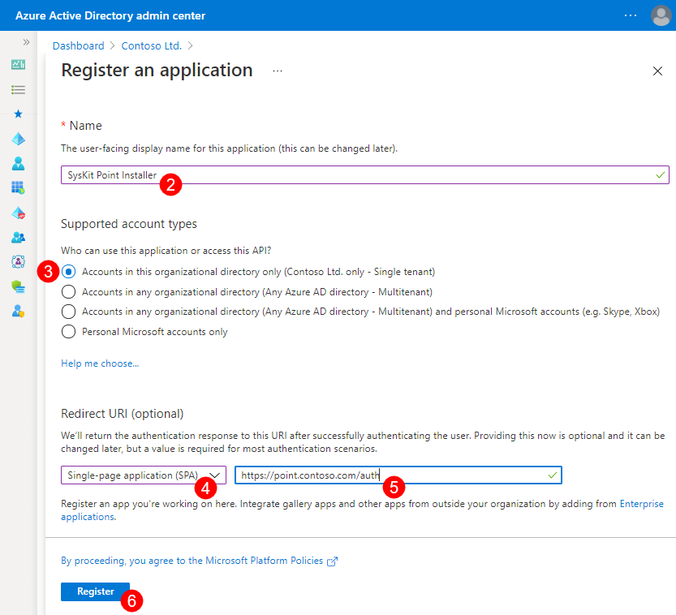
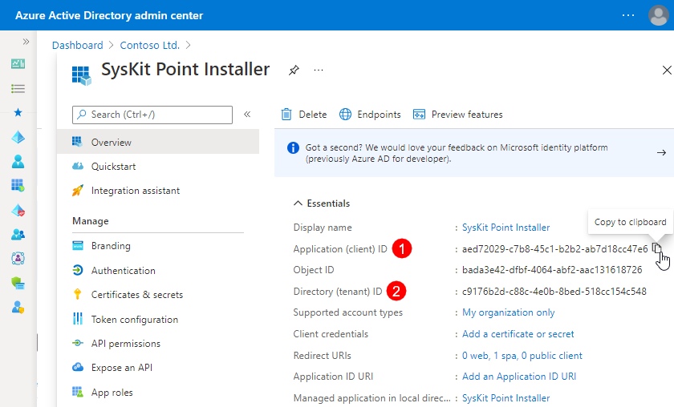
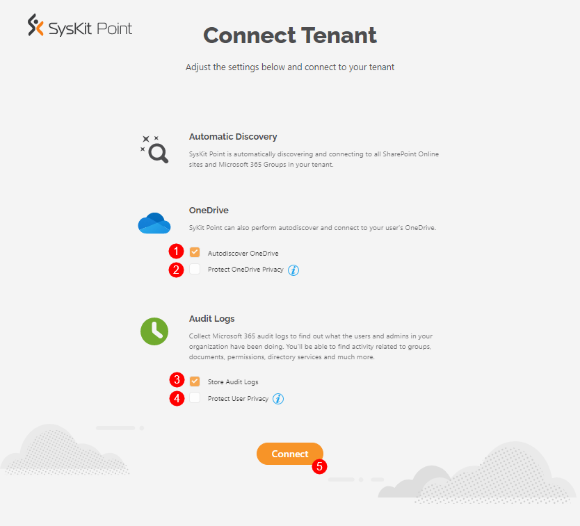
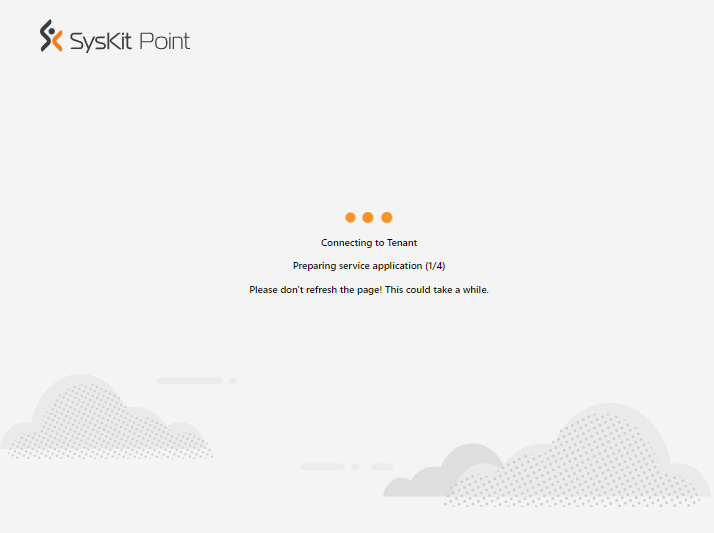

# Connect SysKit Point to Microsoft 365 Tenant

After you [deploy SysKit Point](deploy-syskit-point.md) in your Azure environment, you need to connect SysKit Point to your Microsoft 365 tenant. 
Before you continue, make sure to prepare the following:

* **Point Web Application URL**
* **Microsoft 365 Global Admin account**


**Please note!**  
The Global Admin account is used only for the initial setup; Point does not store any passwords you enter here. SysKit Point upgrades do not need a Global Admin account.


## Connect for the First Time

Open the __SysKit Point Web App URL__ in a browser to start the initial connection process.
The __Register SysKit Point__ page opens, guiding you through the initial connecting process:

* click the __Open Azure Active Directory button (1)__ to open the __App registrations__ screen in Azure Active Directory admin center and create the __SysKit Point Installer__ app registration 

* copy the provided __URL (2)__ needed when creating the __SysKit Point Installer__ app registration

* input the __Application (client) ID__ and __Directory (tenant) ID (3)__ available once you create the __SysKit Point Installer__ app registration

* click the __Register button (4)__ after you enter the required data

To obtain the __Application (client) ID__ and __Directory (tenant) ID__, create the __SysKit Point Installer__ app registration.

## Create App Registration

Open the __App registrations__ screen in Azure Active Directory admin center by clicking the __Open Azure Active Directory button__ available on the __Register SysKit Point__ screen described in the previous section.

To create the required app registration used by SysKit Point, do the following:

* click the __New registration (1)__ button available in the top ribbon; the __Register an application__ screen opens

* enter `SysKit Point Installer` in the __Name (2)__ field 

* select __Accounts in this organizational directory only (<TenantName> only - Single tenant)__ option under __Supported account types (3)__ 
 
* in the __Redirect URI__ section, select the __Single-page Application (SPA) (4)__ option and paste the __URL (5)__ copied from the second step on the __Register SysKit Point__ page  described in the previous section

* click __Register (6)__

After the app registration is created, the App Registration's __Overview screen__ opens.
Here, you can find the following data needed for the initial connection:
* __Application (client) ID (1)__
* __Directory (tenant) ID (2)__

Copy the __Application (client) ID__ and __Directory (tenant) ID__ values, and paste them to the input fields in the third step in the Register SysKit Point page. 

## Consent

After you provide information on the __Register SysKit Point__ page and click the __Register__ button, you will be prompted to sign in.
Here, you need to provide a Microsoft 365 __Global Admin__ account. This account will be used only for the initial setup; SysKit Point does not store any passwords you enter here. The Global Admin account will not be required in future SysKit Point upgrades.


**Why do I need to provide a global admin account?**  
You can find answers in the [following article](../../requirements/permission-requirements.md#microsoft-365).


When you first connect to your tenant, SysKit Point will request permissions to collect data from your Microsoft 365 environment.

To continue, check the __Consent on behalf of your organization option (1)__, and click the __Accept button (2)__. 

A new page opens where you can define additional connection settings. 

## Connection Settings

On the __Connect Tenant__ page, you can choose which information would you like to collect when it comes to your Microsoft 365 environment:

* __Automatic Discovery__ – by default, SysKit Point continuously monitors your Microsoft 365 environment and shows you the latest data. You cannot modify this setting.
* __Autodiscover OneDrive (1)__ – by default, SysKit Point will collect information and report on the users' OneDrive activity, content, and sharing. To stop collecting OneDrive data, uncheck this option.
* __Protect OneDrive privacy (2)__ – When enabled, SysKit Point will only show general information about the user's OneDrive, such as used storage. SysKit Point Admins won't be able to access any OneDrive content and personal data. By default, this option is disabled.
* __Store audit logs (3)__ – SysKit Point will also collect all audit logs to monitor internal and external user activities and changes and store them on a hard drive. To stop storing audit logs, uncheck this option.
* __Protect user privacy (4)__ - When enabled, user activity data will be hidden from SysKit Point and protected from Administrator supervision. By default, this option is disabled.


You can change connection options anytime from the __Settings__ > __General__ > __Connected Tenant__ > __Manage Connection__ screen in SysKit Point application.



**Please note!**  
For SysKit Point to collect, process, and save audit logs, you must enable auditing in your tenant. [Navigate here to find out how to turn on auditing.](../../configuration/turn-on-auditing.md)


Click the __Connect (5)__ button after defining the connection options. A new screen will open and show the progress of the initial connection. __Please do not refresh the page__ as it will provide important information needed for troubleshooting in an unlikely event of an error. 

After all initial connection steps are completed, you will be redirected to the __Welcome Home__ page. 

## Related Topics

* [Deploy SysKit Point](deploy-syskit-point.md)
* [Activate SysKit Point](../activation/activate-syskit-point.md)
* [Set Up Custom Domain and SSL Certificate](set-up-custom-domain-and-ssl-certificate.md)

If you have additional questions or concerns, please [contact us](https://www.syskit.com/contact-us/).