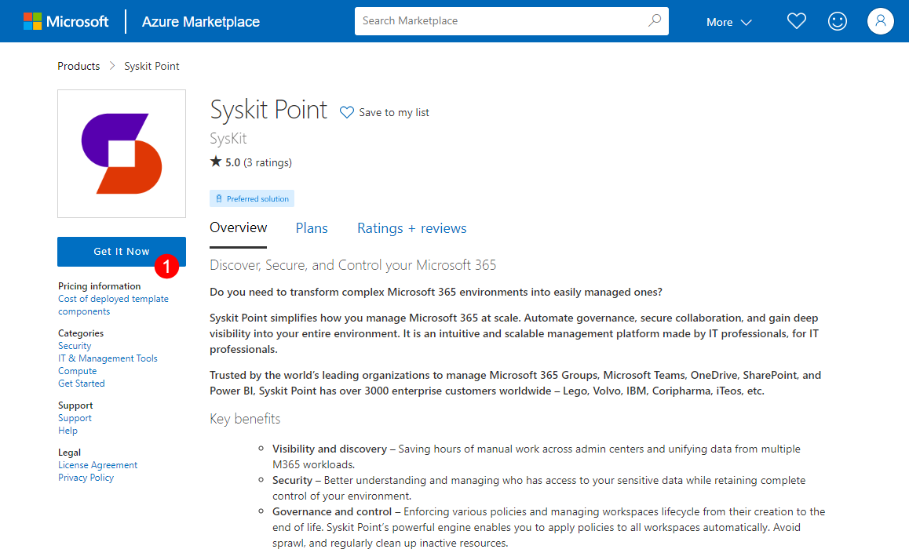
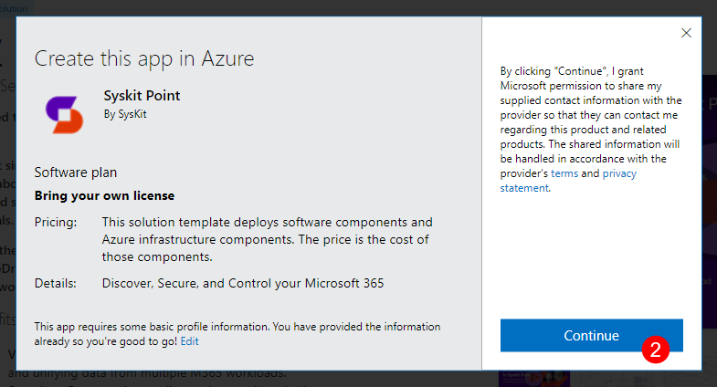
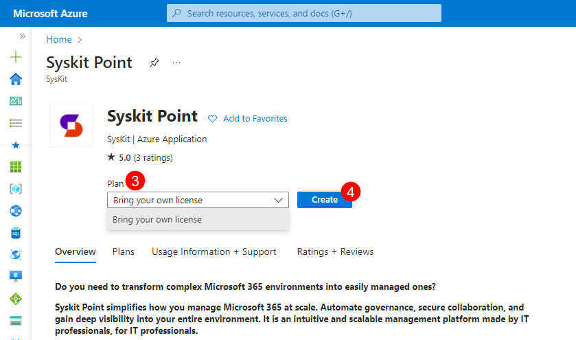
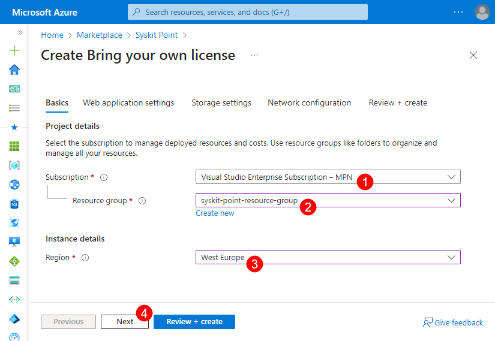
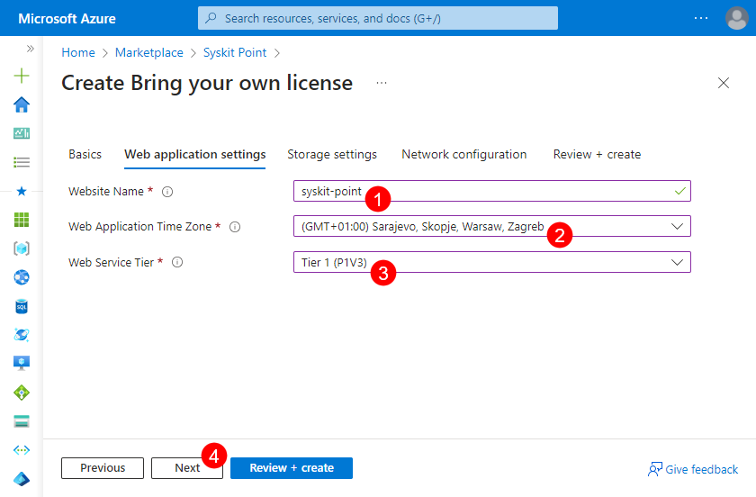
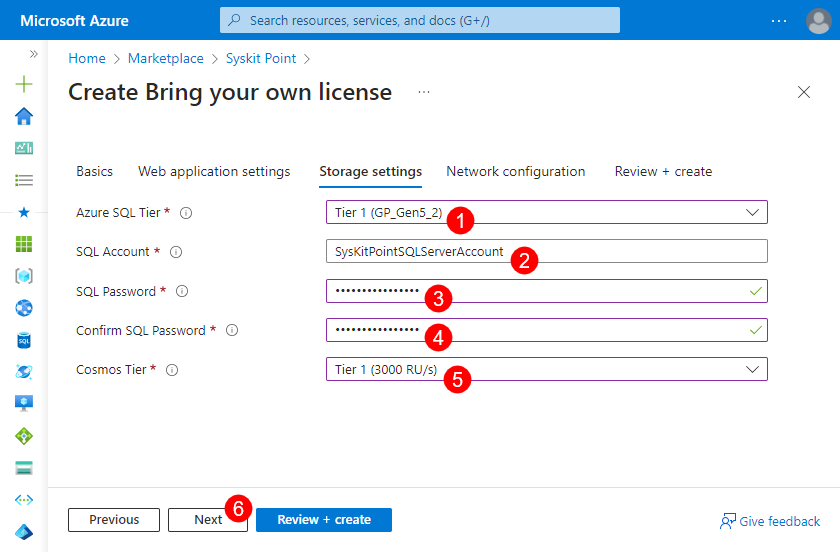
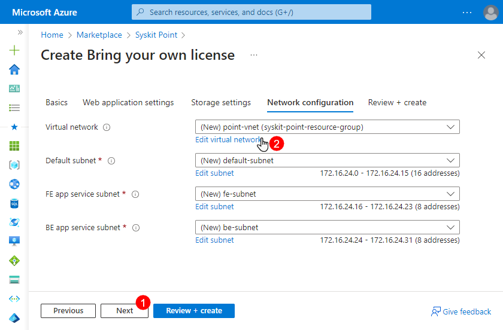
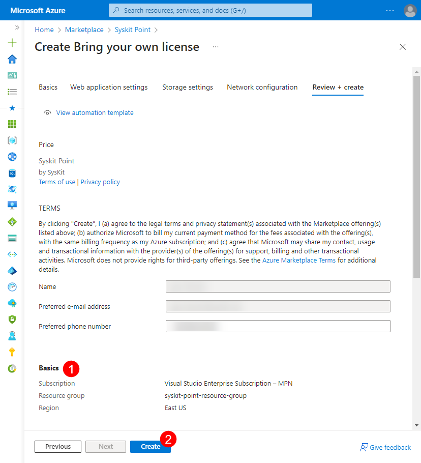
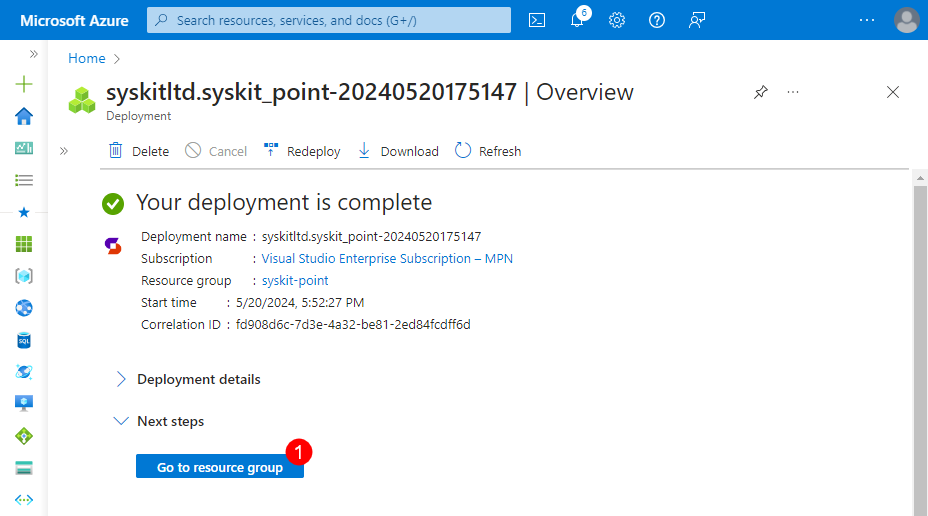
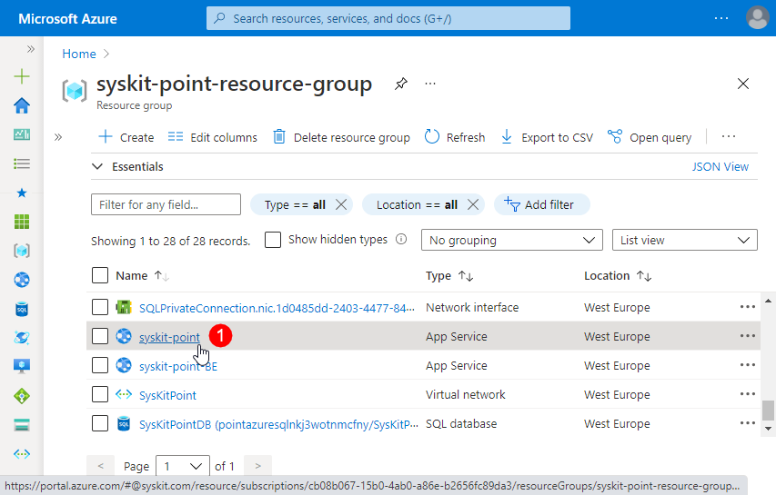

# Deploy Syskit Point


**Please note!**  
Before you continue, make sure to read the [resource requirements article.](system-requirements.md)


Prepare the following for Syskit Point deployment:
* **precreated Azure resource group** and **user credentials of a resource group owner**, or
* **user credentials of a user able to create a new Azure resource group**

## Azure Marketplace

* start by opening the [Syskit Point product page](https://azuremarketplace.microsoft.com/en-us/marketplace/apps/syskitltd.syskit_point) on Azure Marketplace
* Click the **Get It Now button (1)**; a confirmation dialog opens
* Click the **Continue (2) button**; you will be redirected to Azure Portal
* Select the **Plan (3)** from the dropdown menu
* Click **Create (4)** to continue with the deployment configuration; **Create Syskit Point** screen opens with the **Basics** tab selected

## Azure Resources Deployment

Before deploying Azure resources needed to run Syskit Point, you will be prompted to configure several options grouped into three tabs:
* **Basics**
* **Web application settings**
* **Azure SQL settings**

The last available tab - **Review + create** - shows an overview of all configured options to check before the deployment is started.

The **Basics** tab enables you to:
* **select the Azure subscription (1)**
* **select an existing** or **create a new resource group (2)** within which the Syskit Point resources will be created
* **choose the Azure region (3)** where Syskit Point resources will be created
* **click Next (4)** to proceed to the **Web application settings** tab

On the **Web application settings** tab, you will need to define the following:
* **Website Name (1)**; must be a unique name to create FQDN; the resulting Point web app URL will be: `{websiteName}.azurewebsites.net`
* **Web Application Time Zone (2)**
* **Web Service Tier (3)**
* **Background Services Tier (4)**
* **Configuration Inventory Module (5)** - available options
  * **Deploy** - Configuration Inventory module is deployed with Syskit Point; selected by default
  * **Do not deploy** - Configuration Inventory module is not deployed
* **click Next (6)** to continue with the **Azure SQL settings** configuration

Define the following on the **Azure SQL settings** tab:
* **Azure SQL Tier (1)**
* **SQL Account (2)**
* **SQL Password (3)**; enter the same password in the **Confirm SQL Password (4)** field
* **click Next (5)** to move to the **Review + create** tab


**Please note!** This is mandatory in order to **provision a new SQL server** as this is a Microsoft requirement. Without the SQL credentials, it would not be possible to create the SQL server; however, after the initial deployment, the credentials will not be used again. The SQL authentification is disabled, and Managed Identity authentication will be used in the future. 


The **Network configuration** tab enables you to **configure virtual network** used by Syskit Point resources.
Depending on your use case, you have **two options available**:
* **Use the predefined virtual network configuration** - a new virtual network is created when deploying Syskit Point; no additional configuration is needed, and you can **proceed to the next step by clicking the Next button (1)**, or
* **Create a new virtual network with custom settings by clicking the Create new option (2)**

If you click the Create new option, a new screen appears where you can change the predefined settings:
* **Name (1)** of the virtual network
* **Address range (2)**
* **Names and address ranges (3)** for **Default**, **FE app service**, and **BE app service subnets**


**Please note!**  
Predefined ranges comply with the minimum requirements for Syskit Point resources to work properly.
If you decide to change the predefined values, **ensure that all subnets have 255 IP addresses reserved**.


**Click OK** when you finish the virtual network setup. 

The **Review + create** tab shows the following information:
* **Validation status (1)** showing whether all resources are correctly configured
* **Configuration summary (2)** showing all options selected in previous steps
* **Create button (3)**; once clicked, the deployment of Azure resources starts

At the start of the deployment, you will be redirected to a page showing the deployment progress. After 5-10 minutes, the deployment is complete, and the **Go to resource group (1)** button appears, as shown in the image below. Click the button to open the **Resource group's Overview page**, showing all created Azure resources.


With the described deployment, **all Azure resources needed to run Syskit Point are created**, and no additional installation is needed.
You can now **access Syskit Point by opening the Syskit Point web app URL in a browser**.


## Syskit Point Web App URL

To view the Syskit Point web app URL, do the following:
* **navigate to the Overview screen** of the created resource group
* **find and click the app service resource (1)**
* **click the URL link (2)** available in the Essentials section on the app service's Overview screen

Syskit Point web page opens.
First, you will be prompted to [activate Syskit Point](../activation/activate-syskit-point.md)
Once activated, Syskit Point will guide you through the process of [connecting to a tenant for the first time](connect-to-tenant.md). 

## Related Topics

* [System Requirements](system-requirements.md)
* [Activate Syskit Point](../../set-up-point-data-center/activation/activate-syskit-point.md)
* [Connect to Microsoft 365 Tenant](connect-to-tenant.md)
* [Set Up Custom Domain and SSL Certificate](set-up-custom-domain-and-ssl-certificate.md)

If you have additional questions or concerns, please [contact us](https://www.syskit.com/contact-us/).