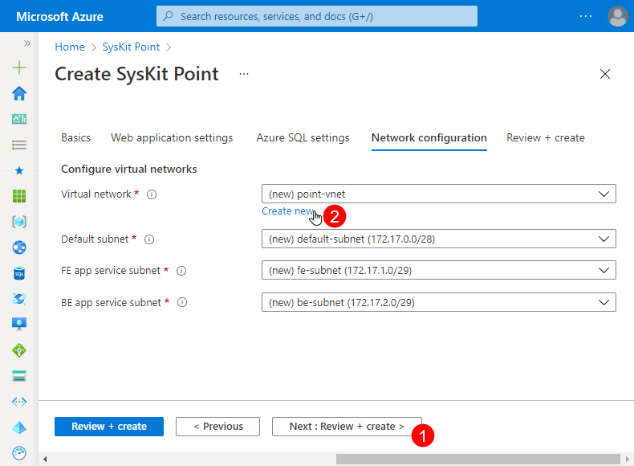
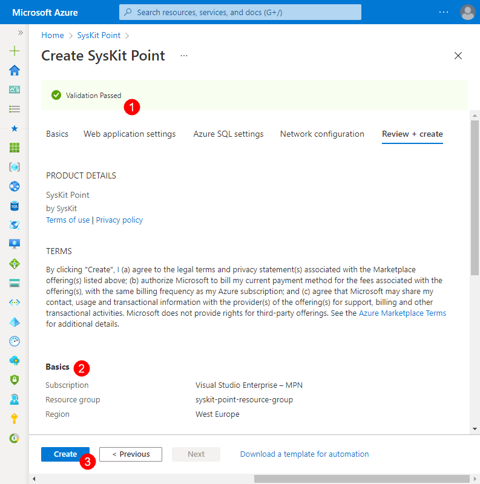

# Deploy Syskit Point


**Please note!**  
Before you continue, make sure to read the [resource requirements article.](system-requirements.md)


Prepare the following for Syskit Point deployment:
* __precreated Azure resource group__ and __user credentials of a resource group owner__, or
* __user credentials of a user able to create a new Azure resource group__

## Azure Marketplace

* start by opening the [Syskit Point product page](https://azuremarketplace.microsoft.com/en-us/marketplace/apps/syskitltd.syskit_point) on Azure Marketplace
* Click the __Get It Now button (1)__; a confirmation dialog opens
* Click the __Continue (2) button__; you will be redirected to Azure Portal
* Select the **Plan (3)** from the dropdown menu
* Click __Create (4)__ to continue with the deployment configuration; __Create Syskit Point__ screen opens with the __Basics__ tab selected

## Azure Resources Deployment

Before deploying Azure resources needed to run Syskit Point, you will be prompted to configure several options grouped into three tabs:
* __Basics__
* __Web application settings__
* __Azure SQL settings__

The last available tab - __Review + create__ - shows an overview of all configured options to check before the deployment is started.

The __Basics__ tab enables you to:
* __select the Azure subscription (1)__
* __select an existing__ or __create a new resource group (2)__ within which the Syskit Point resources will be created
* __choose the Azure region (3)__ where Syskit Point resources will be created
* __click Next (4)__ to proceed to the __Web application settings__ tab

On the __Web application settings__ tab, you will need to define the following:
* __Website Name (1)__; must be a unique name to create FQDN; the resulting Point web app URL will be: `{websiteName}.azurewebsites.net`
* __Web Application Time Zone (2)__
* __Web Service Tier (3)__
* __Background Services Tier (4)__
* __Configuration Inventory Module (5)__ - available options
  * __Deploy__ - Configuration Inventory module is deployed with Syskit Point; selected by default
  * __Do not deploy__ - Configuration Inventory module is not deployed
* __click Next (6)__ to continue with the __Azure SQL settings__ configuration

Define the following on the __Azure SQL settings__ tab:
* __Azure SQL Tier (1)__
* __SQL Account (2)__
* __SQL Password (3)__; enter the same password in the __Confirm SQL Password (4)__ field
* __click Next (5)__ to move to the __Review + create__ tab


**Please note!** This is mandatory in order to **provision a new SQL server** as this is a Microsoft requirement. Without the SQL credentials, it would not be possible to create the SQL server; however, after the initial deployment, the credentials will not be used again. The SQL authentification is disabled, and Managed Identity authentication will be used in the future. 


The __Network configuration__ tab enables you to __configure virtual network__ used by Syskit Point resources.
Depending on your use case, you have __two options available__:
* __Use the predefined virtual network configuration__ - a new virtual network is created when deploying Syskit Point; no additional configuration is needed, and you can __proceed to the next step by clicking the Next button (1)__, or
* __Create a new virtual network with custom settings by clicking the Create new option (2)__

If you click the Create new option, a new screen appears where you can change the predefined settings:
* __Name (1)__ of the virtual network
* __Address range (2)__
* __Names and address ranges (3)__ for __Default__, __FE app service__, and __BE app service subnets__


**Please note!**  
Predefined ranges comply with the minimum requirements for Syskit Point resources to work properly.
If you decide to change the predefined values, **ensure that all subnets have 255 IP addresses reserved**.


__Click OK__ when you finish the virtual network setup. 

The __Review + create__ tab shows the following information:
* __Validation status (1)__ showing whether all resources are correctly configured
* __Configuration summary (2)__ showing all options selected in previous steps
* __Create button (3)__; once clicked, the deployment of Azure resources starts

At the start of the deployment, you will be redirected to a page showing the deployment progress. After 5-10 minutes, the deployment is complete, and the __Go to resource group (1)__ button appears, as shown in the image below. Click the button to open the __Resource group's Overview page__, showing all created Azure resources.


With the described deployment, __all Azure resources needed to run Syskit Point are created__, and no additional installation is needed.
You can now __access Syskit Point by opening the Syskit Point web app URL in a browser__.


## Syskit Point Web App URL

To view the Syskit Point web app URL, do the following:
* __navigate to the Overview screen__ of the created resource group
* __find and click the app service resource (1)__
* __click the URL link (2)__ available in the Essentials section on the app service's Overview screen

Syskit Point web page opens.
First, you will be prompted to [activate Syskit Point](../activation/activate-syskit-point.md)
Once activated, Syskit Point will guide you through the process of [connecting to a tenant for the first time](connect-to-tenant.md). 

## Related Topics

* [System Requirements](system-requirements.md)
* [Activate Syskit Point](../../set-up-point-data-center/activation/activate-syskit-point.md)
* [Connect to Microsoft 365 Tenant](connect-to-tenant.md)
* [Set Up Custom Domain and SSL Certificate](set-up-custom-domain-and-ssl-certificate.md)

If you have additional questions or concerns, please [contact us](https://www.syskit.com/contact-us/).