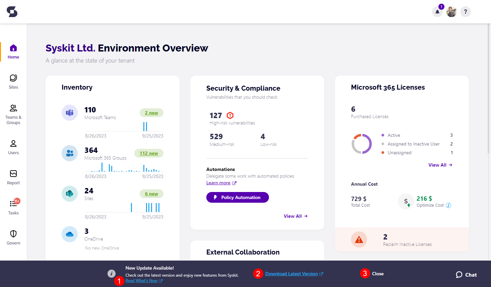
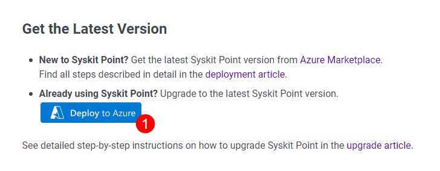

# Upgrade Syskit Point

Since **Syskit Point** is frequently getting new features, we highly recommend deploying the latest available version to use its maximum potential.


**Please note!**\
This article **describes Syskit Point upgrades from version 20 onwards**.

* **If you are using Syskit Point 19**, [contact us](https://www.syskit.com/company/contact-us/) to arrange a guided migration to the latest version due to changes in Syskit Point's architecture.


## Checking for Updates

**Syskit Point automatically checks for updates** every day, outside of working hours. **In case a new update is available, every Syskit Point user** **receives a popup message** at the bottom of the Home screen when they open the web application.

The **Read What's New** **link (1)** opens a new tab in your browser at the [Releases](../../releases/) section in Syskit Point documentation, where you can find out about new features, improvements, and bug fixes by each product version.

Clicking the **Download Latest Version (2)** link will redirect you to the latest **Release Note page** displaying the **Deploy to Azure** button.

**To hide the Update message**, **click the Close link (3)** visible on the right side. The message will stay hidden until the next time you log in to Syskit Point.

## Upgrading to the Latest Version

After you **open the latest Release note**, **click** the **Deploy to Azure button (1)**. 


**Please note!** When entering the App service name, **make sure NOT to enter the app service name ending with '-BE'**. **Entering the backend app service name in the upgrade process results in an invalid upgrade and Syskit Point not working correctly.**


The **Custom deployment** screen in Azure Portal opens. Here you need to:

* **Select the Resource group (1)** wherein the current Syskit Point version is deployed
* **Select Region (2)** - use the location of your currently deployed Syskit Point resources
* **Enter App service Name (3)** - enter the App Service resource Name; you can **find the App Service name (5)** by navigating to the Overview screen of Syskit Point resource group
* **Click Next: Review + create > (4)** - Review + create screen opens showing entered data; check that the entered data is correct and click **Create**

## Next Steps

After the deployment is completed, you can:

* **Access the Syskit Point web app**
* [Check if a re-consent is needed after the upgrade](../../requirements/permission-requirements-change-log.md)


**Hint!**\
Use the [What's new](https://www.syskit.com/products/point/whats-new/) page as an additional source of information on new features available in the latest version of Syskit Point.

