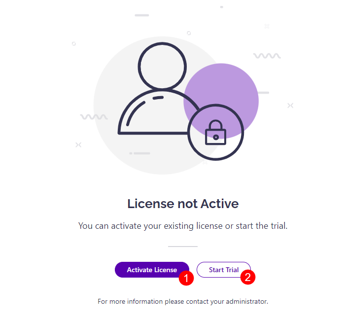
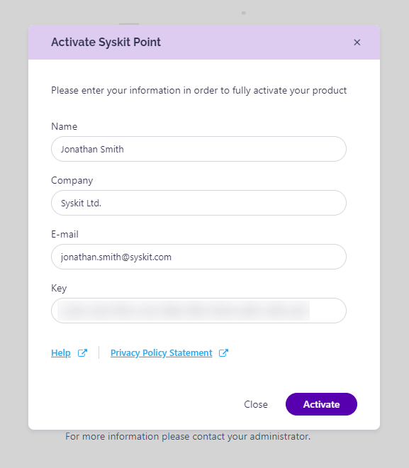

# Activate Syskit Point

To obtain the Syskit Point **Enterprise plan**, complete the following: 

* Deploy Syskit Point through the Azure Marketplace
    * Take a look at [this article for more details on how to deploy Syskit Point](../../set-up-point-enterprise/deployment/deploy-syskit-point.md)  
* [Contact us](https://www.syskit.com/company/contact-us) for the trial key that is needed to start your 21-day trial of Syskit Point 
* After the trial period, or within the 21 days of your trial, you need to purchase the Enterprise plan and enter the newly provided license key
   * [Contact us](https://www.syskit.com/company/contact-us) to receive your activation key

## Activation

You will be provided with the license key for the product activation after purchasing the selected edition of Syskit Point.

Anytime, you can log in to Syskit [Customers Portal](https://my.syskit.com/) and navigate to the list of your licensed products. If you are not seeing the activation information, please [contact us](https://www.syskit.com/company/contact-us).

When opening the Syskit Point web app URL for the first time, you will be prompted to **activate your copy of Syskit Point (1) or start the trial (2)**.

After you click the appropriate button, continue with the following steps:
* **Fill in all the required fields**: name, company, email, and the provided license key. 
* **Click the Activate button** to start the validation process. It only takes 2-5 seconds to perform the activation, and it is a one-time-only procedure. If your email address validation is successful, an info dialog will appear thanking you for the activation. 

You can check the license information in Syskit Point and manage the license on the Settings > License page.

## Changing the License Key

To change the existing license key with a new one, e.g., when you are upgrading to a different license edition, here are the instructions on how to do so:

1. **Navigate to Settings** > **License**.
2. **Click the Deactivate button**.
3. **Enter the new license key and user details**.

## **Deactivate License**

To deactivate the Syskit Point license, please proceed with the following steps:

1. **Navigate to Settings** > **License**. 
2. **Click the Deactivate button**. 

Once that product license has been deactivated, you won’t be able to sign in and access the application until it is activated.

