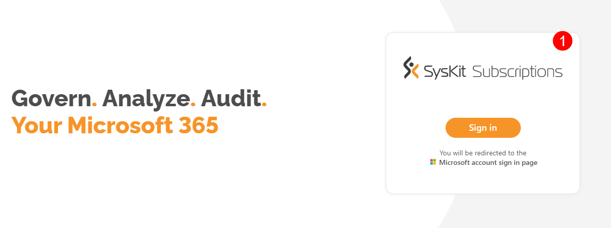
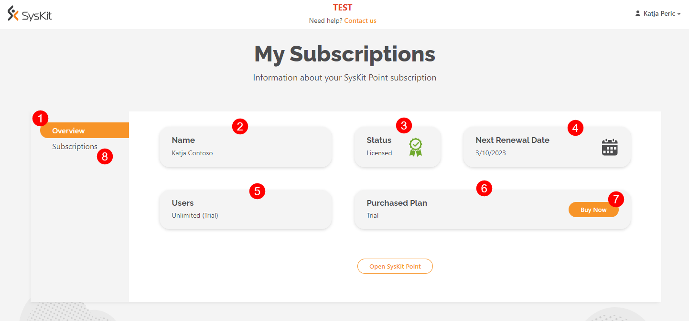
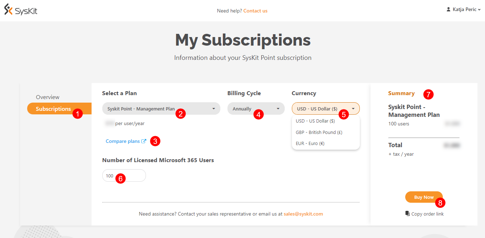
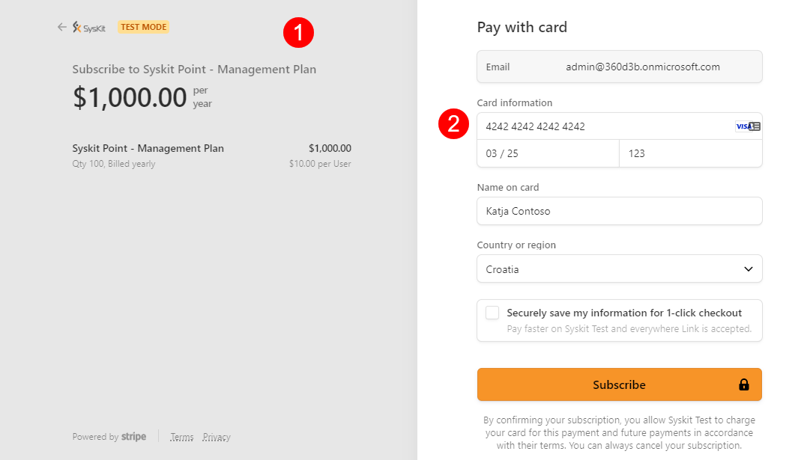

# SysKit Point Subscription

If you didn't start your free 21-day trial, take a look at the [**SysKit Point trial article**](trial.md) for details on getting started.  

At any point during the 21 days of the free trial, you can purchase a SysKit Point subscription. 

After your free trial has expired, the account will be frozen, but you will still be able to purchase the SysKit Point subscription for the next 21 days in order to retain your data. 

## Purchasing Your SysKit Point Subscription

To purchase the subscription, complete the following steps:

  * Click the **Buy Now** button, located in the top right corner of your SysKit Point trial screen
  * On the **SysKit Subscriptions (1)** site that opens, log into the SysKit Point account you used for the trial

This will open a screen with **information about your SysKit Point subscription**.

The **Overview section (1)** provides insight into general information on the status of your subscription and contains the following details:
  * **Name (2)** entered at the start of your trial 
  * **Status (3)** of your SysKit Point license
  * **Next renewal date (4)** of your SysKit Point subscription or expiration date of your free trial
  * **Users (5)** the number of users for your SysKit Point
  * **Purchased Plan (6)** for your subscription
    * This shows as Trial while your free trial period is still active
  * Next to **Purchased Plan** you can click on the **Buy Now button (7)** to purchase your SysKit Point subscription or manually click the **Subscriptions section (8)** on the left side of the screen under Overview

The **Subscription section (1)** is where you can purchase your subscription and select the specific details that suit your needs. 

Your preferences for the following information need to be selected: 
  * **Select a Plan (2)** - clicking on it opens a drop-down menu where you can select which subscription plan suits you best:
     * SysKit Point - Management Plan
     * SysKit Point - Security and Compliance Plan
     * SysKit Point - Governance Plan
    * If you are unsure which subscription suits your needs, clicking the **Compare Plans button (3)** underneath opens the [Pricing page](https://www.syskit.com/products/point/pricing/) with more details on each plan
  * **Billing Cycle (4)** - clicking on it opens a drop-down menu where you can select how often you want to be billed for your subscription:
     * Annually
     * Monthly
  * **Currency (5)** - clicking on it opens a drop-down menu where you can select the currency in which you want to be charged:
     * USD - US Dollar
     * GBP - British Pound
     * EUR - Euro
  * **Number of Licensed Microsoft 365 Users (6)** - here, you can write the number of users you expect will be utilizing SysKit Point
     * The number of licensed users affects the pricing of your SysKit Point subscription
  * **Summary (7)** - located on the right side of the screen, it shows a quick summary of the selection you've made with a cost estimate for your chosen subscription
  * Click the **Buy Now button (8)** for the final step to complete your purchase

After clicking Buy Now, you are redirected to the purchasing site. 
  * On the left side of the screen, you can find an **overview of your selected subscription (1)**
  * On the right side of the screen, you will need to input your **credit card details (2)** to finalize the purchase

Once you've purchased your SysKit Point subscription, you are redirected back to the SysKit Point Subscriptions site.

If your purchase was successful, when you click **Overview**, the information for your **Next Renewal Data** will reflect the renewal period you selected for your subscription. 

The **Purchased Plan** section will now show the name of the subscription you purchased. 