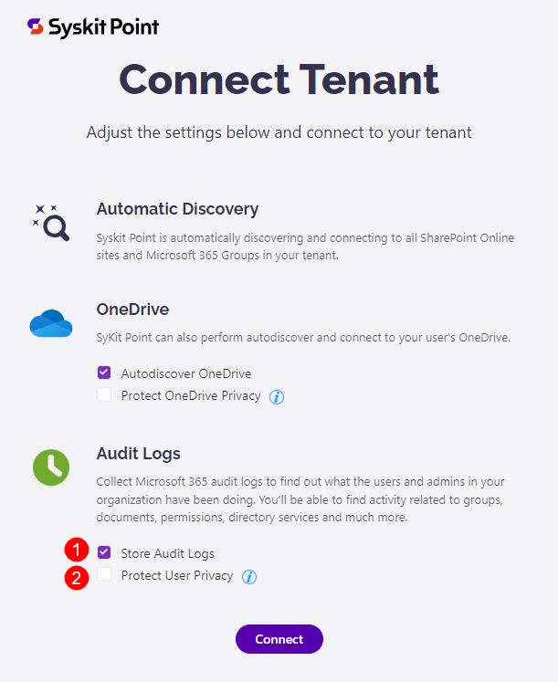
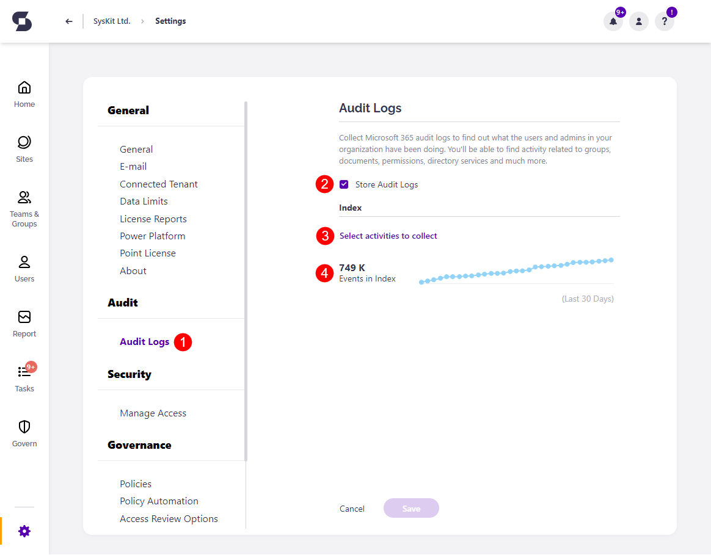
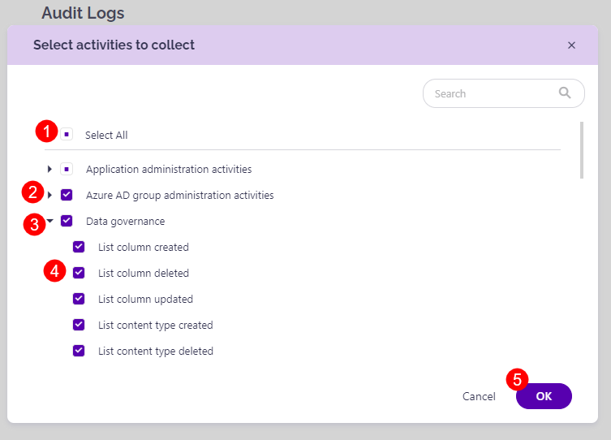
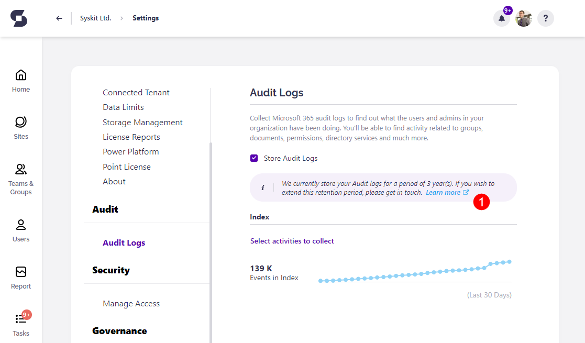
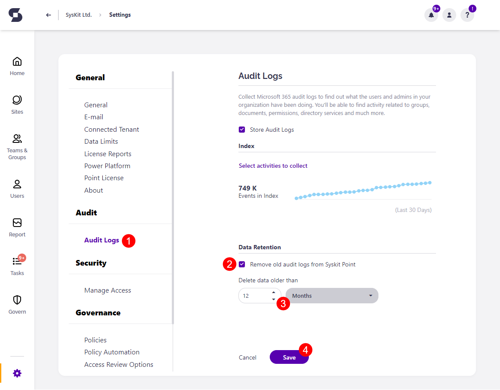
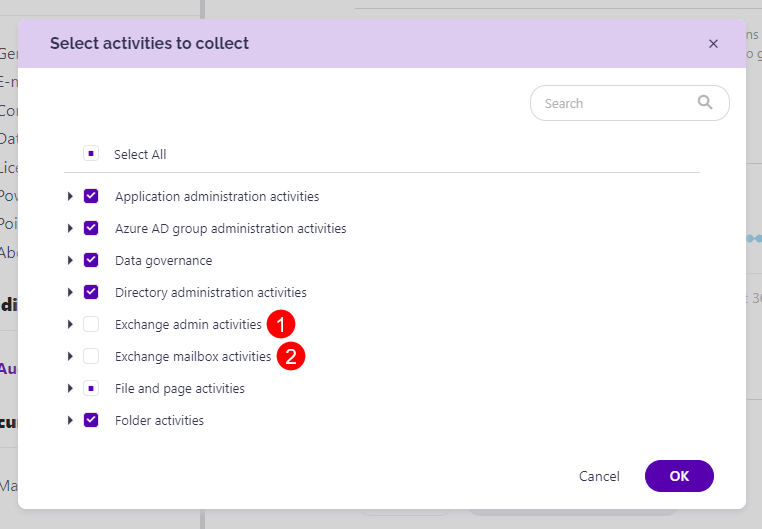

# Customize Audit Logs Collection


**Audit Logs** are available in the Security & Compliance plan and higher tiers. See the [pricing page](https://www.syskit.com/products/point/pricing/) for more details.


Audit logs can provide you with **insights into all activities** related to the user and administration activities in your Microsoft 365 environment. The Audit Logs contain information on activities within your organization related to **groups, documents, permissions, directory services, and much more**. 

Users that are assigned **Syskit Point Admin role** can configure activities that are going to be collected in these locations:

* **Syskit Point Registration > Tenant settings**
* **Audit Logs section in Settings**

## Syskit Point Registration > Tenant settings

After registering **Syskit Point**, on the **Connect tenant** step, you have the following audit options on disposal:

* **Store audit logs \(1\)**
* **Protect user privacy \(2\)**


**Please note!**  
You can change these settings by managing your tenant connection in Settings > General > Connected Tenant. 


### Store Audit Logs Option

By default, the **Store audit logs** option is enabled, meaning that Syskit Point will process and store the audit logs to your **Azure Cosmos DB account**.


**Tip!**  
You can change the Audit Logs settings after the initial connection by managing your tenant connection in Settings > General > Connected Tenant. 


### Protect User Privacy Option

Turning this option on results in the following:

* **User activity data**, such as file and permissions changes, **will be hidden and protected from Administrator supervision** 
  * **User Activity report will be hidden from Syskit Point user interface**
  * **Access to the File and Page Activities report will be hidden**
  * **Summary data in the Analytics & Usage tile will remain visible but cannot be drilled to access data for a specific user**
* **User activity** data will, however, be collected and stored


**Please note!**  
User activity data continues to be collected and stored to be readily available, if needed, in case of a security incident.


The following rules apply regarding the User Privacy option:

* **By default, this option is turned off**
* **The option can be set for each tenant connected with Syskit Point independently**
* **Changing the option is possible through the Manage Connection button in the Syskit Point Settings > General > Connected Tenant screen**


**Please note!**  
The **Protect user privacy** option is disabled automatically if the **Store audit logs option** is turned off.


## Audit Logs Settings

Audit log settings can also be configured after the initial configuration of **Syskit Point**. To do so:

* Open the **Settings** screen
* Navigate to the **Audit** &gt; **Audit Logs \(1\)** page

Here, you can:

* **Turn the storage of Audit Logs on or off \(2\)**
* **Select activities to collect \(3\)**
* **View the number of events \(4\)** in the Audit Index

Audit logs activities that are being collected can be found by clicking the **Select activities to collect \(3\)** link.

A new dialog opens, showing all audit log categories and activities available in Syskit Point. Here you can:

* Use the **Select All** option to enable the collection of all available activities **\(1\)**
* **Adjust which audit log categories will be collected by clicking the checkbox \(2\)** next to a category
* **Expand categories \(3\)**
* **Mark only specific activities within a category to be collected \(4\)**
* **Confirm your changes** by clicking the **OK button \(5\)** and **Save** button on the **Audit Logs** screen.

Available audit log categories:

* **Application administration activities**
* **Azure AD group administration activities**
* **Data governance**
* **Directory administration activities**
* **Exchange admin activities**
* **Exchange mailbox activities**
* **File and page activities**
* **Folder activities**
* **Microsoft Forms**
* **Microsoft Power Automate**
* **Microsoft Stream**
* **Microsoft Teams activities**
* **Power Apps activities**
* **Power BI activities**
* **Role administration activities**
* **SharePoint list events**
* **Sharing and access request activities**
* **Site administration activities**
* **Site permissions activities**
* **Synchronization activities**
* **User activities**
* **User administration activities**

## Data Retention

### Point Cloud

**By default, audit logs data retention is set to 1 year in Syskit Point Cloud**. 

You can purchase additional years of audit logs storage by contacting our Sales team. [Contact us](https://www.syskit.com/contact-us/)

To find the information on how long the Audit logs are stored for you:
* Navigate to **Settings** > **Audit** > **Audit Logs**
* **Find the info section where the audit logs storage period is visible (1)**


**Purchased audit logs storage period will be added to the default period of 1-year audit log storage**. For example, if you purchased 2 years of additional storage, your audit logs will be stored for 3 years.


### Point Data Center

When audit log data retention is **enabled and set up, Syskit Point will delete audit logs** that are older than the specified timeframe. 

This option is **disabled by default**. 

Go to the **General Settings** screen in your Syskit Point to enable it. 
 * Navigate to the **Audit section** &gt; **Audit Logs (1)** page
 * Select the checkbox next to **Remove old audit Logs from Syskit (2)**
 * Choose **the amount of time (3)** that should pass for audit logs to be deleted
    * Once set up, audit logs that are older than the timeframe you select will be deleted 
 * Click **Save (4)** to finalize

## Exchange Logs


**Please note!**  
By default, Exchange logs are **not collected**; at least one Exchange activity must be selected for Syskit Point to start collecting and storing Exchange log data.


To select Exchange activities:

* **Open the Select activities to collect dialog in Audit settings**
* **Choose from two available categories:**
  * **Exchange admin activities \(1\)**
  * **Exchange mailbox activities \(2\)**
* **Click OK** to confirm


**Please note!** It can take up to 30 minutes for Syskit Point to collect Exchange log data.


To view collected Exchange logs, use the **Exchange Logs report** available in the Report Center.

## Additional information

### Type of Audit Logs Collected

Syskit Point collects audit logs accessible in the unified audit log. Out of the box, you can review the audit logs from the [Microsoft 365 compliance center](https://compliance.microsoft.com/auditlogsearch).
You can additionally [customize for which activities Syskit Point will collect audit logs](../customize/customize-audit-logs-collection.md).

### Sign-in Logs from Microsoft Entra ID 

Microsoft Entra ID shows all sing-ins performed by users, service principals, apps, and Azure resources.
**Syskit Point does not collect Microsoft Entra ID sign-in logs.** 
Syskit Point collects unified audit logs, which contain a subset of said logs related to Microsoft 365 and are visible in the [Microsoft 365 compliance center](https://compliance.microsoft.com/auditlogsearch).

### Frequency of Audit Log Collection

Syskit Point checks for and collects new audit logs every 15 minutes. 
Note that it can take up to 24 hours after an event occurs for the corresponding audit log record to be returned in the results of an audit log search. 

### Unified Audit Logs

You can find additional information about unified audit logs in the [following Microsoft's article](https://docs.microsoft.com/en-us/microsoft-365/compliance/search-the-audit-log-in-security-and-compliance?view=o365-worldwide).