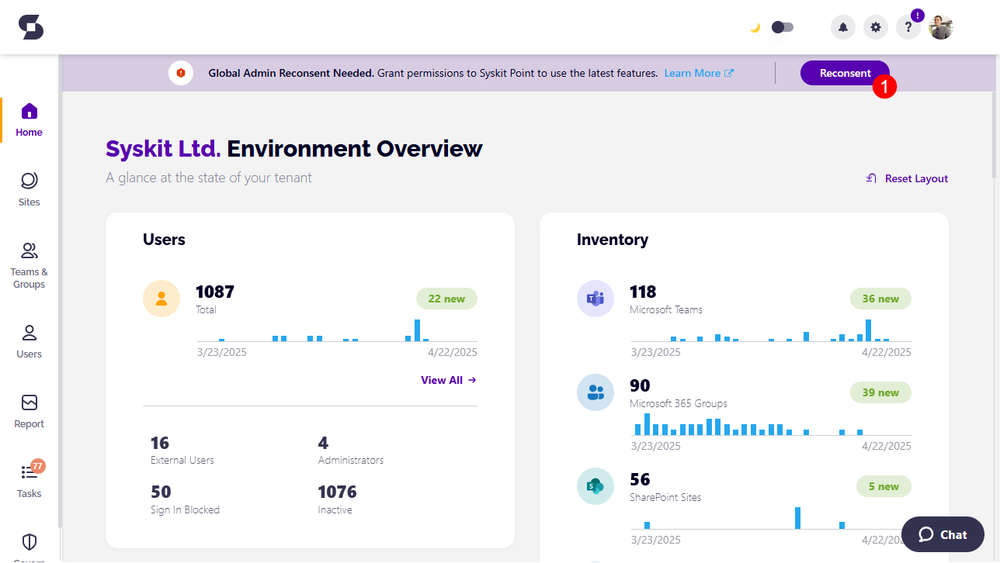

# Change Log

Syskit Point is constantly evolving and adding new features. Sometimes, we require additional consent from a Global administrator in your organization for these new features to work. This might be needed after upgrading to the latest version of Syskit Point.

## How to Reconsent

Reconsent can be performed:

* [**By clicking the Reconsent button**](permission-requirements-change-log.md#reconsent-after-upgrade) **in the notification that appears after the Syskit Point upgrade**, or
* [**By managing tenant connection**](permission-requirements-change-log.md#reconsent-in-settings) **in Syskit Point settings**

### Reconsent After Upgrade

If the latest Syskit Point version has some new permissions requirements to which your Global Administrator has not consented before, you will get a notification at the top of the Home screen after your first sign-in to the new version:

**Global Admin Reconsent Needed** - Grant permissions to Syskit Point to use the latest feature.

To resolve this and ensure all the new features work properly, a Global Administrator should sign in to Syskit Point and click **Reconsent (1)** on the shown notification.

After clicking the Reconsent button, you can expect the following to happen:

1. **Microsoft authentication screen opens** asking you to Pick an account\
   Select or sign in with the Global Administrator account
2. **Microsoft consent screen opens** asking you to consent\
   Check the Consent box and click the Accept button
3. **Syskit Point progress screen opens** showing the connection update progress
4. **Syskit Point Home screen opens** when the update is completed and reconsent successfully performed

### Reconsent in Settings

This option can be used as a fallback in case Syskit Point fails to show the reconsent notification after the upgrade.

To reconsent via settings:

* **Navigate to Settings > General > Connected Tenant**
* **Click the Manage Connection button**

After clicking the Manage Connection button, you can expect the following to happen:

1. **Microsoft authentication screen opens** asking you to Pick an account\
   Select or sign in with the Global Administrator account
2. **Microsoft consent screen opens** asking you to consent\
   Check the Consent box and click the Accept button
3. **Syskit Point Connect Tenant screen opens** showing the OneDrive and Audit Logs privacy options\
   Click Connect to continue
4. **Syskit Point progress screen opens** showing the connection update progress
5. **Syskit Point Home screen opens** when the update is completed and reconsent successfully performed

## Permission Changes

Depending on which version you are upgrading to, below you can find the list of changes in permissions requested and which features depend on them.

### Syskit Point Cloud 2025.2.89

**Consent is required due to permission changes introduced with switching from the beta endpoint to the Graph v1 endpoint to ensure uninterrupted detection of Microsoft Teams activity based on the latest message date**.

**The following permission is added to the existing Syskit Point app registration**:

<table><thead><tr><th>App Registration</th><th width="206">API/Permissions Name</th><th width="103">Permission</th><th width="111">Type</th><th>Reason</th></tr></thead><tbody><tr><td>Syskit Point Service</td><td>Microsoft Graph/ChannelMessage.Read.All</td><td>Read all channel messages</td><td>Application</td><td>Enables Syskit Point to calculate Teams activity based on the latest channel message date.</td></tr></tbody></table>


**Please note!**\
Syskit Point **does not read or save** the content of messages to detect Microsoft Teams activity.


### Syskit Point Cloud 2025.2.88


**Syskit Point will require reconsent only if you enabled Power Platform data collection in one of the previous versions.**\
**New permission is added for the app registration after reconsenting if the Power Platform data collection is enabled.**


**The following permission is added to the existing Syskit Point app registration**:

<table><thead><tr><th>App Registration</th><th width="210">API/Permissions Name</th><th width="115">Permission</th><th width="104">Type</th><th>Reason</th></tr></thead><tbody><tr><td>Syskit Point Client</td><td>PowerApps Service/User</td><td>Access the PowerApps Service API</td><td>Delegated</td><td>Allows you to run Power Platform actions in Syskit Point.</td></tr></tbody></table>

### Syskit Point Cloud 2025.1.77

With the introduction of Power Platform support, new permissions are added to the following app registrations when the Global Administrator turns on the Power Platform data collection and provides consent.


Permissions are added for the app registration only if the Power Platform data collection is enabled.


| App Registration            | Permission Name       | Reason                                                                                             |
| --------------------------- | --------------------- | -------------------------------------------------------------------------------------------------- |
| Syskit Point Client         | PowerAppManagementApp | Allows Syskit Point to access the PowerApps Service API and collect Power Platform resources data. |
| Syskit Point Power Platform | PowerAppManagementApp | Allows Syskit Point to access the PowerApps Service API and collect Power Platform resources data. |


**Please note!**\
Added permissions are not visible in the Microsoft Entra interface.\
To manage the permissions, you can run the related PowerShell cmdlets described in the following articles:

* [Get-PowerAppManagementApp](https://learn.microsoft.com/en-us/powershell/module/microsoft.powerapps.administration.powershell/get-powerappmanagementapp?view=pa-ps-latest)
* [Remove-PowerAppManagementApp](https://learn.microsoft.com/en-us/powershell/module/microsoft.powerapps.administration.powershell/remove-powerappmanagementapp?view=pa-ps-latest)


### Syskit Point Data Center 2024.4.45

**Consent is required if you are using the Access Request feature to enable the addition of members and owners to security groups.**

**The following permissions were added to the existing Syskit Point app registrations**:

| App Registration     | API/Permissions Name                         | Permission                                 | Type        | Reason                                                                                                             |
| -------------------- | -------------------------------------------- | ------------------------------------------ | ----------- | ------------------------------------------------------------------------------------------------------------------ |
| Syskit Point Service | Microsoft Graph/GroupMember.ReadWrite.All    | Read and write all group memberships       | Application | Allows Syskit Point to add users in Microsoft Entra ID to security groups after an access request is approved by the group owner. |
| Syskit Point Service | Microsoft Graph/RoleManagement.ReadWrite.All | Read and write all directory RBAC settings | Application | Allows Syskit Point to add users in Microsoft Entra ID to security groups after an access request is approved by the group owner. |

### Syskit Point Data Center 2023.4.1

**Consent is required due to permission changes introduced to make the Copy User Permissions action more robust**. Before, when adding members to private channels in Microsoft Teams, the action would often result in an error for users recently added to Microsoft Entra ID.

**The following permissions were added to the existing Syskit Point app registrations**:

| App Registration    | API/Permissions Name                     | Permission                        | Type      | Reason                                                                                         |
| ------------------- | ---------------------------------------- | --------------------------------- | --------- | ---------------------------------------------------------------------------------------------- |
| Syskit Point Client | Microsoft Graph/TeamMember.ReadWrite.All | Add and remove members from teams | Delegated | Allows Syskit Point to add newly created users in Microsoft Entra ID to Microsoft Teams and private channels. |

### Syskit Point Cloud - November 02, 2023

**Consent is required due to permission changes introduced to make the Copy User Permissions action more robust**. Before, when adding members to private channels in Microsoft Teams, the action would often result in an error for users recently added to Microsoft Entra ID.

**The following permissions were added to the existing Syskit Point app registrations**:

| App Registration    | API/Permissions Name                     | Permission                        | Type      | Reason                                                                                         |
| ------------------- | ---------------------------------------- | --------------------------------- | --------- | ---------------------------------------------------------------------------------------------- |
| Syskit Point Client | Microsoft Graph/TeamMember.ReadWrite.All | Add and remove members from teams | Delegated | Allows Syskit Point to add newly created users in Microsoft Entra ID to Microsoft Teams and private channels. |

### Syskit Point 2023.1

**Syskit Point 2023.1 supports sync and management of distribution lists and email enabled security groups**. In order to sync all needed data and for the end-users to perform management actions, additional permissions were added to access the Exchange service.

**Global Admin must re-consent permissions after the upgrade to Syskit Point 2023.1**.

**The following permissions were added to the existing Syskit Point app registrations**:

| App Registration                | API/Permissions Name | Permission                     | Type        | Reason                                                                                                          |
| ------------------------------- | -------------------- | ------------------------------ | ----------- | --------------------------------------------------------------------------------------------------------------- |
| Syskit Point Service            | Exchange.ManageAsApp | Manage Exchange as application | Application | Allows Syskit Point to sync distribution lists and email enabled security groups.                               |
| Syskit Point Permissions Loader | Exchange.ManageAsApp | Manage Exchange as application | Application | Allows Syskit Point to sync distribution lists and email enabled security groups.                               |
| Syskit Point Client             | Exchange.Manage      | Manage Exchange configuration  | Delegated   | Allows Syskit Point users to manage owners and members in distribution lists and email enabled security groups. |

### Syskit Point 2022.5

Due to [Outlook REST APIs being fully decommissioned on November 30, 2022](https://devblogs.microsoft.com/microsoft365dev/outlook-rest-api-v2-0-deprecation-notice/), **with version 2022.5**, **Syskit Point migrates to Microsoft Graph API**. **The newly added permissions listed below are used to send all automatic and on-demand emails in Syskit Point**.

**Global Admin must re-consent permissions after the upgrade to Syskit Point 2022.5**.

**The following permissions were added to the existing Syskit Point service app registration**:

| App Registration     | API/Permissions Name           | Permission                           | Type        | Reason                                                                                                                                  |
| -------------------- | ------------------------------ | ------------------------------------ | ----------- | --------------------------------------------------------------------------------------------------------------------------------------- |
| Syskit Point Service | Microsoft Graph/Mail.ReadWrite | Read and write mail in all mailboxes | Application | Allows Syskit Point to send emails as a part of the Access Review, Lifecycle Management, Scheduled Reports, Alerts, and other features. |
| Syskit Point Service | Microsoft Graph/Mail.Send      | Send mail as any user                | Application | Allows Syskit Point to send emails as a part of the Access Review, Lifecycle Management, Scheduled Reports, Alerts, and other features. |

**The following permissions were removed from the existing Syskit Point service app registration**:

| App Registration     | API/Permissions Name                    | Permission            | Type        | Reason                                                                                                                           |
| -------------------- | --------------------------------------- | --------------------- | ----------- | -------------------------------------------------------------------------------------------------------------------------------- |
| Syskit Point Service | Microsoft 365 Exchange Online/Mail.Send | Send mail as any user | Application | Allows Syskit Point to send emails as a part of the Access Review, Lifecycle Management, Scheduled Reports, and Alerts features. |

### Syskit Point 2022.4.1

**Additional permissions for the Access Review feature were added** to the existing app registrations regarding private channels support.

Therefore, **a Global Admin will have to re-consent in the Syskit Point Welcome Home screen**.

### Syskit Point 2022.4

**The following app registration was added**:

* **Syskit Point Power Platform**
  * created during the upgrade to the new Syskit Point version
  * used to collect Power BI data
  * by default, no permissions are added

Due to the listed permission changes, **Global Admin is required to re-consent permissions**.

[To see the complete list of used App Registrations and assigned permissions, navigate to the Permission Requirements article](permission-requirements.md).

**The following permissions were added to existing app registrations**:

| App Registration                | Permissions                          | Type        | Reason                                                                          |
| ------------------------------- | ------------------------------------ | ----------- | ------------------------------------------------------------------------------- |
| Syskit Point Service            | Read the members of all channels     | Application | Allows Syskit Point to collect membership data for private and shared channels. |
| Syskit Point Permissions Loader | Read the members of all channels     | Application | Allows Syskit Point to collect membership data for private and shared channels. |
| Syskit Point Client             | Add and remove members from channels | Delegated   | Enables users to manage private channels in Syskit Point.                       |

Due to the listed permission changes, **Global Admin is required to re-consent permissions**.

[To see the complete list of used App Registrations and assigned permissions, navigate to the Permission Requirements article](permission-requirements.md).

### Syskit Point 2022.2

* A **redirect URI was added to the Syskit Point Service app registration** that **enables Syskit Point Admins to access the new Hangfire dashboard**. The Hangfire dashboard offers an overview of the status of all the background jobs Syskit Point is periodically running. Therefore, a **Global Admin will have to**:
  * **Re-Consent in the Syskit Point Welcome Home screen**
  * **Navigate to the Hangfire dashboard URL and grant permissions to the Syskit Point Service** so that it can log in users from the tenant securely.
* **No new permissions were added**

### Syskit Point 2021.10

**The following app registrations were added**:

* **Syskit Point Permissions Loader** - used for optimized data sync of SharePoint sites and OneDrive
* **Syskit Point API** - used for third-party app integration to get Syskit Point data and use it in other business applications and web services; **currently in Beta stage**; by default, the app registration has **no permissions added**

**The following permissions were added**:

| App Registration                | Permissions                                                               | Type        | Reason                                                                                                      |
| ------------------------------- | ------------------------------------------------------------------------- | ----------- | ----------------------------------------------------------------------------------------------------------- |
| Syskit Point Client             | Read all users' relevant people lists                                     | Delegated   | Allows Syskit Point to display users' relevant people lists in People Picker within Syskit Point Teams app. |
| Syskit Point Service            | Read files in all site collections                                        | Application | Enables Syskit Point to perform partial site syncs, containing changed files only.                          |
| Syskit Point Service            | Read all published labels and label policies for an organization          | Application | Enables Syskit Point to sync published sensitivity labels and store them in the database.                   |
| Syskit Point Permissions Loader | Uses the same set of permissions as Syskit Point Service App Registration | Application | Used for optimized SharePoint and OneDrive sync.                                                            |
| Syskit Point API                | No permissions added                                                      | -           | Used for third-party app integration.                                                                       |

[To see the complete list of used App Registrations and assigned permissions, navigate to the Permission Requirements article](permission-requirements.md).
