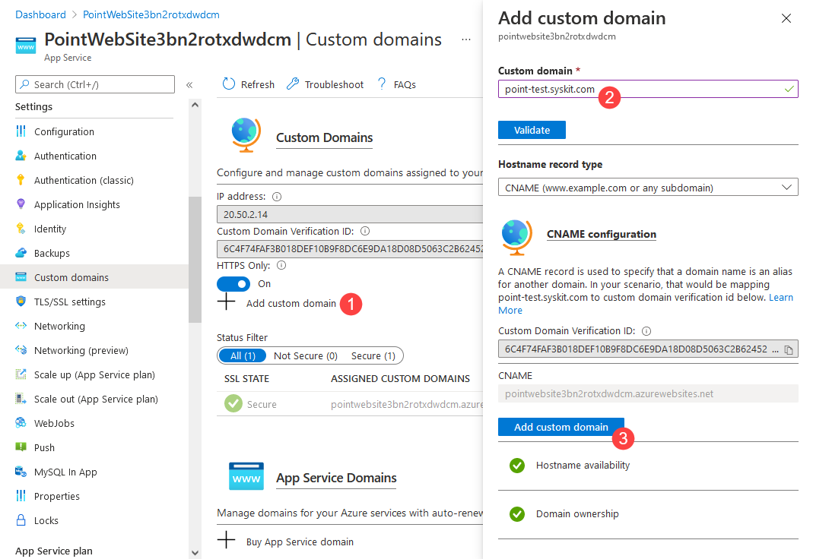
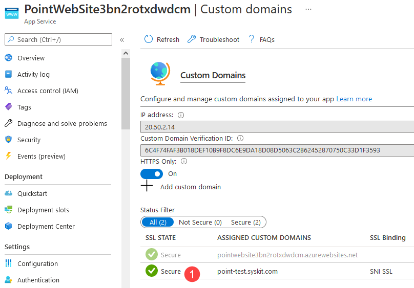
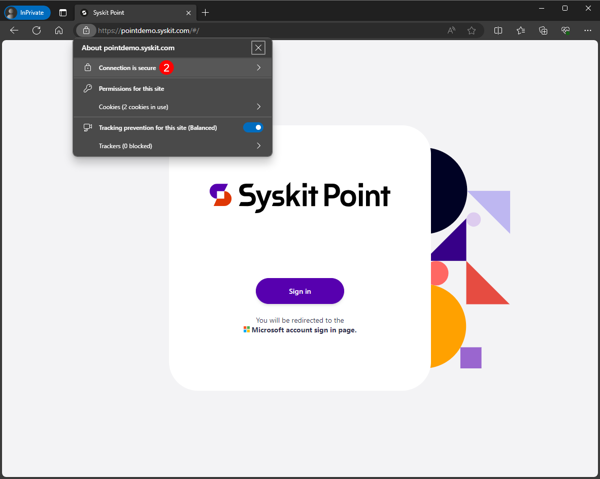

# Set Up Custom Domain and SSL Certificate

Here are the instructions on how to make your Syskit Point web application publicly available on a custom domain and how to configure a secure access connection by setting up an SSL certificate.

## Prerequisites

* Syskit Point app deployed as App Service in Azure
* Custom domain added to your Azure Active Directory
* Access to your public DNS hosting provider
* SSL certificate

## Steps

1. Navigate to your newly deployed Syskit Point App Service in Azure, select **Custom domains (1)** in the left-hand navigation, and make a record of the default **assigned custom domain (2)** for that App Service.

1. On your public **DNS registrar**, create a **CNAME** record with the desired name pointing to the default custom domain name recorded in the previous step. This is what it might look like in Cloudflare DNS.

1. Go back to the Azure Custom domains page and select **Add custom domain (1)**. Enter the fully qualified domain name as **Custom domain (2)** and click **Validate**. After a few seconds, you should get two green checkmarks at the bottom which means you may click the **Add custom domain (3)** button.

1. A new entry will be added under the Custom Domains, from where you can select **Add binding (1)** to add an SSL certificate for a secure connection to the Syskit Point app. You can choose between uploading your **.pfx certificate** or importing an **App Service Certificate** if you have one. If you already have some **certificates in Azure**, you will be able to **choose one from there (2)**. Also, choose the **SNI SSL (3)** type and click **Add Binding (4)**.

1. Once the binding is created, the **SSL state becomes secured (1)**, and you should be able to access your Syskit Point app through a **secure URL connection (2)** - `https://point-test.syskit.com` in this example.

 

1. **If you added the custom domain before connecting the application to your Microsoft 365 Tenant**, **then you can skip this step**. If you already have a tenant connected, then you need to do the following:
   * **For Single Sign-on (SSO) to work**, you need to **add the new URL to the Redirect URIs of the Syskit Point Client app registration**. To do that navigate to **Azure Portal** > **App Registrations**. Find the **Syskit Point Client app registration** and click it, under **Manage** > **Authentication** add a new redirect URI in the format hostname + /auth, in this example, it would be `https://point-test.syskit.com/auth`
   * **For future upgrades to work**, you need to **add the new URL to the Redirect URIs of the Syskit Point Installer app registration**. To do that navigate to **Azure Portal** > **App Registrations**. Find the **Syskit Point Installer app registration** and click it, under **Manage** > **Authentication** add a new redirect URI in the format hostname + /auth, in this example, it would be `https://point-test.syskit.com/auth`
   * Lastly, **you need to update the hostname in the Syskit Point database**. Run the following sql command:\
     `UPDATE [dbo].[Options] SET OptionValue = 'https://point-test.syskit.com' WHERE OptionID = 23`

## Related Topics

* [Deploy Syskit Point](deploy-syskit-point.md)
* [Activate Syskit Point](../../set-up-point-data-center/activation/activate-syskit-point.md)
* [Connect to Microsoft 365 Tenant](connect-to-tenant.md)

If you have additional questions or concerns, please [contact us](https://www.syskit.com/contact-us/).
